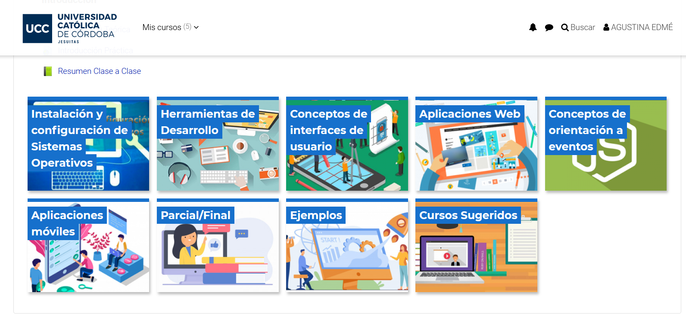
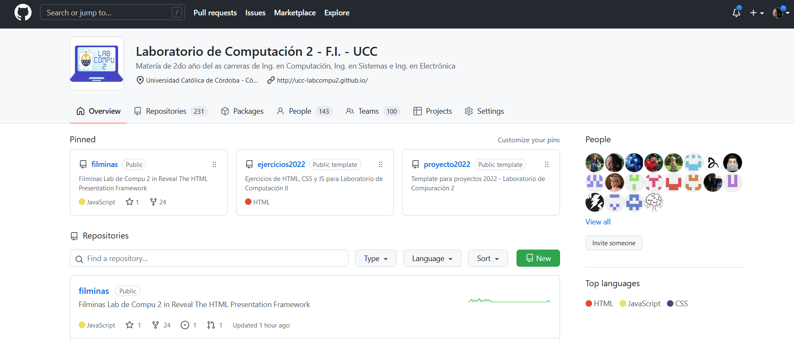

# Taller de Desarrollo Web (Práctica)
Created by <i class="fab fa-telegram"></i>
[edme88]("https://t.me/edme88")

---
## ¿PROYECTO?
    
Relizar un proyecto Web

(de cualquier temática apta para la facultad)

* User Interface (HTML5 y CSS3)
* Funcionalidad (Javascript)
* Framework: React

---
## PROYECTO: Requisitos básicos
La página debe tener:
* Imágenes
* Campos de formulario

---
## PROYECTO Web: Ideas
* Venta de productos
* Gym
* Hotel
* Etc, etc, etc

<!--
## Ejemplos de Proyectos
[Historico de Proyectos](https://ucc-labcompu2-historico.github.io/)
-->

<!--
## Aula Virtual
[http://campusvirtual.ucc.edu.ar](https://campusvirtual.ucc.edu.ar/course/view.php?id=4429)
-->

---
## Organización en Github

[github.com/UCC-LabCompu2](https://github.com/UCC-LabCompu2)

