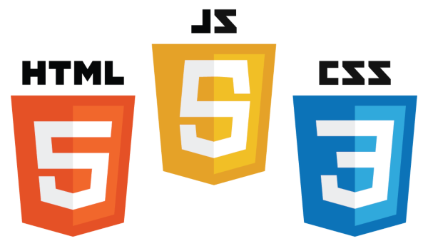
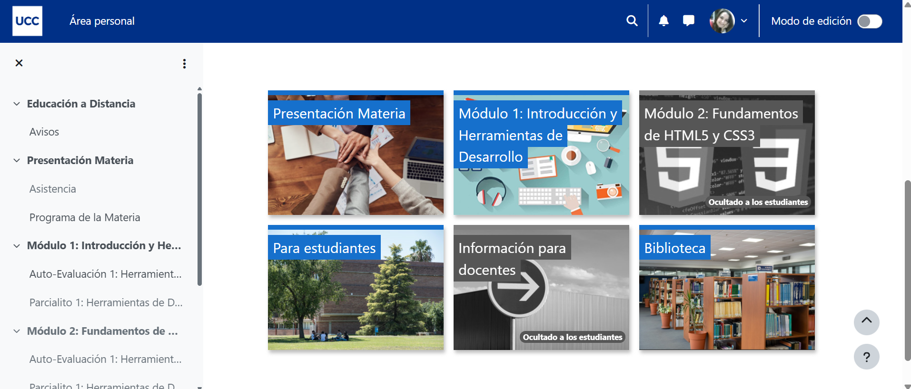
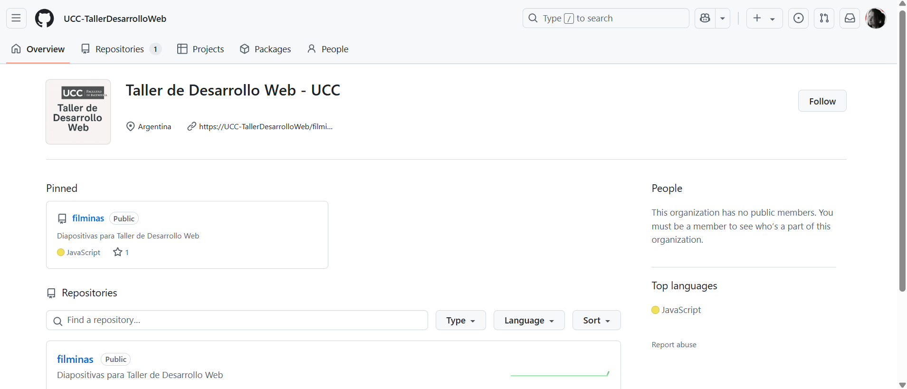
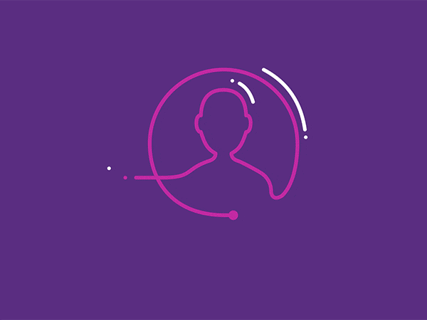

# Taller de 
# Desarrollo Web
## Práctica
Created by <i class="fab fa-telegram"></i>
edme88

---
## ¿PROYECTO?
    

Relizar un proyecto Web
(de cualquier temática apta para la facultad)

* User Interface (HTML5 y CSS3)
* Funcionalidad (Javascript)
* Framework: React

---
## PROYECTO: Requisitos básicos
La página debe tener:
* HTML + CSS + JS
* Imágenes
* Campos de formulario
* Uso de etiquetas semánticas

---
## PROYECTO Web: Ideas
* Venta de productos
* Adopción de Animales
* CV interactivo
* Trekking y senderismo
* Experiencias de Vacaciones
* Recomendador de series/películas/anime
* Gym y rutinas
* Hotel
* Etc, etc, etc

Busquen una temática que amen ❤️ ...Para que más que cumplir con un trabajo de una materia, sientan que están construyendo algo propio!

<!--
## Ejemplos de Proyectos
[Historico de Proyectos](https://ucc-labcompu2-historico.github.io/)
-->

---

## Aula Virtual

[http://campusvirtual.ucc.edu.ar](https://presencial.ucc.edu.ar/course/view.php?id=13678)

---
## Organización en Github

[github.com/UCC-TallerDesarrolloWeb](https://github.com/UCC-TallerDesarrolloWeb)

---
## ¿Dudas, Preguntas, Comentarios?

