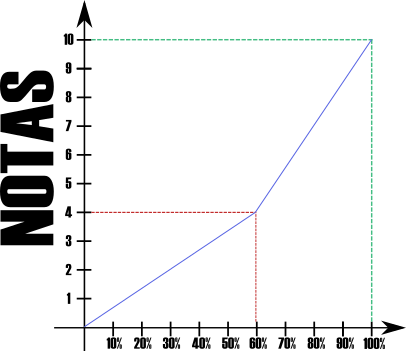

# Taller de Desarrollo Web (Teórico)
Created by 
<i class="fab fa-telegram"></i> [edme88](https://t.me/edme88)

---

## ¿Alguna vez han desarrollado una página Web?
## ¿Conocen HTML, CSS y Js?
## ¿Conocen algún framework de programación?

---
# Taller de Desarrollo Web

- Teórico: 2hs
- Práctico: 2hs

---
## Profesores
### Ing. Agustina Edmé Aliciardi
agustina.aliciardi@ucc.edu.ar

### Ing. Nicolás Rodriguez
<!--TODO: PONER EL EMAIL AQUÍ-->
[]@ucc.edu.ar

### David Azulay
<!--TODO: PONER EL EMAIL AQUÍ-->
[]@ucc.edu.ar

---
## UNIDADES

<!-- .slide: style="font-size: 0.90em" -->
**Unidad 1:** Introducción y Herramientas de Desarrollo

**Unidad 2:** Fundamentos de HTML5 y CSS3

**Unidad 3:** JavaScript y ES6+

**Unidad 4:** Funcionamiento del Navegador y Herramientas de Desarrollo

**Unidad 5:** Frameworks y Preprocesadores CSS

**Unidad 6:** Frameworks de JavaScript: React, Vue y Angular

**Unidad 7:** Backend y APIs

**Unidad 8:** Buenas prácticas en los desarrollos Web

---
## Calendario

| Clase | Unidad | Tema                              |
|-------|--------|-----------------------------------|
| 1     | 1      | Herramientas de Desarrollo        |
| 2 a 4 | 2      | HTML5 y CSS3                      |
| 5 a 7 | 3      | JavaScript y ES6+                 |
| 8     | 4      | Navegador - Presentación Proyecto |

---
## Calendario

| Clase   | Unidad | Tema                             |
|---------|--------|----------------------------------|
| 9 y 10  | 5      | Frameworks y Preprocesadores CSS |
| 11 y 12 | 6      | React                            |
| 13      | 7      | Backend y APIs                   |
| 14      | 8      | Buenas Prácticas                 |
| 15      |        | 2do PARCIAL                      |

---
## Forma de Evaluación: Cursado
* Proyecto Web: Primera Entrega (HTML+CSS+Js)
* Proyecto Web: Segunda Entrega (React)
* Nota del promedio de 8 parcialitos teóricos multiple opción

---
## Forma de Evaluación: FINAL
FINAL:

*    Entrega a tiempo del proyecto
*    HTML+CSS+JS
*    React
*    Preguntas sobre el código
*    Preguntas de la guía
*    Promoción de la parte Teórica   Promedio >= 8 y nota mínima 7

---
## Regularidad
* Asistencia del 70% en Clases Teórico-Prácticas (en el repositorio **ejercicios2025-Apellido** tener realizados los ejercicio de clase)
* Proyecto primera y segunda etapa aprobados (nota mínima de 4)
* Promedio de los 7 parcialitos >= 4

---
## Promoción
* Asistencia del 70% en Clases Teórico-Prácticas
* Promedio >= 8 y nota mínima 7 (3 notas: proyecto primera etapa, segunda etapa y promedio de parcialitos)

---
<!-- .slide: data-background-color="grey"-->
## Notas

<small>Tener en cuenta que un 55%=4, 70%=6, 80%=7.5, 90%=9</small>
