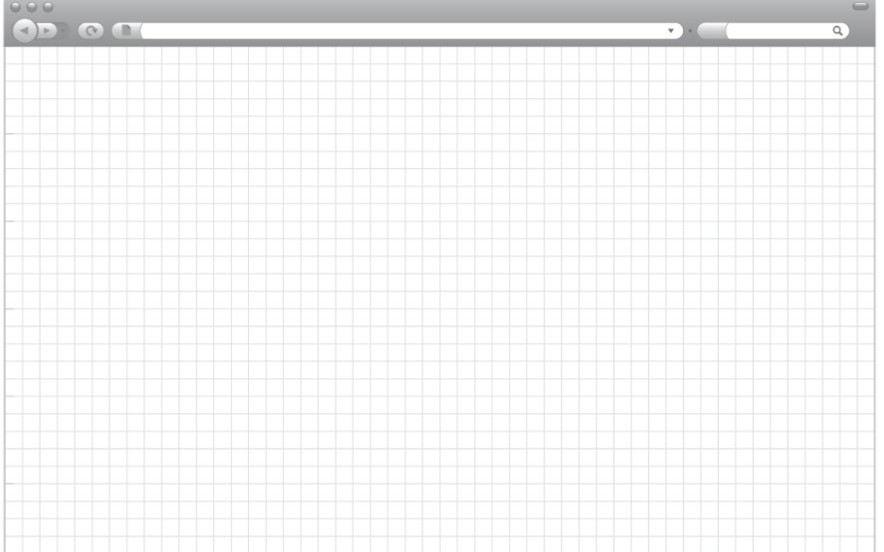

# Proyecto
Created by <i class="fab fa-telegram"></i> 
[edme88]("https://t.me/edme88")

---

<style>
.grid-container2 {
    display: grid;
    grid-template-columns: auto auto;
    font-size: 0.8em;
    text-align: left !important;
}

.grid-item {
    border: 3px solid rgba(121, 177, 217, 0.8);
    padding: 20px;
    text-align: left !important;
}
</style>
<!-- .slide: style="font-size: 0.70em" -->
## Temario
<div class="grid-container2">
<div class="grid-item">

### Proyecto
* Consigna básica
* Link con template base (obligatorio)

### Requisitos del Primer Parcial
* [Sketch](Proyecto.html#/4)
* [Wireframe/Mockup](Proyecto.html#/8)
* [Repositorio](Proyecto.html#/9)
* [Proyecto general](Proyecto.html#/10)
* [HTML](Proyecto.html#/11)
* [Imágenes](Proyecto.html#/14)
* [CSS](Proyecto.html#/15)
* [Accesibilidad](Proyecto.html#/16)
* [Correcciones](Proyecto.html#/17)

</div>
<div class="grid-item">

### Requisitos del Segundo Parcial
* [Proyecto General](Proyecto.html#/26)
* [Funcionalidad JavaScript](Proyecto.html#/27)
* [Documentación](Proyecto.html#/29)
* [Correcciones](Proyecto.html#/30)

### Requisitos del Final
* [Proyecto General](Proyecto.html#/33)
* [Animación](Proyecto.html#/34)

</div>
</div>

---
## [PROYECTO](https://ucc-labcompu2-historico.github.io/)
    
Relizar un proyecto Web. La página debe poder resolver ejercicios de **Física I** ó **Física II**
<span style="font-size: 0.4em">(o puede tener de temática cualquier idea que cumpla con los requisitos)</span>
* User Interface (HTML5 y CSS3)
* Funcionalidad (Javascript, canvas, etc)
* Campos para realizar algún cálculo
* Lienzo canvas para realizar algún dibujo

---

<!-->
## Github Classroom: Proyecto Integrador
[Primer Parcial 2024](https://classroom.github.com/a/WNgx1bBa)
<-->

---
### Requisitos del Primer Parcial
#### Sobre el [Sketch](U3_prototipado.html#/20)
<!-- .slide: style="font-size: 0.80em" -->
- [ ] Versión Desktop y Mobile
- [ ] Guardado en formato PNG, JPG ó PDF
- [ ] Dentro de una carpeta llamada "Sketch"
- [ ] Tener en cuenta los mensajes de error para el usuario
- [ ] Debe ser realizado con el template de la **GTP** (Guía de Trabajos Prácticos) (2024)

---
### Requisitos del Primer Parcial
#### Sobre el Sketch


---
### Requisitos del Primer Parcial
#### Sobre el Sketch


---
### Requisitos del Primer Parcial
#### Sobre el Sketch
Tener en cuenta
* ¿Qué opciones debe ofrecer al usuario?
* ¿Qué campos hay para ingresar datos?
* ¿Hay ejercicios de ejemplo?
* ¿Hay una introducción teorica?
* [Sistemas similares](images/interfazUsuario/tiroOblicuo.jpg)
* ¿Qué acciones le permiten al usuario realizar?
* Mensajes de Error
* Conversión de unidades

---
### Requisitos del Primer Parcial
#### Sobre el [Wireframe/Mockup](U3_prototipado.html#/26)
<!-- .slide: style="font-size: 0.80em" -->
- [ ] Dibujado con algún programa como: Figma, AdobeXD, Draw.io en Drive, Pencil Project, Mockups, NinjaMock, o similares.
- [ ] Tener en cuenta los mensajes de error para el usuario
- [ ] Versión Desktop y Mobile
- [ ] Guardado en formato PNG, JPG ó PDF
- [ ] Dentro de una carpeta llamada "Wireframe" ó "Mockup"

---
### Requisitos del Primer Parcial
#### Sobre el repositorio
<!-- .slide: style="font-size: 0.60em" -->
- [ ] El proyecto debe estar subido al repositorio adecuado "Proyecto2025-ApellidoAlumno1-ApellidoAlumno2" (en gitHub Classroom)
- [ ] Modificar el Readme.MD y colocar información del proyecto/página (mínimamente: título del proyecto, autores, link de gh-pages, contenido de la página,  listado de tecnologías usadas, etc)
- [ ] En el **readme.md** se debe emplear [Markdown](U2_git_avanzado.html#/13) y aplicar negrita, titulo de orden 1, 2 y 3, link, items, tabla, index a cada sección (2024)
- [ ] El código debe estar en **gitHubPages** (emplear gh-pages o configurar github para que se tome a la main como la [página a visualizar](Proyecto.html#/24))
- [ ] En caso de haber múltiples branchs, NO debe haber diferencias entre **main** y **gh-pages** (verificar de realizar el Merge).
- [ ] Publicar la Web empleando [GitHubPages](Proyecto.html#/24)
- [ ] El repositorio no debe contener archivos innecesarios (no debe contener .idea o .vsc o .DS_Store o node_modules, en todo caso emplear **.gitignore**)
- [ ] "Lorem ipsum" es sólo válido para los prototipos, NO para la página

---
### Requisitos del Primer Parcial
#### Sobre el proyecto general
<!-- .slide: style="font-size: 0.60em" -->
- [ ] NO está permitido descargar un TEMPLATE (diseño 100% desde cero)
- [ ] La página principal debe llamarse index
- [ ] La estructura del proyecto debe ser adecuada (crear una carpeta para las imágenes, otra para los sketch/mockups)
- [ ] Identar correctamente el código (en Webstorm con Ctrol+A se selecciona todo el código y con Ctrl+Alt+L ó menú *Code* > *Reformat Code*)
- [ ] No debe haber errores presentes (en Webstorm *Code* > *Inspect Code* para verificar que no haya errores)
- [ ] Se debe emplear [favicon](U4_CSS.html#/34)
- [ ] Emplear alguna fuente de [google fonts](U4_CSS.html#/35) o subir al proyecto alguna fuente externa (aunque sea para un título)
- [ ] Debe haber navegación entre todas las páginas
- [ ] No debe haber errores de ortografía en el contenido visual

---
### Requisitos del Primer Parcial
#### Sobre el HTML
<!-- .slide: style="font-size: 0.60em" -->
- [ ] Todas las etiquetas deben estar en minúscula
- [ ] Poner comillas a todos los atributos
- [ ] **Title** debe contener el título de la página
- [ ] En el ```<head></head>``` incluir las etiquetas ```<meta>``` detallando: [autor, descripción y palabras clave](U4_HTML.html#/6)
- [ ] Emplear al menos 3 [etiquetas semánticas](U4_HTML.html#/11) diferentes (header, nav, aside, main, section, article, footer)
- [ ] Emplear ```<header></header>```. En el contenido de la cabecera debe haber un título ```<h1></h1>```, puede tener color de fondo, algún logotipo, etc.
- [ ] La estructura de la página debe estar definida con ```<div></div>```

---
### Requisitos del Primer Parcial
#### Sobre el HTML
<!-- .slide: style="font-size: 0.80em" -->
- [ ] Debe contener al menos 3 [elementos](U4_HTML_avanzado.html#/5) de tipo ```<input>``` o ```<select>``` o ```<button>``` que le permitan al usuario ingresar valores para poder realizar un cálculo de un ejercicio o seleccionar opciones.
- [ ] Emplear el atributo [**placeholder**](U4_HTML_avanzado.html#/19) (mínimamente en 1 input) (2024)
- [ ] Emplear el atributo **size** para que el tamaño de los inputs sea prolijo (2024)
- [ ] Emplear el atributo **maxlength** para que el usurario no pueda ingresar valores "muy grandes" (2024)

---
<!-- .slide: style="font-size: 0.80em" -->
### Requisitos del Primer Parcial
#### Sobre el HTML (2)
<!-- .slide: style="font-size: 0.70em" -->
<!-- .slide: style="font-size: 0.70em" -->
- [ ] Debe contener un [canvas](U4_HTML_avanzado.html#/33), para que posteriormente (en la 2da etapa) se grafique alguna imagen representativa del ejercicio. (el desarrollo del gráfico se realizará cuando se vea la unidad de “Orientación a Eventos”)
- [ ] No espaciar con excesivos ```<br>```. Utilizar márgenes, paddings, etc.
- [ ] La [anidación de etiquetas](U4_HTML_avanzado.html#/31) HTML debe ser correcta.
- [ ] No utilizar etiquetas deprecadas.


- [ ] Todas las etiquetas que correspondan deben estar correctamente cerradas
- [ ] Los ids de los elementos deben ser unívocos

---
<!-- .slide: style="font-size: 0.80em" -->
### Requisitos del Primer Parcial
#### Sobre las imágenes
- [ ] Debe haber por lo menos una etiqueta `````` en la página.
- [ ] Todas las imágenes deben ser incluidas en el repositorio dentro de una carpeta llamada **imagenes** (salvo que sean demasiado pesadas. En ese caso, se puede emplear un servidor externo). (2024)
- [ ] No se deben subir videos en el repositorio (excepto que sean muy livianos).
- [ ] Toda imagen debe tener su etiqueta alt
- [ ] Las imágenes deben poseer un nombre representativo (2024)
- [ ] Debe contener al menos 1 etiqueta `` 

---
<!-- .slide: style="font-size: 0.80em" -->
### Requisitos del Primer Parcial
#### Sobre el CSS
- [ ] El estilo de los elementos debe establecerse en un archivo CSS (prohibido poner el atributo style a los elementos o emplear estilos incrustados).
- [ ] El CSS debe contar mínimo con un tipo de cada forma (por Tag, por ID y por clase).
- [ ] Se debe emplear pseudoclase
- [ ] No emplear ```!important```
- [ ] El diseño de la página debe ser consistente
- [ ] Debe existir un único archivo CSS (se debe evitar código duplicado. Se debe aplicar re-utilización de código/estilos) (2024)

---
### Requisitos del Primer Parcial
#### Sobre Accesibilidad
- [ ] Toda imagen debe tener su etiqueta alt
- [ ] Todo ```<input>``` o ```<select>``` debe tener su ```<label>```
- [ ] Los labels deben contener el atributo **for** (el for debe contener el id del input al cual se referencia) 
- [ ] Si hay una tabla en la página, debe contener ```<caption></caption>```

---
### Requisitos del Primer Parcial
#### Sobre las Correcciones
- [ ] Se corregirá el proyecto con el último commit realizado en Github hasta las 23:59 del día anterior a la fecha de entrega
- [ ] Las notas serán de manera logarítmica: (Por ejemplo 60% 4; 70% 5,5; 80% 7; 90% 8,5)

---
### Requisitos del Primer Parcial
#### Sobre las Correcciones
- [ ] Todas los errores o la falta de cumplimiento de los requisitos serán reportados a través de la plataforma de GitHub, en la pestaña de ISSUES


---
### Requisitos del Primer Parcial
#### Sobre las Correcciones
| Items a Evaluar | %   |
|-----------------|-----|
| Prototipo en papel | 7%  |
| Prototipo Mockup | 8%  |
| HTML+CSS | 85% |
Por cada corrección o defecto en el HTML+CSS se descontará un 6% del 85%.

---
#### Como quiere sentirse la Profe al corregir el proyecto


---
## Proyecto - Parte 1
<iframe width="560" height="315" src="https://www.youtube.com/embed/Iay1jxKGqQI" title="YouTube video player" frameborder="0" allow="accelerometer; autoplay; clipboard-write; encrypted-media; gyroscope; picture-in-picture" allowfullscreen></iframe>

---
## Proyecto - Parte 2
<iframe width="560" height="315" src="https://www.youtube.com/embed/p1-5tzJb6CU" title="YouTube video player" frameborder="0" allow="accelerometer; autoplay; clipboard-write; encrypted-media; gyroscope; picture-in-picture" allowfullscreen></iframe>

---
## Proyecto - Parte 3
<iframe width="560" height="315" src="https://www.youtube.com/embed/nMPTkLKy1gg" title="YouTube video player" frameborder="0" allow="accelerometer; autoplay; clipboard-write; encrypted-media; gyroscope; picture-in-picture" allowfullscreen></iframe>

---
### Proyecto: Configuración de Github Pages
<iframe width="560" height="315" src="https://www.youtube.com/embed/aChzT06VBok" title="YouTube video player" frameborder="0" allow="accelerometer; autoplay; clipboard-write; encrypted-media; gyroscope; picture-in-picture" allowfullscreen></iframe>

---

# Proyecto
### Requisitos del Segundo Parcial

---
### Requisitos del Segundo Parcial
#### Sobre el proyecto general
- [ ] Todas las correcciones y mejoras (sugerencias) solicitadas durante el primer parcial deben estar corregidas.
- [ ] No debe haber errores presentes en el código (realizar *Code* > *Inspect Code* para verificar que no haya errores)
- [ ] No debe haber errores JavaScript presentes (F12 > Consola)
- [ ] El funcionamiento de la página debe ser consistente.

---
### Requisitos del Segundo Parcial
#### Sobre la funcionalidad JavaScript
<!-- .slide: style="font-size: 0.75em" -->
Se debe agregar funcionalidad Js a la página HTML+CSS desarrollada</p>
* Una función que compruebe si los valores ingresados son correctos, y si no lo son, que le indique al usuario por un alert o dialog, y que blanquee el contenido del campo.
* Una función que calcule algo en base a los valores ingresados por el usuario en los inputs.
* Una función que realice un dibujo sobre un canvas (debe ser representativo y acorde a los valores ingresados).
* Los inputs no deberían permitir ingresar números extremadamente grandes
NOTA: Prueba el funcionamiento de la página con diferentes valores. Qué pasa si presiono calcular sin ingresar nada? Y si ingreso solo algunos campos? Y si ingreso todo cero? Y si ingreso letras? Y si ingreso números negativos?

---
### Requisitos del Segundo Parcial
#### Sobre la funcionalidad JavaScript
- [ ] El código Js debe estar en un archivo externo
- [ ] Se debe emplear var, let o const según corresponda para mayor eficiencia (2023)
- [ ] No deben existir funciones innecesarias que no se llamen en ninguna sección del código (2024)
- [ ] Las funciones deben estar escritas cómo **función flecha** (2024)

---
### Requisitos del Segundo Parcial
#### Sobre la documentación
- [ ] **TODAS** las funciones javaScript deben estar comentadas adecuadamente. [JsDoc](https://jsdoc.app/about-getting-started.html)
````javascript
   /**
   * Descripción de que hace la función
   * @method Nombre de la función
   * @param {string} ParámetroA - Explicación de que valor almacena ParámetroA
   * @param {number} ParámetroB - Explicación de que valor almacena ParámetroB
   * @return Valor que retorna
   */
````

---
### Requisitos del Segundo Parcial
#### Sobre las Correcciones
- [ ] Se corregirá el proyecto con el último commit realizado en Github hasta las 23:59 del día anterior a la fecha de entrega
- [ ] Las notas serán de manera logarítmica: (Por ejemplo 60% 4; 70% 5,5; 80% 7; 90% 8,5)

---
### Requisitos del Segundo Parcial
#### Sobre las Correcciones
| Items a Evaluar        | %   |
|------------------------|-----|
| Canvas                 | 26% |
| Gráfico Representativo | 10% |
| Cálculo del Ejercicio  | 40% |
| Errores Js             | 7%  |
| HTML+CSS corregido     | 10% |
| Comentar Js            | 7%  |

---

# Proyecto
### Requisitos del FINAL

---
### Requisitos del Final
#### Sobre el proyecto general
<!-- .slide: style="font-size: 0.80em" -->
- [ ] Todas las correcciones y mejoras solicitadas durante el primer y segundo parcial deben estar corregidas.
- [ ] No debe haber errores presentes en el código (realizar *Code* > *Inspect Code* para verificar que no haya errores)
- [ ] No debe haber errores JavaScript presentes (F12 > Consola)
- [ ] Debe cumplir con TODOS los requisitos del 1er y 2do Parcial (si se agrego código nuevo en Js, se debe documentar, si hay nuevos inputs de html deben contener su label, etc)

---
### Requisitos del Final
- [ ] El Canvas debe poseer animación con *setInterval()* o *requestAnimationFrame()*