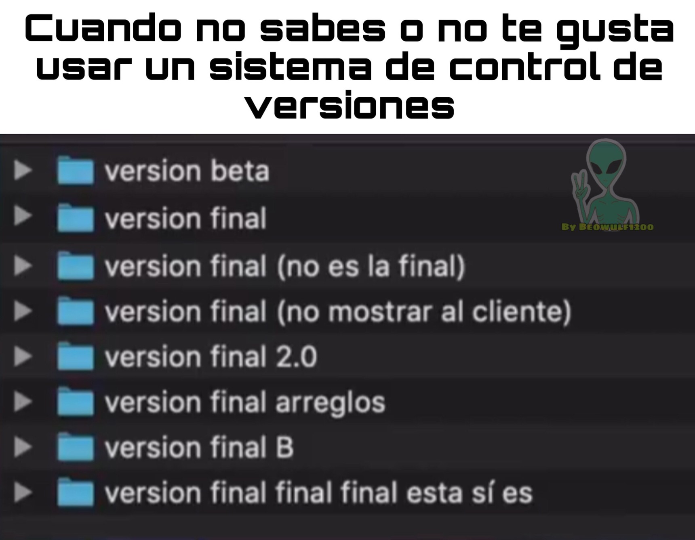
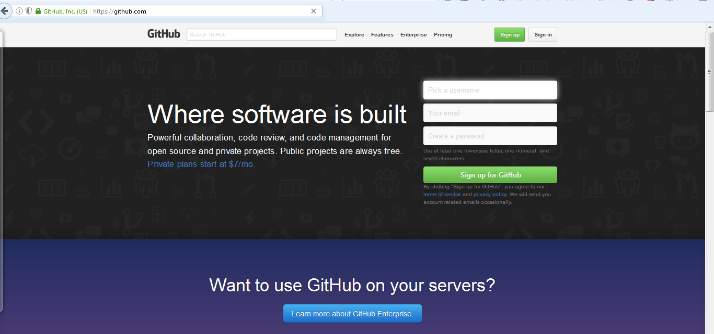
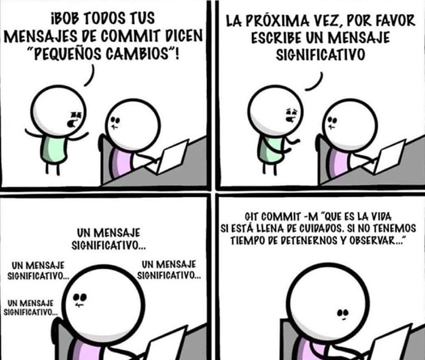
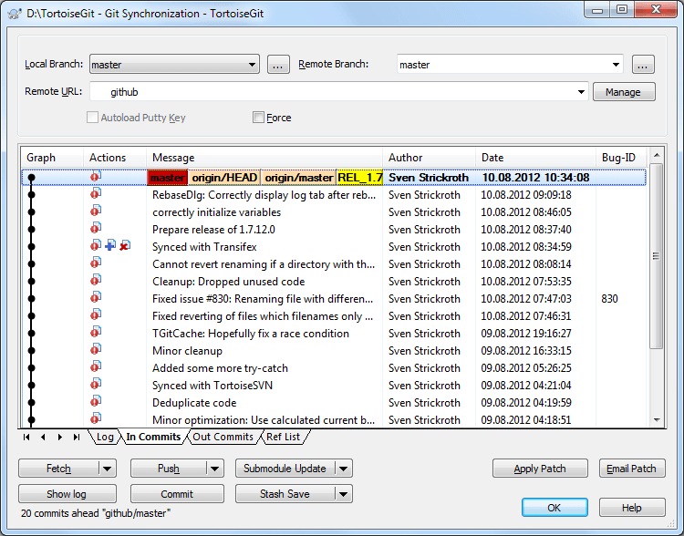
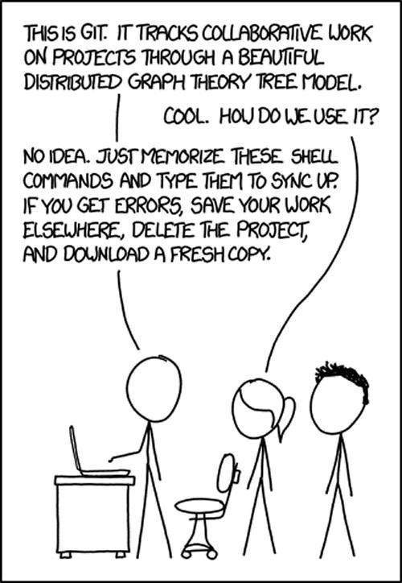
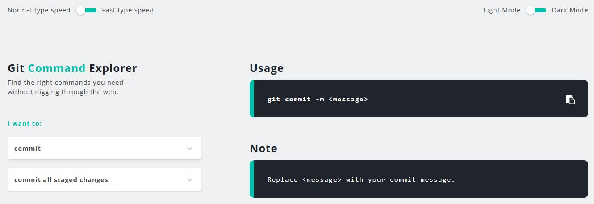
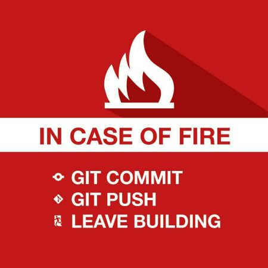

# Git: Sistema de Control de Versiones
Created by <i class="fab fa-telegram"></i>
[edme88]("https://t.me/edme88")

---
## Bibliografia
[](https://git-scm.com/book/en/v2)

---
<!-- .slide: style="font-size: 0.60em" -->
<style>
.grid-container4 {
    display: grid;
    grid-template-columns: auto auto auto auto;
    font-size: 0.8em;
    text-align: left !important;
}

.grid-item {
    border: 3px solid rgba(121, 177, 217, 0.8);
    padding: 20px;
    text-align: left !important;
}
</style>
## Temario
<div class="grid-container4">
<div class="grid-item">

### GIT
* Definición

[Ejercicio: Instalar Git](U2_git.html#/5)
* Configuración

[Ejercicio: Configurar Usuario](U2_git.html#/10)
* Servidores

[Ejercicio: Crear Cuenta Github](U2_git.html#/15)
* Estados 
* Comandos
</div>
<div class="grid-item">

### Comandos
* init 
* clone
* status
* add
* commit
* push
* pull
* log
* diff

[Ejercicio: Github Básico](U2_git.html#/32)
* Software VCS

[Ejercicio: Github Básico II](U2_git.html#/44)
* Sobre git
</div>
<div class="grid-item">

### Classroom
* Qué es?

[Ejercicio: Github Classroom](U2_git.html#/43)
* Cursos de git
</div>
</div>

---
## Git
* Sistema distribuido de control de versiones
* Libre
* Crea branches y hace merge rapido y fácil
* Cada "Clón" es un repositorio completo

]

---



---
### Instalar git en Windows
1. Ingresar a [https://git-scm.com/download/win](https://git-scm.com/download/win)
2. Descargar la versión **Standalone**
3. Durante la instalación dejar las opciones por defecto, excepto en el paso:
   * Git from the command line and also from 3rd-party software
   * Use Windows' default console windows
4. Abrir el **Cmd** o **Consola** o **Simbolos del Sistema** y escribir
```javascript
   git --version
```
<small> Deberas ver un texto como **git version 2.31.0.windows.1** </small>

---
## Ejercicio: Instalar Git
<iframe width="560" height="315" src="https://www.youtube.com/embed/WEUliO01zL4" frameborder="0" allow="accelerometer; autoplay; clipboard-write; encrypted-media; gyroscope; picture-in-picture" allowfullscreen></iframe>

---
### Instalar git en Mac
Ingresar a [https://git-scm.com/download/mac](https://git-scm.com/download/mac) para leer los pasos
1. Abrir el **BASH** o consola y escribir el comando para instalar **BREW** (gestor de paquetes)

```javascript
/bin/bash -c "$(curl -fsSL https://raw.githubusercontent.com/Homebrew/install/HEAD/install.sh)"
```
2. Instalar **brew** (gestor de paquetes)
```javascript
   brew install git
```

---
### Instalar git en Linux
Ingresar a [https://git-scm.com/download/linux](https://git-scm.com/download/linux) para leer los pasos
1. Abrir el **BASH** o consola y escribir
```javascript
   apt-get install git
```
o 
```javascript
yum install git
``` 
o el comando correspondiente con tu distribución de linux.

---
## git config
Este comando permite establecer una configuración específica de usuario, como email, nombre de usuario, tipo de formato, etc

Esta configuración se puede tener diferentes [alcances](https://www.theserverside.com/blog/Coffee-Talk-Java-News-Stories-and-Opinions/Where-system-global-and-local-Windows-Git-config-files-are-saved): system, **global**, **local**, worktree, portable.

---
## Git: Configuración Usuario
Desde la consola de comandos:
* Configurar usuario de manera Global

```javascript
   git config --global user.name "nombreUsuario"
   git config --global user.email miEmail@domain.com 
```
La palabra **global** puede ser reemplazada por local, worktree, portable o system según sea necesario.

* Ver configuración realizada
```javascript
   git config --list
```
---
## Ejercicio: Configurar Usuario
* Abre la consola de windows **cmd** (símbolo del sistema) o el Bash de Git (depende como lo instalaste)
* Configura tu usuario de git de manera global (Recuerda tu nombre de usuario e email usados. Posteriormente lo usaras para tu cuenta de GitHub)

---
## Ejercicio: Configurar Usuario
<iframe width="560" height="315" src="https://www.youtube.com/embed/R1DgidQBjgc" frameborder="0" allow="accelerometer; autoplay; clipboard-write; encrypted-media; gyroscope; picture-in-picture" allowfullscreen></iframe>

---
<!-- .slide: data-background="images/herramientas/servidoresGIT.png" -->
## Git: Servidores
* [Github](https://github.com/)
* [Bitbucket](https://bitbucket.org/)
* [GitLab](https://about.gitlab.com/)
* [GiTea](https://about.gitea.com/)
* [GitBucket](https://github.com/gitbucket/gitbucket)
* [GitPrep](https://github.com/yuki-kimoto/gitprep)
* [GNU Savannah](https://savannah.nongnu.org/projects/administration)

---
## Git: Servidores
Los servidores permiten tener almacenamiento virtual de tu proyecto. 
Puedes guardar versiones del código y accederlas cuando lo necesites. 

---
## Ejercicio: Creación de Cuenta en GitHub
Create una cuenta en [gitHub](www.github.com) ...**Sign up** ...for Free
Recuerda emplear el mismo nombre de usuario e email que tu usuario de github global.
Una vez creada tu cuenta, enviar el nombre usuario al Profe por email, así puede validarlo!
[](https://www.github.com)

---
## Ejercicio: Creación de Cuenta en GitHub
<iframe width="560" height="315" src="https://www.youtube.com/embed/2xr8dkuMb_c" frameborder="0" allow="accelerometer; autoplay; clipboard-write; encrypted-media; gyroscope; picture-in-picture" allowfullscreen></iframe>

---
## Los 3 estados + Untraking
* **Unmodified** los datos estan almacenados de manera segura en el repositorio
* **Modified** Se ha modificado el archivo pero todavía no se ha confirmado
* **Untrack** el archivo no lleva seguimiento de versionado

---
## Los 3 estados + Untraking


---
## Git: Comandos
Algunos comandos son:
* init
* clone
* add
* commit
* push
* pull
* log
* diff
etc, etc, etc

---
## git init
Permite crear un nuevo repositorio de git para comenzar a versionar los archivos.
````
git init
````

---
## git clone
Crea una copia local de un repositorio remoto.
````
git clone <repo url>
````
La última versión de los archivos del respositorio remoto se copian en nuestra computadora dentro de una nueva carpeta: NOMBRE_REPO

Si queremos que en nuestro local el proyecto/carpeta tenga otro nombre, podemos agregar un parámetro más:
````
git clone <repo url> nombre_carpeta
````

---
## git status
Muestra la lista de archivos que se han cambiado junto con los archivos que están por ser añadidos (add).
````
git status
````

---
## git add
Permite agregar archivos al index. Es decir, selecciona el/los archivos que seran versionados en el proximo commit.
````
git add mi_archivo.html
````

Puedes agregar espacio y el nombre de otros archivos, o en lugar de un archivo poner el nombre de una carpeta (se agrega TODO su contenido), o emplear:
````
git add .
````
para agregar TODOS los cambios (pero CUIDADO!!! no agregues archivos que no deseas).

---
## git commit
Permite guardar los cambios (versionar) en el repositorio local
````
git commit -m "Se agrego un elemento a la pagina"
````

---
## Commit
* Identificadores numéricos de 40bytes
* Identificación de la persona que realizo el commit (nombre y mail)
* Fecha del commit
* Mensaje de texto asociado al commit (comentario personal de los cambios)


---


---
## git push
Envia los cambios realizados al repositorio remoto.
````
git push
````

---
## git pull
Trae los cambios del repositorio remoto.
Debe emplearse, por ejemplo, cuando el repositorio remoto ha sido actualizado manualmente, o, en el caso del trabajo colaborativo, si nuestro compañero ha subido cambios con un push.
````
git pull
````
   
---
## git log
Muestra el historial del repositorio, un listado de todos los commits realizados, junto con detalles del autor y fecha del cambio.
````
git log
````

---
## git diff
Muestra los cambios que se realizaron en los archivos (con respecto al último commit)
````
git diff
````

---
#### Antes de comenzar... sabes usar lo básico de la consola???
| accion           | comando | Windows    | Mac        |
|------------------|---------|------------|------------|
| change directory | cd      | cd carpeta | cd carpeta |
| change directory a carpeta padres | cd.. | cd.. | cd .. |
| ver contenido de un directorio | dir | dir | ls |


---
## Ejercicio: Github Básico
* Crear un repositorio (inicializarlo)
* Clonar el repositorio
* Agregar archivo
* Guardar cambios en repositorio local
* Guardar el commit en el repositorio remoto
* En el navegador, visualizar los commits realizados
<!--(No te preocupes, hay un [PDF](https://drive.google.com/open?id=15WiD8tBJ1rZtosfbDFEaoFBBAbN8oJh5) con el paso a paso y capturas de pantalla)-->

---
## Ejercicio: Github Básico
````html
<!DOCTYPE html>
<html lang="es">
<head>
    <meta charset="UTF-8">
    <meta name="description" content="Free Web tutorials">
    <meta name="keywords" content="HTML,CSS,XML,JavaScript">
    <meta name="author" content="John Doe">
    <meta name="viewport" content="width=device-width, initial-scale=1.0">
</head>
<body>
</body>
</html>
````
---
## Ejercicio: Github Básico
<iframe width="560" height="315" src="https://www.youtube.com/embed/IxlMd1Mu_40" frameborder="0" allow="accelerometer; autoplay; clipboard-write; encrypted-media; gyroscope; picture-in-picture" allowfullscreen></iframe>

---
## Ejercicio: Github Básico
Con este ejercicio aprendimos los comandos para:
* Clonar un respositorio remoto
````
git clone https://github.com/mi_usuario/nombre_repositorio.git
````
* Verificar que archivos del repositorio cambiaron
````
git status
````

---
## Ejercicio: Github Básico
Con este ejercicio aprendimos los comandos para:
* Añadir el cambio al siguiente commit
````
git add nombre_archivo
````
* Guardar cambios en repositorio local
````
git commit -m "Comentario"
````
* Guardar el commit en el repositorio remoto
````
git push
````

---
## Ejercicio: Github Básico
Los siguientes comandos
* git clone
* git status
* git add
* git commit
* git push
### Es lo más importante de Git. APRENDANLO COMO SU NOMBRE!!!

---
## Y si no me gusta emplear lineas de comando?
Hay otras alternativas, como emplear softwares de VCS.

Sin embargo...la mayoría de interfaces gráficas de usuario solo implementan una parte de las características de Git por motivos de simplicidad.
Muchas veces cuando se presentan conflictos en estos softwares, por problemas de configuración o acciones mal realizadas, hay que solucionarlas por linea de comandos.

---
## por que debo emplear lineas de comando?
<!-- .slide: data-background="images/herramientas/hackerman.jpg" -->
Para sentirse como **Hackerman** xD

Aprendiendo **Git** por linea de comandos no dependeras de ningun software, y podras realizar TODAS las acciones.

---
## Esto de la linea de comandos sigue sin convencerme...
En la siguiente diapositiva tienes algunas opciones de software para VCS. Puedes probar y usar cualquiera :D
Depende de ti! (pero en clase solo veremos linea de comandos)

---
<!-- .slide: data-background="images/herramientas/SOFTsubversionado.png" -->
## Software para VCS
* Linea de Comandos
* GitHub for windows
* Tortoise
* SourceTree (BitBucket)
* GitKraken

----

## GitKraken


----

## SourceTree


----

## Git Tortoise


---


---
## Repaso de Terminología
* **Repositorio:** Colección de todas las referencias, base de datos, objetos y una copia de trabajo.
* **Commit:** Es una foto del proyecto en un tiempo determinado.
* **Tag (etiqueta):** Una etiqueta a un commit en particular
* **Ref o referencia:** Cadena de 40 bytes que representa una version/commit.

---
## Ejercicio: Github Básico II
* Realizar un cambio en el repositorio remoto
* Ver el repositorio local (esta ese cambio?)
* Traer los cambios del repositorio remoto al local
<!--(No te preocupes, hay un [PDF](https://drive.google.com/open?id=1fImvKA6bvFDLyq0-17OHXUeUGhJmJLBK) con el paso a paso y capturas de pantalla)-->

---
## Ejercicio: Github Básico II
<iframe width="560" height="315" src="https://www.youtube.com/embed/eqEVgp98qcY" frameborder="0" allow="accelerometer; autoplay; clipboard-write; encrypted-media; gyroscope; picture-in-picture" allowfullscreen></iframe>

---
## Sobre Git
Puedes versionar código, documentos de texto plano...

Pero recuerda que GIT no está optimizado para subir VIDEOS o imágenes muy pesadas, o archivos binarios (como instaladores).

Usa Git sabiamente pequeño padawan.

---
## Github
https://gitexplorer.com/


---
## GitHub Classroom
Plataforma que facilita el intercambio de código entre alumnos y docentes, manteniendolo versionado.

Permite el trabajo colaborativo, gestión de issues, code reviews, feedback, etc.

---
## Ejercicio: GitHub Classroom
* Crear un repositorio para los ejercicios de la materia, empleando el código base de los ejercicios (servira para avanzar con html, css, js más adelante).

[Link Classroom 2024](https://classroom.github.com/a/xxcqvYYq)

<!--Paso a paso aquí...[PDF](https://drive.google.com/open?id=1scW5JZ3puH0uPpmzckFkEgE8TjqSJbV8)-->

---
## Ejercicio: GitHub Classroom
<iframe width="560" height="315" src="https://www.youtube.com/embed/BH2V4aBNkYk" frameborder="0" allow="accelerometer; autoplay; clipboard-write; encrypted-media; gyroscope; picture-in-picture" allowfullscreen></iframe>

---


---
## Cursos de Git
* [TAU - Source Control for Test Automation with Git](https://testautomationu.applitools.com/git-tutorial/) 
* [Learn Git Branching](https://learngitbranching.js.org/)
* [Codecademy](https://www.codecademy.com/learn/learn-git)
* [Digital House](https://www.digitalhouse.com/ar)
* [Dev-talles](https://cursos.devtalles.com/courses/git-github-control-versiones)

---
## ¿Dudas, Preguntas, Comentarios?

