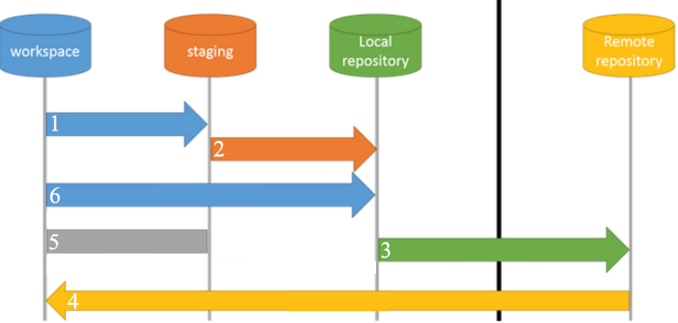
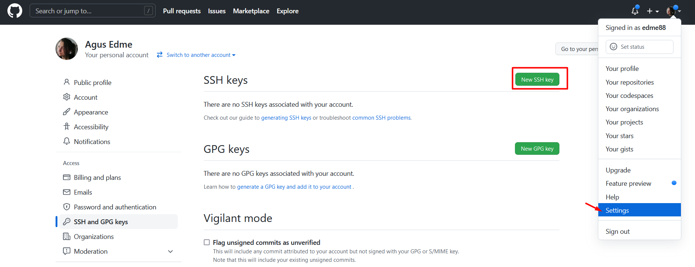
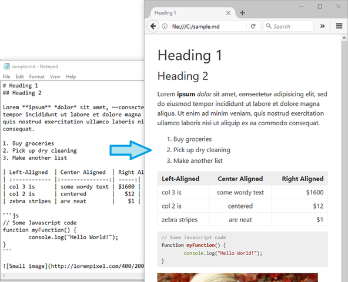
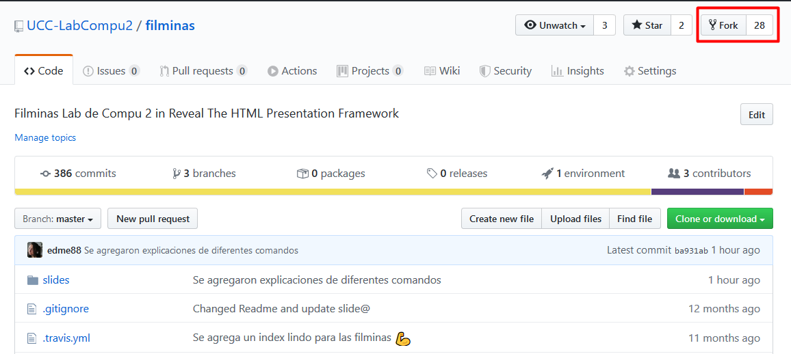
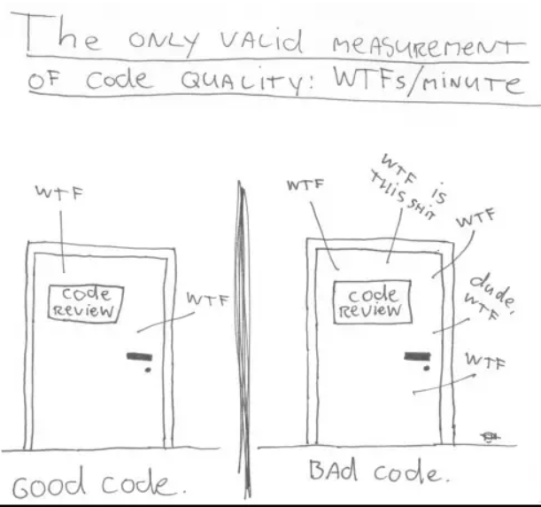
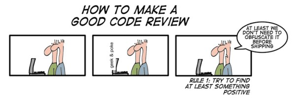
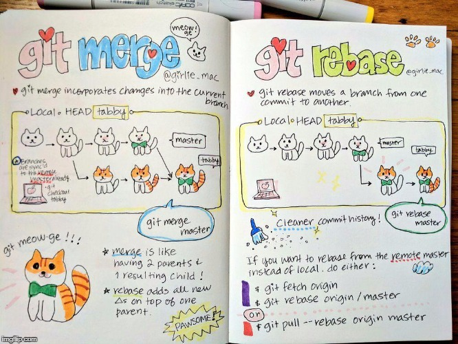

# Git (parte II)
Created by <i class="fab fa-telegram"></i>
[edme88]("https://t.me/edme88")

---
<!-- .slide: style="font-size: 0.60em" -->
<style>
.grid-container2 {
    display: grid;
    grid-template-columns: auto auto;
    font-size: 0.8em;
    text-align: left !important;
}

.grid-item {
    border: 3px solid rgba(121, 177, 217, 0.8);
    padding: 20px;
    text-align: left !important;
}
</style>
## Temario
<div class="grid-container2">
<div class="grid-item">

### GIT
* Repaso de comandos
* Autenticación Segura
    * PAT
    * 2 Factores
    * SSH
    * Ejercicio: Configurar SSH
* Readme.md

[Ejercicio: Escribir readme.md](U2_git_avanzado.html#/15)

</div>
<div class="grid-item">

* Git branch

[Ejercicio: Github Branch](U2_git_avanzado.html#/25)
* Fork
* Pull Request
* Code review
* .gitignore

[Ejercicio: .gitignore](U2_git_avanzado.html#/38)
</div>
</div>

---
### Qué comandos aprendimos la clase pasada?
<ul>
<li class="fragment">git config</li>
<li class="fragment">git init</li>
<li class="fragment">git add</li>
<li class="fragment">git commit</li>
<li class="fragment">git push</li>
<li class="fragment">git pull</li>
<li class="fragment">git log</li>
</ul>

---
### Cómo funcionan los comandos que aprendimos la clase pasada?


<small class="fragment">1 git add</small>
<small class="fragment">2 git commit -m</small>
<small class="fragment">3 git push</small>
<small class="fragment">4 git clone/pull</small>
<small class="fragment">5 git diff</small>
<small class="fragment">6 git commit -a -m</small>

---
### Git: Autenticación Segura
A partir de agosto/2021 github solicita un método seguro de autenticación, como:
1. PAT: Token de Acceso Personal
2. Autenticación de Dos Factores
3. **SSH**

---
### Pasos para generar el PAT
1. En **gitHub** entrar a la sección de Setting
2. En el menú de la izquierda ingresar a **Developer Setting**
3. Seleccionar **Personal Access Token**
4. Click en el botón **Generate New Token**

Ese token NO compartirlo con NADIE (es personal)

```javascript
git config --global user.password TOKEN_GENERADO_EN_GITHUB
```

---
### Y si empleo git en la facultad???
<!-- .slide: style="font-size: 0.75em" -->
Las computadoras están freezadas (por lo que los cambios se pierden al reiniciar el sistemas)
Podria hacerse la prueba de hacer un .bat y correrlo al principio de la clase para configurar github y bajar el repositorio.
```bash
@echo [off]
title config git account
git --version
git config --global user.name "nombreUsuario"
git config --global user.email miEmail@domain.com
git config --global user.password TOKEN_GENERADO_EN_GITHUB
git config --list
git clone URL_COPIADA_DE_GITHUB_PARA_CLONAR_EL_REPO
pause
```

---
### Pasos para autenticación de 2 Factores
Esta configuración es obligatoria desde agosto/2023
1. En **gitHub** entrar a la sección de Setting
2. En el menú de la izquierda ingresar a **Password and authentication**
3. Click en **Enable two-factor authentication**
4. Para configurarlo con mensaje desde el celular (o google authenticator, o microsoft authenticadtor), click en "Set up using SMS"


---
## SSH
**Secure Shell** es una forma de autenticarse en servidores remotos sin tener que escribir la contraseña siempre.

Funciona empleando 2 claves: la privada (solo para tí), la pública (para todo internet).

---
### [Como configurar SSH?](https://medium.com/humantodev/configurar-ssh-github-enwindows-10-linux-y-macos-e843eb6d104e#:~:text=%C2%BFQu%C3%A9%20es%20SSH%3F,(PARA%20TODA%20LA%20HUMANIDAD))
<!--https://platzi.com/tutoriales/1557-git-github/4067-configurar-llaves-ssh-en-git-y-github/?gclid=EAIaIQobChMI35TBz4ij9gIVgwWRCh1ddwUPEAAYAiAAEgJJJfD_BwE&gclsrc=aw.ds-->
<!-- .slide: style="font-size: 0.60em" -->

1. Abrir CMD
2. Correr el comando
````
ssh-keygen -t rsa -b 4096 -C "tu@email.com"
````
    - La terminal responde: Generating public/private rsa key pair.
    - Enter file in which to save the key: **ENTER**
    - Enter passphrase (empty for no passphrase): **ENTER**
    - Your identification has been saved in cd .ssh.
    - Your public key has been saved in cd .ssh.pub.
    - The key fingerprint is: SHA256:.......
3. Correr el comando
````
cd .ssh
````
4. Correr el comando
````
more id_rsa.pub
````
5. Copiar el texto que dice "ssh-rsa BLA BLA"
6. Ingresar a gitHub, Setting, SSH and GPG Keys, New SSH Key, pegar la clave

---
## SSH en GitHub


---
## Readme.md
<!-- .slide: style="font-size: 0.80em" -->
Seguramente te estes preguntando: qué es ese readme.md que se autogeneró? 
Es un archivo que deberian tener todos los proyectos de Soft. El mismo se supone que sea una:
* Guía rápida de la aplicación o librería y de cómo empezar a usarla.
* Instrucciones de configuración, instalación, operación, manifiesto de archivos, información sobre licencia y el desarrollador, bug conocidos, solución a problemas, créditos y agradecimientos, registro de cambios o versiones (ChangeLog), sección de noticias, etc.

<!--https://jesuslc.com/2016/07/12/como-escribir-un-readme-que-mole/-->

---
## Ejemplos de Readmes
[RevealJS](https://github.com/hakimel/reveal.js)

[MelonJS](https://github.com/melonjs/melonjs)

---
## Markdown
Markdown es una forma de estilo de texto en la web, que permite controlar la visualización del documento; dar formato a 
las palabras en negrita o cursiva, agregar imágenes y crear listas.
 
En su mayoría, Markdown es solo texto normal con algunos caracteres no alfabéticos, como # o * que permiten formatear el 
texto.


---
## Readme.md


[Visualizador de Markdown](https://dillinger.io/)

---
## Ejercicio Readme.md
* Agregar títulos secundarios:
 * Autor
 * Contenido/Descripción
* Agregar los autores con items
* Poner los apellidos de los autores en negrita
* Agregar un link del aula virtual
* Agregar info de contacto en una tabla
* Agregar [emoji](https://github.com/ikatyang/emoji-cheat-sheet/blob/master/README.md)

---
## Ejercicio Readme.md
<iframe width="560" height="315" src="https://www.youtube.com/embed/NlmsWZmC_IQ" title="YouTube video player" frameborder="0" allow="accelerometer; autoplay; clipboard-write; encrypted-media; gyroscope; picture-in-picture" allowfullscreen></iframe>

---
## Git Brach
Branch significa **rama**. 
Las ramas son caminos que puede tomar el desarrollo de un software, algo que ocurre generalmente para resolver problemas o crear nuevas funcionalidades. 

Las **branch** permiten que nuestro proyecto pueda tener diversos estados y que los desarrolladores sean capaces de pasar de uno a otro de una manera ágil.

El **branching** permite el desarrollo en paralelo sin interferencia entre las diferentes ramas. 

---
## Git Brach
Cuando se crea un repositorio, por defecto se emplea la rama principal **master** (en local) o **main** (en remoto). 

Podemos verificar esto entrando a nuestro repositorio (ejercicio1), y escribiendo:
```
git branch
```

---


---
## Branching
* Master/main: Contiene una versión estable y funcional del código.
* Se pueden crear ramas para desarollar nuevas funcionalidades **feature**
* En equipos de trabajo, Se puede crear una rama para cada desarrollar o **developer**
* Se pueden crear ramas para trabajar en soluciones a los defectos o errores encontrados, **hotfix**

---
## Comandos de Branch
* branch
* checkout
* merge
* push

---
## git branch
Permite visualizar en que rama se está trabajando
````
git branch
````
ó, Permite crear una rama nueva
````
git branch nombre_rama
````

---
## git checkout
Permite movernos de una rama a otra
````
git checkout nueva_rama
````

---
## git merge
A medida que crees ramas y cambies el estado del las carpetas o archivos tu proyecto empezará a divergir de una rama a otra. 
Llegará el momento en el que te interese fusionar ramas para poder incorporar el trabajo realizado a la rama master. 

Parados en la rama **master**:
````
git merge nueva_rama
````

---
## Ejercicio: Github Branchs
Empleando el repositorio ejercicio 1:
* Visualizar en que rama estamos trabajando
* Cree una nueva rama (develop)
* Vea el listado de todas las branchs
* Cambie de rama
* Realice algún cambio en el código y commit al repositorio local
* Visualice en Github los commits de las branchs
* Merge de la nueva rama con Master
* Borrar una branch

---
## Ejercicio: Github Branchs
<iframe width="560" height="315" src="https://www.youtube.com/embed/2KXSZtjzgkA" title="YouTube video player" frameborder="0" allow="accelerometer; autoplay; clipboard-write; encrypted-media; gyroscope; picture-in-picture" allowfullscreen></iframe>

---
## Repaso de Terminología
* **Branch (rama):** Linea de desarrollo del proyecto
* **Merge:** Mezcla código de 2 ramas

---
## Fork
Alguna vez te pasó que en **GitHub** encontraste un código que te era de utilidad? 

Quizás encontraste un código de un juego y te dijiste: "Quiero hacer mi propia versión"?

O un proyecto que era interesante y querias hacer tus propias pruebas? 

Esto se soluciona con un **fork**!!!

---
## Fork
Hacerle **fork** a un repositorio significa copiarlo. Así podemos modificar el código sin afectar al proyecto original.

Se utiliza para proponer cambios en el proyecto de otra persona u organización ó para utilizar el proyecto de otra 
persona como punto de partida para nuevas ideas.

---
## Fork: Ejemplo
Si quisieras investigar como hacer filminas con tecnología markdown, podrías emplear este [repositorio](https://github.com/UCC-LabCompu2/filminas)


---
#### Hice un cambio muy bueno en el repositorio, y quisiera que el autor original del código incorpore ese cambio?!?
Esto se soluciona con un **pull request**

---
## Pull Request
Un pull request es una petición que el propietario de un fork de un repositorio hace al propietario del repositorio 
original para que este último incorpore los commits que están en el fork.

También se denomina pull request a una solicitud que se realiza de una branch a otra para mergearse (generalmente 
después de un code review y si no se tienen permisos de merge a master).

<!--http://aprendegit.com/que-es-un-pull-request/-->
---
## Code Review
Todo buen PR, requiere code review, es decir, que otro dev revise el código que desarrollamos, previo a mergear la rama.

Ayuda a detectar errores en el código (lógicos, ortografía, funcionalidad), previo a su pase a producción. 

El revisor puede aprobar el código y mergearlo, o solicitar al dev que realice correcciones. Todo push que se realice, se agregará al PR mientras este esté abierto.

---
## Code Review


---
## Code Review


---
## .gitignore
El archivo "gitignore" sirve para decirle a Git qué archivos o directorios completos debe ignorar y no subir al repositorio de código. 

Puede que no sea necesario versionar esos archivos porque: son privados y no se desea compartir, son archivos binarios 
con datos que no se desea versionar (instaladores, diagramas, etc).

---
## Ejercicio: .gitignore
* Crear un archivo .gitignore
* Incluir el nombre de la carpeta que se desea ignorar
* Subir los cambios al repositorio remoto

---
## Ejercicio: .gitignore
<iframe width="560" height="315" src="https://www.youtube.com/embed/1yGiz06KKRo" title="YouTube video player" frameborder="0" allow="accelerometer; autoplay; clipboard-write; encrypted-media; gyroscope; picture-in-picture" allowfullscreen></iframe>

---
#### Sigo sin enter como funcionan las ramas con los comandos...
* push
* pull
* merge

No te preocupes, te lo explicamos con gatitos (si, nada que tenga gatitos puede fallar!)


---   


---


---

 
---
## +
Existen muchos comandos de git, y parámetros que se pueden agregar a comandos ya existentes, pero has aprendido lo básico 
(e inclusive un poquito más) para que puedas trabajar versionando tus proyectos de software.
 
---
## ¿Dudas, Preguntas, Comentarios?

