# Herramientas de Desarrollo
Created by <i class="fab fa-telegram"></i>
edme88

---
<style>
.grid-container5 {
    display: grid;
    grid-template-columns: auto auto auto auto auto;
    font-size: 0.8em;
    text-align: left !important;
}

.grid-container2 {
    display: grid;
    grid-template-columns: auto auto;
    font-size: 0.8em;
    text-align: left !important;
}

.grid-item {
    border: 3px solid rgba(121, 177, 217, 0.8);
    padding: 20px;
    text-align: left !important;
}
</style>
<!-- .slide: style="font-size: 0.60em" -->
## Temario
<div class="grid-container5">
<div class="grid-item">

### Herramientas de Desarrollo
* Definición
* Categoría de herramientas
</div>
<div class="grid-item">

1. IDE
2. Control de Versiones
3. Repositorios de Código
4. Gestión de Incidencias
5. Gestión de proyectos
6. Documentación

</div>
<div class="grid-item">

7. Integración Continua
8. Despliegue Continuo
9. Automatización de pruebas
10. Pruebas de desempeño, carga, stress
11. Análisis estático de código

</div>
<div class="grid-item">

12. Depuración (Debugging)
13. Administración de dependencias
14. Automatización de compilación
15. Contenedores y virtualización
16. Orquestación de contenedores

</div>
<div class="grid-item">

17. Monitoreo y observabilidad
18. Registro de eventos
19. Gestión de API
20. Comunicación
21. Diseño y prototipado
- Otras herramientas

</div>
</div>

---
## Herramientas de Desarrollo

Conjunto de recursos que facilitan y agilizan el desarrollo, mantenimiento y prueba del software.

Acompañan al desarrollador desde la escritura del código hasta su despliegue y monitoreo.

Una aplicación o programa puede contar con múltiples herramientas que se encarguen de funciones específicas y afines para realizar una tarea.

---
## Categoría de Herramientas

<div class="grid-container2">
<div class="grid-item">

1. IDE
2. Control de Versiones
3. Repositorios de Código
4. Gestión de Incidencias
5. Gestión de proyectos
6. Documentación
7. Integración Continua
8. Despliegue Continuo
9. Automatización de pruebas
10. Pruebas de desempeño, carga, stress
11. Análisis estático de código
12. Depuración (Debugging)

</div>
<div class="grid-item">

13. Administración de dependencias
14. Automatización de compilación
15. Contenedores y virtualización
16. Orquestación de contenedores
17. Monitoreo y observabilidad
18. Registro de eventos
19. Gestión de API
20. Comunicación
21. Diseño y prototipado

</div>
</div>

---
## 1. Ambiente de Desarrollo Integrado o IDE
Es un software que proporciona servicios integrales para facilitarle al programador el desarrollo de software.

Un IDE combina varias herramientas en una sola interfaz: editor, compilador, depurador y más. Esto mejora la productividad y reduce errores al centralizar el desarrollo.

----

## 1. Ambiente de Desarrollo Integrado o IDE
Normalmente, un IDE consiste de:
* Editor de código fuente
* Herramientas de construcción automáticas
* Depurador o Debugger
* Compilador
* Intérprete

----

## 1. Editor de código fuente
Es un "editor especializado" orientado para escribir código fuente de aplicaciones en general en lenguajes de programación.

Generalmente los editores de código soportan varios lenguajes y son capaces de abrir varios archivos a la vez, resaltar su sintaxis y ofrecer ayudas contextuales a la hora de escribir o visualizar el código de las aplicaciones.

----

## 1.Depurador o Debugger
Permite probar y eliminar los errores del programa.

El depurador permite detener el programa en un punto determinado o en un momento determinado para que el usuario pueda 
examinar y modificar la memoria y las variables del programa, cambiar punto de ejecución, ejecutar una instrucción o 
partes determinadas de código.

----


----

## 1. Compilador
Traduce del lenguaje de programación al lenguaje máquina, código intermedio o texto.

* **Lenguajes compilados:** C, C++, Go, Rust, Fortran, Pascal, Visual Basic.
* **Lenguajes interpretados:** Python, JavaScript, Ruby, PHP.

----


----

## 1. Intérprete
Realiza la traducción a medida que sea necesaria, instrucción por instrucción y no guardan el resultado de la traducción.

Los programas interpretados suelen ser más lentos que los compilados debido a la necesidad de traducir el programa 
mientras se ejecuta, pero son más flexibles permitiendo reemplazar partes del programa.

Uno de los entornos más comunes de uso de los intérpretes es en los navegadores web, debido a que se ejecutan independientemente de la plataforma.

----

<!-- .slide: data-background="images/herramientas/IDES.png" -->
## 1. IDE's
Ejemplos de IDE's para desarrollo Web:
* [Cursor (The AI Code Editor)](https://cursor.com/)
* [JetBrains Web Storm](https://www.jetbrains.com/es-es/webstorm/download/#section=windows)
* [Microsoft Visual Studio Code](https://code.visualstudio.com/)
* [Sublime Text](https://www.sublimetext.com/)
* [Eclipse](https://www.eclipse.org/downloads/)
* [Net Beans](https://netbeans.apache.org/download/index.html)

----

### 1. IDE: Extensiones o plugins

Los IDEs modernos permiten instalar extensiones que agregan soporte para nuevos lenguajes, linters, herramientas de testing, snippets, etc.

Ejemplos: Prettier, ESLint, Live Server (en VSCode)

----

<!-- .slide: data-background="images/herramientas/Busydesk-desarrollo.png" -->
## 1. IDE's
No existe un IDE perfecto. El mejor será el que se adapte a tu flujo de trabajo, tus herramientas y tu nivel de experiencia.

---

### Actividad 1.1: Instalación de VSCode

1. Ingresa a https://code.visualstudio.com/
2. Descarga el instalador del **Visual Studio Code**
3. Instálalo!
4. Abrí VSCode y explorá brevemente la interfaz: barra lateral, explorador, terminal y sección de extensiones.


----

### Actividad 1.2: Instalación de Extensiones

1. Abre el **Visual Studio Code**
2. Ingresa a la sección de **Extensiones** (puedes presionar Ctrl+Shift+X)
3. Busca e instala las siguientes extensiones:
   * Color the tag name
   * ESLint
   * GitLens
   * HTML CSS Support
   * Material Icon Theme
   * Prettier

----

### Linter
Es un analizador de código estático, es una herramienta de software que verifica y analiza el código fuente de un programa en busca de posibles errores, problemas de estilo y faltas de las convenciones de codificación.

Su propósito es mejorar la calidad y legibilidad del código.

En **JavaScript** la herramienta más empleada es **ESLint**

----

### Prettier
Es un formateador de código, que permite que todo el equipo de desarrollo cumpla con los estándares de codificación definidos sin necesidad de acciones manuales.

Prettier es compatible con múltiples frameworks de JavaScript (Angular, React, Vue y Svelte) y también funciona con TypeScript.

----

### ¿Por qué usar VSCode?

* Es un IDE liviano que consume pocos recursos.
* Es **gratis** y ampliamente usado en el desarrollo profesional
* Posee muchos pluggins o extensiones que amplian su uso

---

### Actividad 1.2: Instalación de WebStorm

1. Ingresa a https://www.jetbrains.com/webstorm
2. Descarga el instalador del **WebStorm**
3. Instálalo!
4. En la página de **WebStorm** ingresa a **Education** -> Free Licenses (For students)
5. Click en "Request now"
6. Completa los datos para aplicar a la licencia! Es importante que uses el email institucional que contiene **.edu**
7. Abrí WebStorm y explorá brevemente la interfaz

----

### ¿Por qué usar WebStorm?

* Análisis estático de código más profundo.
* Integración nativa con herramientas frontend.
* Refactorización más robusta.

---
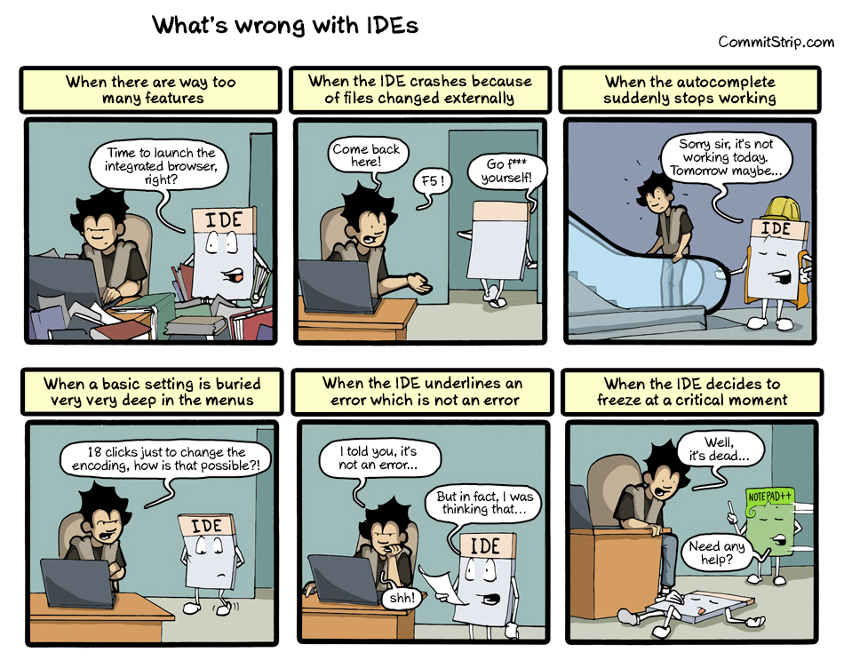

---
## 2. Gestión de Versiones o VCS
Permiten gestionar los cambios en los archivos de un proyecto a lo largo del tiempo, facilitando el trabajo colaborativo
y el acceso remoto al código fuente.

----

## 2. Gestión de Versiones o VCS
Los usuarios pueden:
* Clonar o descargar archivos del repositorio
* Editar y guardar cambios localmente
* Publicar (subir) sus cambios al repositorio remoto
* Consultar el historial y volver a versiones anteriores 
* Crear ramas (branches) para desarrollar nuevas funcionalidades
* Unificar cambios provenientes de diferentes ramas

----

### Un VCS funciona como una máquina del tiempo para tus archivos. Podés ver, comparar o volver a cualquier momento del proyecto.

----

<!-- .slide: data-background="images/herramientas/subversionado.png" -->
## 2. Ventajas de VCS:
* Permite llevar cuenta de los cambios de un conjunto de archivos digitales en el tiempo.
* Cada conjunto de cambios registrados en un momento específico se denomina revisión o commit.
* Permite tanto a un desarrollador como a un grupo de desarrolladores, gestionar el código del proyecto.
* Facilita la colaboración sin sobrescribir el trabajo de otros/as, gracias al control de ramas.

----

## 2. Herramientas de VCS
* Git
* ~~SVN~~
* ~~Mercurial~~
* ~~Bazaar~~

----

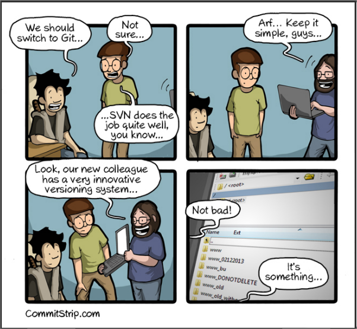

---

## 3. Repositorios de Código
Sitio de almacenamiento digital donde se guardan, organizan y administran los archivos de un software.

----

## 3. Repositorios de Código: Ejemplos
* GitHub
* GitLab
* Bitbucket
* Azure Repos

---

## 4. Gestión de Incidencias o Bug Tracker
Es una herramienta de seguimiento de errores, que permite registrar, clasificar, asignar y resolver defectos detectados durante el desarrollo o prueba del software.

Un buen BTS no solo organiza errores, también ayuda a establecer prioridades, gestionar tiempos de resolución y comunicar avances.

----

## 4. Ejemplos de Bug Tracker
* Jira
* Azure
* Bugzilla
* Flyspray
* Trac
* The bug Genie
* MantisBT
 
----

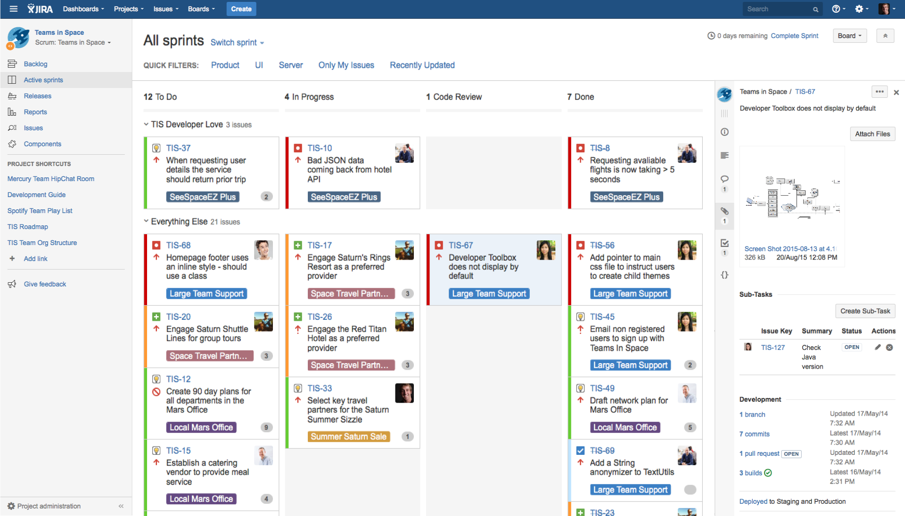

----

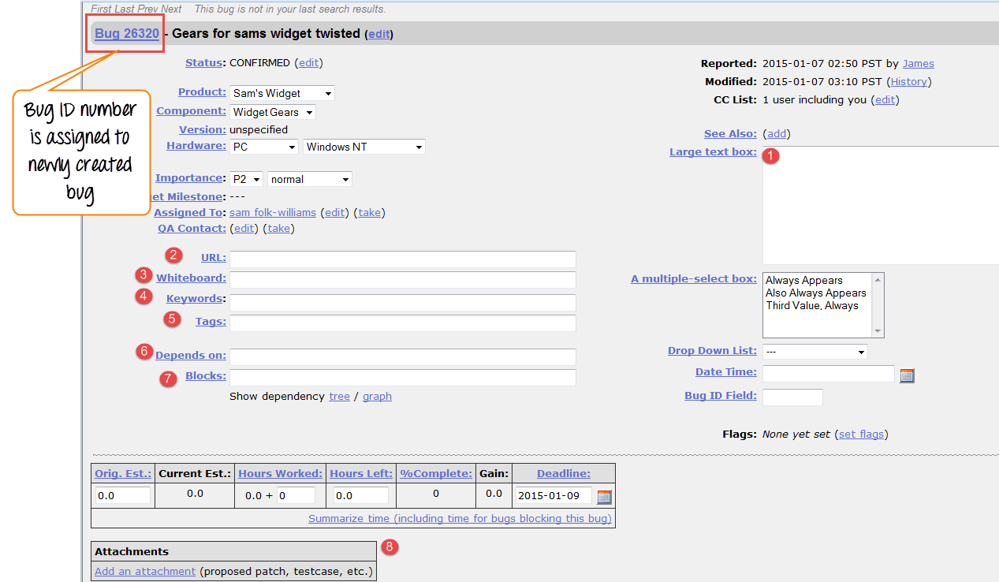

----

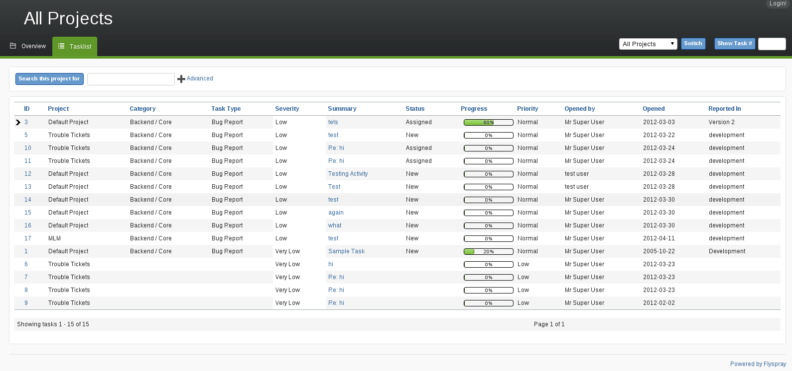

----

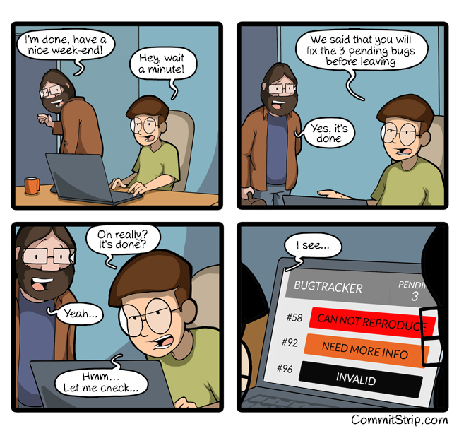

---

### Ejercicio: Jira 1
1. El docente ingresará a la página de [Jira](https://www.atlassian.com/es/software/jira) 
y creará un espacio de trabajo/proyecto
2. El docente invitará a los alumnos al proyecto
3. Los alumnos se dividirán en grupos de 5, donde cada uno tome un rol: 
frontend dev, backend dev, base de datos, qa, full stack, y crearán tareas para el desarrollo de un software
de venta de productos.

----

### Ejercicio: Jira 2
1.  Crea **Story** por cada tarea que se desea desarrollar: Título, descripción
2. Asignale un **responsable**
3. Coloca **tags** relacionados
4. Asegurate de que la tarea esté en la columna correspondiente

---

## 5. Gestión de proyectos
Ayuda a planificar, organizar y seguir el trabajo en equipo.

----

## 5. Gestión de proyectos
* Jira
* Trello
* Asana
* Azure Boards

---
## 6. Documentación

Puede ser del **proyecto** o del **código**, cada uno tiene un objetivo diferente y se emplean herramientas diferentes.

----

## 6. Documentación del Proyecto

- Confluence
- MkDocs
- Docusaurus
- Notion

----

## 6. Documentación de Código
   
Permite:
* Entender **qué** se está haciendo y por qué
* Mantener el código a lo largo del tiempo

**Documentar ayuda tanto al equipo como a tu “yo del futuro”**

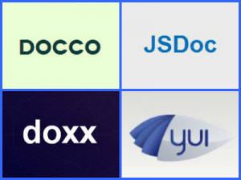

----

## 6. Niveles de Documentación
* **Por clase:** incluir una descripción general, autor, fecha y última modificación.
* **Por método:** detallar su función, parámetros y lo que retorna.
* **Variables importantes:** especialmente si son complejas o no evidentes.
* **Limitaciones del código:** advertencias o restricciones relevantes.
* **Algoritmos implementados:** describir la lógica general si no es trivial.

----

## 6. Formato de Documentación (JSDoc)
```javascript
/**
* @fileoverview Librería con funciones de utilidad
* @author Jose
* @version 0.1
*/
   /**
   * Muestra un mensaje de texto
   * @param {String} método nombre del método
   * @param {String} mensaje mensaje a mostrar
   * @returns {integer} el codigo de retorno 0
   */
   function trazas(metodo, mensaje){
       alert("["+metodo+"]:"+mensaje);
       return 0;
   }
```

----

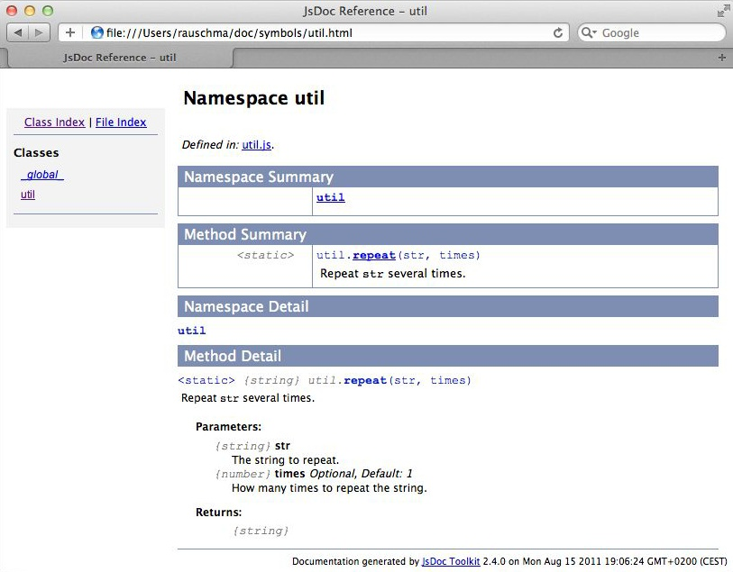

----

## 6. Documentación...A tener en cuenta
* No uses solo una línea, divídela en párrafos para que sea mas legible
* Tabular los comentarios de líneas consecutivas
* No comentar obviedades
* Se profesional (No insultes o coloques frases fuera de contexto)
* Revisa la ortografía

----

## 6. Documentación...A tener en cuenta
* No comentes si no es necesario
* Comentarios simple y directo
* Documenta mientras desarrollas
* Manten los comentarios actualizados

----

````javascript
return 1; # returns 1
stop(); // Hammertime!
long long ago; /* in a galaxy far far away */
//This code sucks, you know it and I know it.
//Move on and call me an idiot later.
/////////////////////////////// this is a well commented line
// I don't know why I need this,
//but it stops the people being upside-down
x = -x;
````

[más ejemplos](http://stackoverflow.com/questions/184618/what-is-the-best-comment-in-source-code-you-have-ever-encountered%3E)

----

Si empleas **VSC** es recomendable tener la extensión **Better Comments** para visualizar los comentarios con el highlight adecuado.

----


----


---

## 7. Integración Continua
Es una práctica del desarrollo de software en la que los cambios de código se integran frecuentemente en un repositorio 
compartido y luego se verifican automáticamente mediante pruebas, builds u otros procesos.

----

## 7. Integración Continua

<div class="grid-container2">
<div class="grid-item">

### Servidor Propio
* GitLab CI
* Jenkins
* Drone.io

</div>
<div class="grid-item">

### Cloud
* Github Actions
* Azure Pipelines
* Travis CI
* Codeship
* CircleCI

</div></div>

----


----

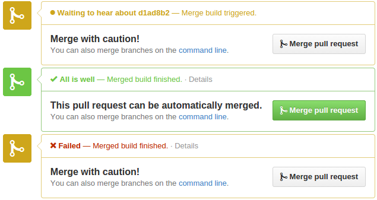

----

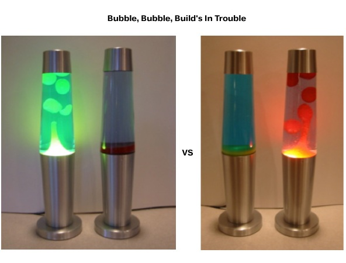

----

[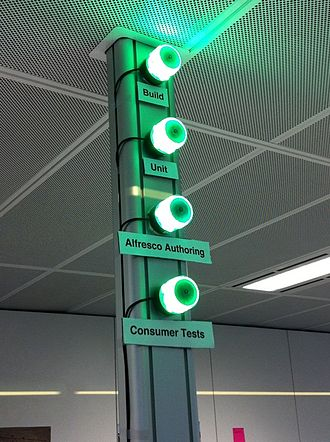](https://en.wikipedia.org/wiki/Build_light_indicator)

---

## 8. Entrega Continua
Es un enfoque en que los equipos de desarrollo producen software en ciclos cortos, asegurando que el software puede ser liberado de forma confiable en cualquier momento.

Apunta a la construcción, prueba, y liberación del software de forma más rápida y más frecuente.

----

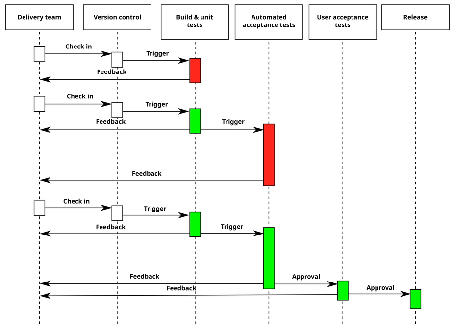

---

## 9. Automatización de pruebas
Utiliza software especial y scripts para ejecutar validaciones y comparar resultados reales con los esperados sin intervención humana. Los componentes clave son pruebas unitarias, de integración y de extremo a extremo.

----

## 9. Automatización de pruebas: Beneficios
- Velocidad: Ejecución masiva en segundos o minutos.
- Precisión: Menos errores humanos en tareas repetitivas.
- Mejora en la calidad percibida

----

## 9. Automatización de pruebas
- Selenium
- Cypress
- Playwright
- Robot Framework
- JUnit 
- TestNG
- Jest
- Etc...

---
## 10. Herramientas para prueba de Desempeño o Performance
Tipos principales:

- **Load Test:** Evalúa cómo responde el sistema ante una carga esperada, simulando condiciones reales de producción.
- **Stress Test:** Aplica una carga mayor a la esperada para detectar el punto de ruptura del sistema.
- **Endurance (Resistencia):** Analiza el rendimiento cuando el sistema está bajo carga continua durante un período prolongado.

----

## 10. Prueba de Desempeño o Performance
Estas pruebas ayudan a:
- Identificar cuellos de botella.
- Medir el consumo de recursos.
- Garantizar estabilidad bajo presión.

----

## 10. Herramienta para Stress Test
* Apache JMeter
* SmartMeter.io
* LoadUI
* WebLOAD
* LoadRunner
* Appvance
* NeoLoad
* LoadComplete

----

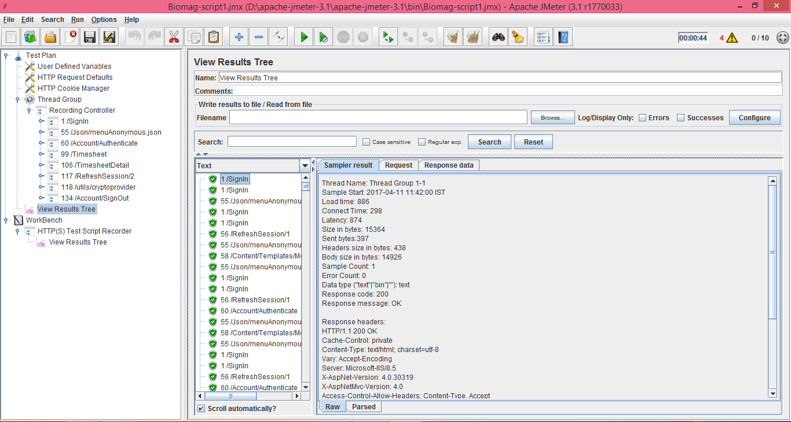

----

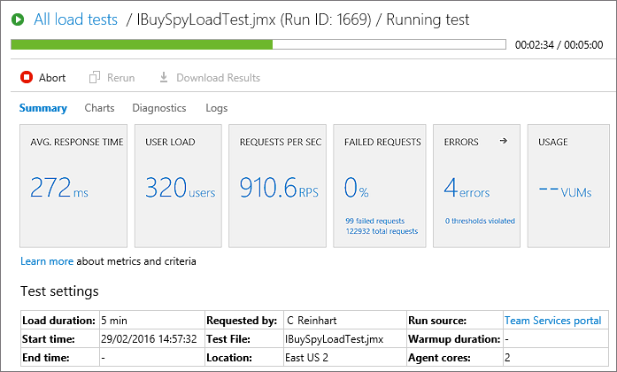

----

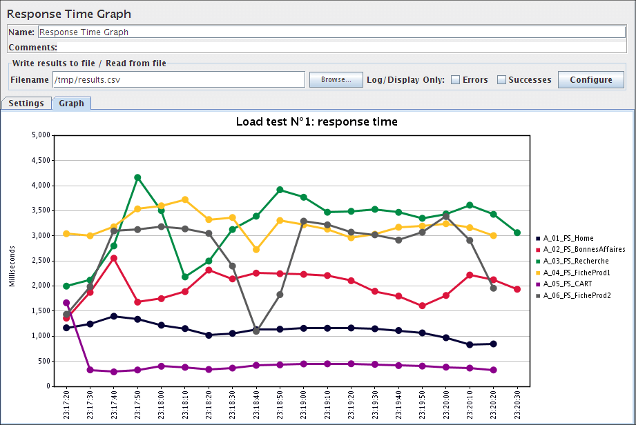

---

## 11. Análisis estático de código
Es la revisión del código fuente sin ejecutar el programa, utilizando herramientas automáticas para detectar fallos, vulnerabilidades de seguridad y malas prácticas desde las primeras etapas del desarrollo

----

## 11. Análisis estático de código: Ventajas
- **Detección temprana:** Encuentra errores antes de ejecutar el programa o llevarlo a producción.
- **Seguridad:** Identifica vulnerabilidades críticas como inyecciones SQL o fallos de tipo XSS.
- **Calidad y estilo:** Mantiene un estilo de código uniforme y evita duplicaciones.

----


### 11. SonarQube 
Es una plataforma de análisis de código estático de código abierto que ayuda a los desarrolladores a identificar y corregir problemas de calidad y seguridad en su código. Se integra con herramientas de desarrollo y pipelines.

----

### 11. SonarQube: Beneficios
<!-- .slide: style="font-size: 0.80em" -->
- **Análisis de calidad de código:** Detecta errores, vulnerabilidades, code smells, duplicaciones, cobertura de pruebas y complejidad. 
- **Seguridad del código:** Identifica vulnerabilidades de seguridad en el código. 
- **Integración con herramientas:** Se integra con IDEs, sistemas de construcción y plataformas CI/CD. 
- **Informes y paneles de control:** Genera informes detallados sobre la calidad del código y permite la creación de paneles personalizados. 
- **Mejora continua:** Permite a los equipos de desarrollo mejorar continuamente la calidad de su código con retroalimentación en tiempo real. 

----

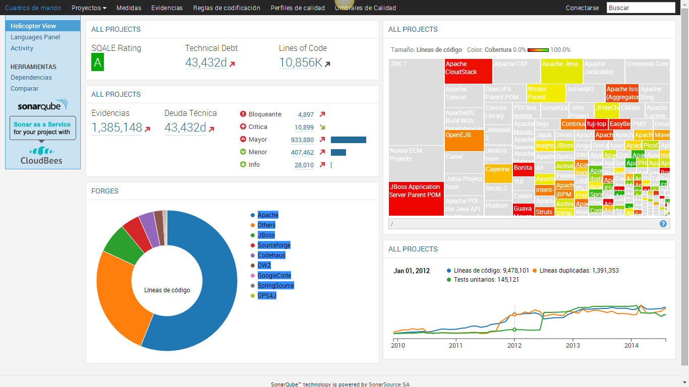

---

## 12. Depuración o Debugging
Es el proceso de encontrar, analizar y corregir fallos o errores en el código fuente de un programa.
Cuenta con:
- **Puntos de ruptura (breakpoints):** marcas para pausar el código en una línea específica y revisar qué pasa allí.
- **Consola o registros (logs):** textos impresos en pantalla para ver el valor de los datos mientras corre el programa.

----

## 12. Depuración o Debugging
- GDB
- Chrome DevTools
- Visual Studio Debugger

----

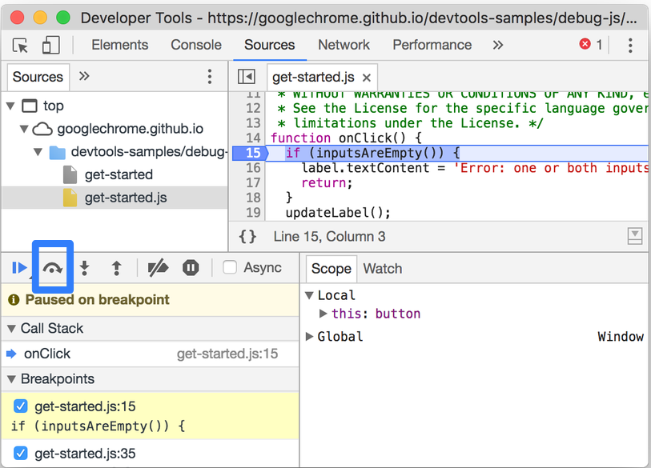

---

## 13. Administración de dependencias
Es el proceso de identificar, instalar, actualizar y rastrear sistemáticamente las bibliotecas, módulos o paquetes externos de terceros que una aplicación requiere para su correcto funcionamiento.

----

## 13. Administración de dependencias
- **Gestores de paquetes:** Herramientas que automatizan la descarga e instalación (ej. npm, pip, Maven).
- **Archivos de manifiesto:** Documentos de configuración donde se listan los módulos requeridos y sus rangos de versión tolerados (ej. package.json, requirements.txt, pom.xml).
- **Archivos de bloqueo (Lockfiles):** Archivos que congelan las versiones exactas instaladas en un momento dado para garantizar la replicabilidad del entorno (ej. package-lock.json, poetry.lock).

----

## 13. Administración de dependencias
- npm
- Maven
- Gradle
- NuGet
- pip
- Composer

---

## 14. Automatización de compilación (Build Tools)
Es el proceso de usar programas para convertir el código fuente en aplicaciones listas para usar sin intervención manual

----

## 14. Automatización de compilación (Build Tools)
Las funciones principales son:
- **Gestión de dependencias:** Descarga y organiza librerías externas de forma automática.
- **Compilación:** Transforma el código fuente legible por humanos en código binario o ejecutable.
- **Pruebas y empaquetado:** Ejecuta tests unitarios y agrupa los archivos en paquetes listos para enviar a producción.

----

## 14. Automatización de compilación (Build Tools)
- **Java:** Maven y Gradle
- **JavaScript / Frontend:** Webpack, Vite y Gulp.
- **C / C++:** Make, CMake y MSBuild

---

## 15. Contenedores y virtualización
Son formas de aislar programas.
- **Virtualización** emula hardware físico completo con su propio sistema operativo.
- **Contenedores** comparten el núcleo del sistema operativo del servidor anfitrión

----

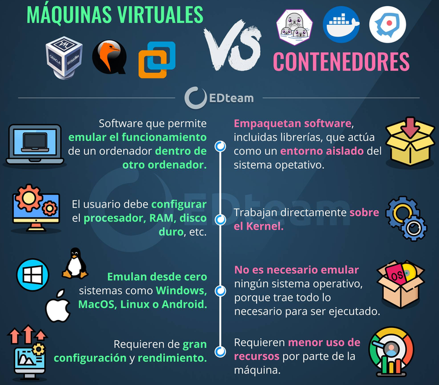

----

## 15. Virtualización con Máquinas Virtuales
- Usan un programa llamado hipervisor para crear computadoras falsas sobre una máquina real, dividiendo la memoria, el disco y la potencia.
- Cada máquina virtual lleva instalado su propio sistema operativo completo (por ejemplo, Windows o Linux), lo que consume muchos recursos.
- Ejecutar sistemas pesados y distintos entre sí que necesitan un aislamiento total y seguro.

----

## 15. Contenedores
- Empaquetan únicamente una aplicación junto con sus archivos de código y herramientas necesarias, usando un motor de contenedores como Docker.
- No necesitan un sistema operativo propio; aprovechan y comparten el núcleo del sistema operativo principal, ocupando poco espacio y arrancando en segundos.
- Crear aplicaciones rápidas, livianas y fáciles de mover de una computadora a otra sin que fallen.

----

## 15. Contenedores y virtualización
- Docker
- Docker Compose
- Podman

---

## 16. Orquestación de contenedores
Es el proceso de automatizar la implementación, el escalado, la red y la administración de aplicaciones en contenedores.

----

## 16. Orquestación de contenedores
Las funciones principales:
- **Despliegue automático:** Pone en marcha las aplicaciones en los servidores sin intervención manual.
- **Escalabilidad:** Aumenta o reduce el número de contenedores según la cantidad de trabajo o tráfico.
- **Autorreparación:** Reinicia o reemplaza los contenedores que fallan de manera imprevista.
- **Balance de carga:** Reparte el tráfico de datos de forma equilibrada entre los diferentes contenedores activos.

----

## 16. Orquestación de contenedores
- Kubernetes
- OpenShift
- Docker Swarm
- Amazon ECS

---
## 17. Monitoreo y observabilidad
Sirve para evaluar el funcioamiento de un sistema. El **monitoreo** avisa *qué* y *cuándo* falla mediante métricas predefinidas, 
mientras que la **observabilidad** explica el *por qué* y el *cómo*.

----

### Monitorio
- Mide variables conocidas y avisa cuando un límite se supera.
- Paneles de control (dashboards) de CPU, memoria y tasas de error básicas.

### Observabilidad
- Permite investigar problemas nuevos o no previstos en el diseño original.
- Permite consultar el sistema sobre fallas que no se conocían de antemano.
- 3 pilares: métricas, registros (logs) y rastreos (traces).

----

## 17. Monitoreo y observabilidad
- Prometheus
- Grafana
- Datadog
- New Relic
- OpenTelemetry

---

## 18. Registro de eventos o Logging
Es el proceso de recolectar, indexar y analizar datos generados por máquinas, como actividades del sistema operativo, registros de red y aplicaciones, para facilitar la observación y la seguridad.

----

## 18. Registro de eventos o Logging
- ELK Stack (Elasticsearch, Logstash, Kibana)
- Splunk

---

## 19. Gestión de API
Es el proceso de crear, publicar y proteger interfaces de programación.

----

## 19. Gestión de API
- **Diseño y documentación:** crear reglas claras y manuales de uso para los desarrolladores.
- **Seguridad y acceso:** controlar quién entra mediante contraseñas y permisos.
- **Análisis:** medir el rendimiento y la cantidad de llamadas que recibe la interfaz.

----

## 19. Gestión de API
- Postman
- Insomnia
- Swagger/OpenAPI
- Bruno

---

## 20. Colaboración y comunicación
Permiten a los equipos trabajar juntos, compartir datos y hablar en tiempo real.

----

## 20. Colaboración y comunicación
- Slack
- Microsoft Teams
- Discord

---

## 21. Diseño y prototipado
Permiten crear modelos visuales e interactivos de aplicaciones o sitios web antes de programarlos.

----

## 21. Diseño y prototipado
- Figma
- Adobe XD
- Balsamiq

---

## Otras herramientas
Y la lista podría continuar:
- IA
- Pruebas de accesibilidad

---

### Otras herramientas de pruebas...
Una herramienta de prueba sumamente sencilla de usar el **Axe**, que permite encontrar defectos
relacionados con accesibilidad.

----

### Otras herramienta de pruebas...
Empleando **Lighthouse** se pueden encontrar errores de:
- Performance
- Accesibilidad
- Buenas Prácticas
- SEO (Search Engine Optimization)

---
## ¿Dudas, Preguntas, Comentarios?

