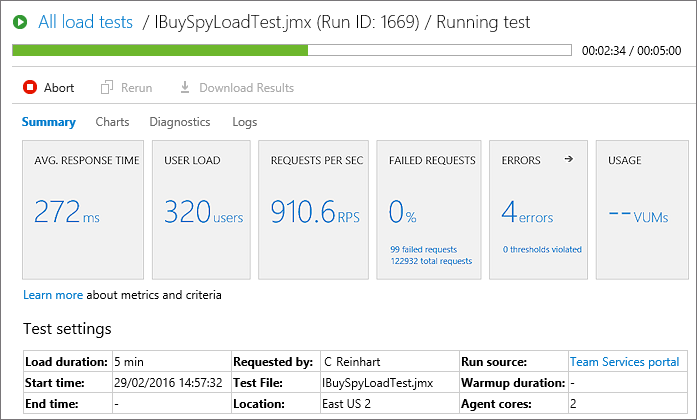

# Herramientas de Desarrollo
Created by <i class="fab fa-telegram"></i>
[edme88]("https://t.me/edme88")

---
<style>
.grid-container5 {
    display: grid;
    grid-template-columns: auto auto auto auto auto;
    font-size: 0.8em;
    text-align: left !important;
}

.grid-container2 {
    display: grid;
    grid-template-columns: auto auto;
    font-size: 0.8em;
    text-align: left !important;
}

.grid-item {
    border: 3px solid rgba(121, 177, 217, 0.8);
    padding: 20px;
    text-align: left !important;
}
</style>
<!-- .slide: style="font-size: 0.60em" -->
## Temario
<div class="grid-container5">
<div class="grid-item">

### Herramientas de Desarrollo
* Definición
* Tipos de herramientas
</div>
<div class="grid-item">

### IDE
* Definición 
* Editor de código
* Construcción aut.
* Debugger
* Compilador
* Intérprete
* Ejemplos de IDEs
</div>
<div class="grid-item">

### VSC
* Definición
* Función
* Ventajas
* Ejemplo de herramientas
</div>
<div class="grid-item">

### Documentación
* Funcionalidad
* Nivel de documentación
* Recomendaciones


### Bug Tracker
* Definición
* Ejemplo de herramientas
* Recomendaciones
</div>
<div class="grid-item">

### Testing
* Pruebas de desempeño
* Ejemplo de herramientas

### Integración Continua
* Definición
* Ejemplo de herramientas
</div>
</div>

---
## Herramientas de Desarrollo

Conjunto de recursos que facilitan y agilizan el desarrollo, mantenimiento y prueba del software.

Acompañan al desarrollador desde la escritura del código hasta su despliegue y monitoreo.

Una aplicación o programa puede contar con múltiples herramientas que se encarguen de funciones específicas y afines para realizar una tarea.

---
## Tipos de Herramientas
* IDE
* Control de Versiones
* Bug Tracker
* Pruebas de desempeño, carga, stress
* Documentación
* Integración Continuo


---
## Ambiente de Desarrollo Integrado o IDE
Es un software que proporciona servicios integrales para facilitarle al programador el desarrollo de software.

Un IDE combina varias herramientas en una sola interfaz: editor, compilador, depurador y más. Esto mejora la productividad y reduce errores al centralizar el desarrollo.

---
## Ambiente de Desarrollo Integrado o IDE
Normalmente, un IDE consiste de:
* Editor de código fuente
* Herramientas de construcción automáticas
* Depurador o Debugger
* Compilador
* Intérprete

---
## Editor de código fuente
Es un "editor especializado" orientado para escribir código fuente de aplicaciones en general en lenguajes de programación.

Generalmente los editores de código soportan varios lenguajes y son capaces de abrir varios archivos a la vez, resaltar su sintaxis y ofrecer ayudas contextuales a la hora de escribir o visualizar el código de las aplicaciones.

---
## Depurador o Debugger
Permite probar y eliminar los errores del programa.

El depurador permite detener el programa en un punto determinado o en un momento determinado para que el usuario pueda 
examinar y modificar la memoria y las variables del programa, cambiar punto de ejecución, ejecutar una instrucción o 
partes determinadas de código.

---
## Depurador o Debugger


---
## Compilador
Traduce del lenguaje de programación al lenguaje máquina, código intermedio o texto.

* **Lenguajes compilados:** C, C++, Go, Rust, Fortran, Pascal, Visual Basic.
* **Lenguajes interpretados:** Python, JavaScript, Ruby, PHP.

---


---
## Interprete
Realiza la traducción a medida que sea necesaria, instrucción por instrucción y no guardan el resultado de la traducción.

Los programas interpretados suelen ser más lentos que los compilados debido a la necesidad de traducir el programa 
mientras se ejecuta, pero son más flexibles permitiendo reemplazar partes del programa.

Uno de los entornos más comunes de uso de los intérpretes es en los navegadores web, debido a que se ejecutan independientemente de la plataforma.

---
<!-- .slide: data-background="images/herramientas/IDES.png" -->
## IDE's
Ejemplos de IDE's para desarrollo Web:
* [JetBrains Web Storm](https://www.jetbrains.com/es-es/webstorm/download/#section=windows)
* [Microsoft Visual Studio Code](https://code.visualstudio.com/)
* [Sublime Text](https://www.sublimetext.com/)
* [Eclipse](https://www.eclipse.org/downloads/)
* [Net Beans](https://netbeans.apache.org/download/index.html)
* [Aptana](http://www.aptana.com/)
* [NotePad ++](https://notepad-plus-plus.org/downloads/)

---

### Extensiones o plugins

Los IDEs modernos permiten instalar extensiones que agregan soporte para nuevos lenguajes, linters, herramientas de testing, snippets, etc.

Ejemplos: Prettier, ESLint, Live Server (en VSCode)

---
<!-- .slide: data-background="images/herramientas/Busydesk-desarrollo.png" -->
## IDE's
No existe un IDE perfecto. El mejor será el que se adapte a tu flujo de trabajo, tus herramientas y tu nivel de experiencia.

---

### Actividad 1.1: Instalación de VSCode

1. Ingresa a https://code.visualstudio.com/
2. Descarga el instalador del **Visual Studio Code**
3. Instálalo!
4. Abrí VSCode y explorá brevemente la interfaz: barra lateral, explorador, terminal y sección de extensiones.

----

### ¿Por qué usar VSCode?

* Directo y fácil de seguir.
* Ideal para comenzar con un IDE liviano y muy popular.

---

### Actividad 1.2: Instalación de WebStorm

1. Ingresa a https://www.jetbrains.com/webstorm
2. Descarga el instalador del **WebStorm**
3. Instálalo!
4. En la página de **WebStorm** ingresa a **Education** -> Free Licenses (For students)
5. Click en "Request now"
6. Completa los datos para aplicar a la licencia! Es importante que uses el email institucional que contiene **.edu**
7. Abrí WebStorm y explorá brevemente la interfaz

----

### ¿Por qué usar WebStorm?

* Análisis estático de código más profundo.
* Integración nativa con herramientas frontend.
* Refactorización más robusta.

---

### Actividad 2.1: Instalación de Extensiones

1. Abre el **Visual Studio Code**
2. Ingresa a la sección de **Extensiones** (puedes presionar Ctrl+Shift+X)
3. Busca e instala las siguientes extensiones:
   * Color the tag name
   * ESLint
   * GitLens
   * HTML CSS Support
   * Material Icon Theme
   * Prettier

---


---
## Gestión de Versiones o VCS
Permiten gestionar los cambios en los archivos de un proyecto a lo largo del tiempo, facilitando el trabajo colaborativo
y el acceso remoto al código fuente.

---
## Gestión de Versiones o VCS
Los usuarios pueden:
* Clonar o descargar archivos del repositorio
* Editar y guardar cambios localmente
* Publicar (subir) sus cambios al repositorio remoto
* Consultar el historial y volver a versiones anteriores 
* Crear ramas (branches) para desarrollar nuevas funcionalidades
* Unificar cambios provenientes de diferentes ramas

---

### Un VCS funciona como una máquina del tiempo para tus archivos. Podés ver, comparar o volver a cualquier momento del proyecto.

---
<!-- .slide: data-background="images/herramientas/subversionado.png" -->
## Ventajas de VCS:
* Permite llevar cuenta de los cambios de un conjunto de archivos digitales en el tiempo.
* Cada conjunto de cambios registrados en un momento específico se denomina revisión o commit.
* Permite tanto a un desarrollador como a un grupo de desarrolladores, gestionar el código del proyecto.
* Facilita la colaboración sin sobrescribir el trabajo de otros/as, gracias al control de ramas.

---
## Herramientas de VCS
* Git
* SVN
* Mercurial
* Bazaar

---


---
## Documentación de Código
   
Permite:
* Entender **qué** se está haciendo y por qué
* Mantener el código a lo largo del tiempo

**Documentar ayuda tanto al equipo como a tu “yo del futuro”**


---
## Niveles de Documentación
* **Por clase:** incluir una descripción general, autor, fecha y última modificación.
* **Por método:** detallar su función, parámetros y lo que retorna.
* **Variables importantes:** especialmente si son complejas o no evidentes.
* **Limitaciones del código:** advertencias o restricciones relevantes.
* **Algoritmos implementados:** describir la lógica general si no es trivial.

---
## Formato de Documentación (JSDoc)
```javascript
/**
   * @fileoverview Librería con funciones de utilidad
   * @author Jose
   * @version 0.1
   */
   /**
   * Muestra un mensaje de texto
   * @param {String} método nombre del método
   * @param {String} mensaje mensaje a mostrar
   * @returns {integer} el codigo de retorno 0
   */
   function trazas(metodo, mensaje){
       alert("["+metodo+"]:"+mensaje);
       return 0;
   }
```

---


---
## Documentación...A tener en cuenta
* No uses solo una línea, divídela en párrafos para que sea mas legible
* Tabular los comentarios de líneas consecutivas
* No comentar obviedades
* Se profesional (No insultes o coloques frases fuera de contexto)
* Revisa la ortografía

---
## Documentación...A tener en cuenta
* No comentes si no es necesario
* Comentarios simple y directo
* Documenta mientras desarrollas
* Manten los comentarios actualizados

---
````javascript
return 1; # returns 1
stop(); // Hammertime!
long long ago; /* in a galaxy far far away */
//This code sucks, you know it and I know it.
//Move on and call me an idiot later.
/////////////////////////////// this is a well commented line
// I don't know why I need this,
//but it stops the people being upside-down
x = -x;
````

[más ejemplos](http://stackoverflow.com/questions/184618/what-is-the-best-comment-in-source-code-you-have-ever-encountered%3E)

---


---


---
## Bug Tracker o BTS
En proyectos de cierta complejidad o trabajo colaborativo, es fundamental usar una herramienta de seguimiento de errores 
**Bug Tracker o BTS** para registrar, clasificar, asignar y resolver defectos detectados durante el desarrollo o prueba del software.

Un buen BTS no solo organiza errores, también ayuda a establecer prioridades, gestionar tiempos de resolución y comunicar avances.

---
## Ejemplos de Bug Tracker
* Jira
* Bugzilla
* Flyspray
* Trac
* The bug Genie
* MantisBT
 
---


---


---


---


---
## Prueba de Desempeño o Performance
Tipos principales:

- **Load Test:** Evalúa cómo responde el sistema ante una carga esperada, simulando condiciones reales de producción.
- **Stress Test:** Aplica una carga mayor a la esperada para detectar el punto de ruptura del sistema.
- **Endurance (Resistencia):** Analiza el rendimiento cuando el sistema está bajo carga continua durante un período prolongado.

---
## Prueba de Desempeño o Performance
Estas pruebas ayudan a:
- Identificar cuellos de botella.
- Medir el consumo de recursos.
- Garantizar estabilidad bajo presión.

---
## Herramienta para Stress Test
* Apache JMeter
* SmartMeter.io
* LoadUI
* WebLOAD
* LoadRunner
* Appvance
* NeoLoad
* LoadComplete

---


---


---


---
## Integración Continua
Es una práctica del desarrollo de software en la que los cambios de código se integran frecuentemente en un repositorio 
compartido y luego se verifican automáticamente mediante pruebas, builds u otros procesos.

---
## Integración Continua

<div class="grid-container2">
<div class="grid-item">

### Servidor Propio
* GitLab CI
* Jenkins
* Drone.io

</div>
<div class="grid-item">

### Cloud
* Github Actions
* Travis CI
* Codeship
* CircleCI

</div></div>

---
[Ejemplo de Construcción con GitHub Actions de las filminas](https://github.com/UCC-LabCompu2/filminas/actions)

---


---


---


---
[](https://en.wikipedia.org/wiki/Build_light_indicator)

---
## ¿Dudas, Preguntas, Comentarios?

