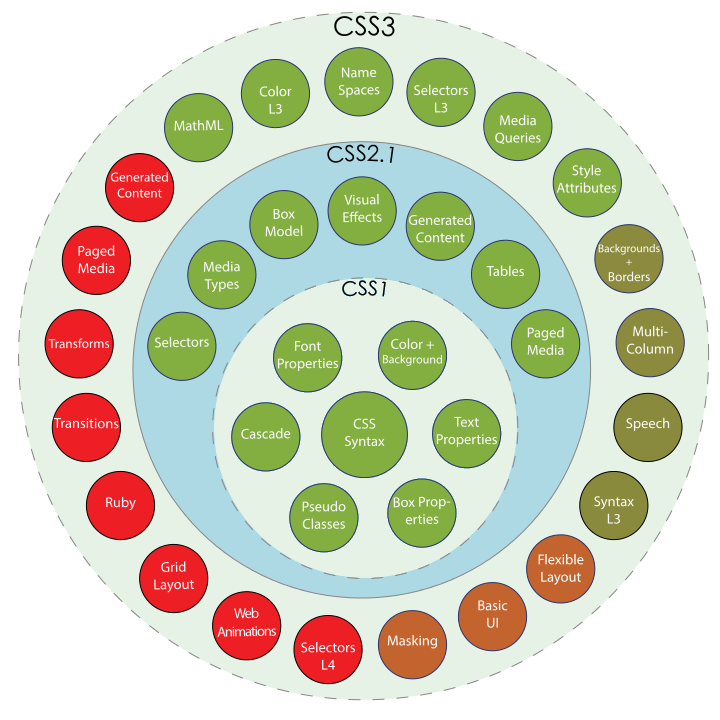
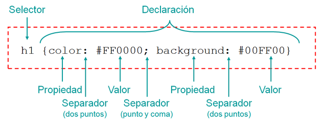
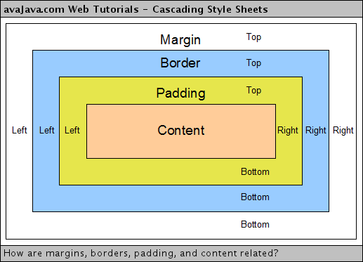
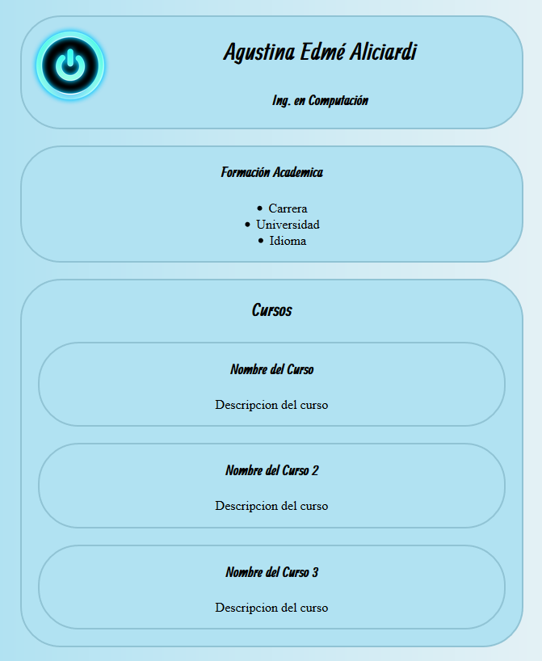
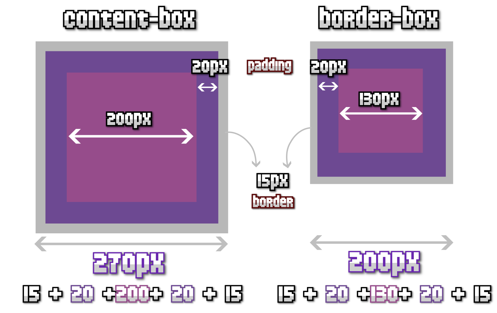

# CSS
### Cascading Style Sheet
Created by <i class="fab fa-telegram"></i>
edme88

---
<style>
.grid-container2 {
    display: grid;
    grid-template-columns: auto auto;
    font-size: 0.8em;
    text-align: left !important;
}

.grid-item {
    border: 3px solid rgba(121, 177, 217, 0.8);
    padding: 20px;
    text-align: left !important;
}
</style>
<!-- .slide: style="font-size: 0.70em" -->
## Temario
<div class="grid-container2">
<div class="grid-item">

### CSS
* Definición
* Capas de diseño
* Sintaxis
* Estilos en línea
* Estilos incrustados
* Hoja de estilo enlazada
* Propiedades tipográficas
* Colores
* Estilo: Tag, #ID, .clase

[Ejercicio: Propiedades tipográficas](U2_CSS.html#/20/1)

[Ejercicio: CSS incrustado](U2_CSS.html#/24/1)

* Descendientes

[Ejercicio: Estilos con descendientes](U2_CSS.html#/22/1)

</div>
<div class="grid-item">

* Pseudo clases

[Ejercicio: Pseudo Clases](U2_CSS.html#/24/1)

* Modelo de cajas: Margin, border, padding
* Unidades de medida
* Fondos y Gradientes
* Favicon

[Ejercicio: CV](U2_CSS.html#/33/2)

* Comentarios
* Backgrounds

[Ejercicio: Backgrounds](U2_CSS_avanzado.html#/5/1)

* Box-sizing
* Buenas prácticas
</div>
</div>

---
### Y los estilos?
Con el HTML 3.2 se daba formato en HTML con los elementos específicos para ello: <b>, <font>... y sus respectivos
atributos face="arial,helvetica,sans-serif", size="3", align="center"...

Implementarlo requería mucho tiempo, actualizarlo era molesto y no resultaba productivo.

---
### CSS
Con la llegada del HTML 4 se quitaron los estilos, pero se crearon las hojas de estilo en cascada, **Cascading Style Sheet** o CSS.

La primera versión data del 17 de diciembre de 1996, cuando salio HTML 3.2

----

### CSS 2
Aparece el 12 de mayo de 1998. Se trataba de una versión con demasiadas novedades, y los navegadores no pudieron adaptarse bien.

El W3C (World Wide Web Consortium  ) volvió a retrabajarlo, y entre 2004-2006, lanzó la versión level 2 revisión 1, que se conoce como CSS 2.1.
La versión 2.1 de las CSS fue publicada como Recommendation el 7 de junio de 2011.

----

### CSS 3
Los primeros borradores aparecieron en 1999. El W3C publicó varios "módulos" independientes los unos de los otros.

Esto resulta bastante práctico para los navegadores, que pueden así implementar las novedades progresivamente.

---


---
## CCS: Cascading Style Sheets
Hojas de Estilo en Cascada (CSS) es un lenguaje de estilo de hojas usado para describir la presentación de las páginas web escrito en HTML o XML.

CSS permite la separación del contenido del documento de la presentación del documento (disposición, colores, fuentes, etcétera).

---
## CCS3: Cascading Style Sheets
Estilos visual del documento.
* Selectores
* Modelos de Caja
* Fondos y Bordes
* Valores de imagenes y Remplazo de contenido
* Efectos de texto
* Transformaciones 2D/3D
* Animaciones
* Múltiples columnas
* Interfaz de Usuario

---
## CSS: Sintaxis


---
## Comenzar!
Cuando estás empezando a trabajar con CSS es recomendable tener a mano siempre un CheatSheet con un resumen de los 
comandos más empleados.
[CSS Cheat Sheet](https://raw.githubusercontent.com/UCC-LabCompu2/filminas/master/slides/cheatsheet/css3-cheatsheet.pdf)

---
## Formas de Agregar Estilos
* Estilo en Línea
* Incrustando una Hoja de Estilo
* Enlazando una hoja de Estilo Externa

---
## Estilo en Línea
* Se usa el atributo "style" para definir como la etiqueta debe mostrarse.
* Ejemplo:
````html
<h1 style="color: red; font-type: helvetica; font-size: 2em">
````

----

## Estilo en Línea: Desventajas
* Difícil de mantener
* Solución poco elegante
* Código duplicado para que varios elementos posean el mismo estilo visual
* La estructura y el estilo se mezclan

---
## Hoja de Estilo Incrustada
* Se incorpora en `<head>`
*  Se describe:
````html
<style>
   Selector{
propiedad: valor;
   }
</style>
````
Ejemplo:
````html
h1{
color: #333333;
font-weight: bold;
margin-left: 15px;
}
````

----

## Hoja de Estilo Incrustada: Desventajas
- Aplicar el mismo estilo en todas las páginas es complicado
- Código no reutilizable en otros sitios


---
## Hoja de Estilo Externa o Enlazada
* En el &lt;head&gt; se emplea un link a un archivo externo
````css
<link rel="stylesheet" href="estilos.css" type="text/css">
````

---
### Hoja de Estilo Externa o Enlazada: Ventajas
* Se separa la estructura del estilo
* Fácil de mantener
* Permite compartir estilos similares en todas las páginas

---
##  ¿Como Escribir un Estilo? 
<!-- .slide: style="font-size: 0.90em" -->

1. **por Tag** (se aplica a TODOS los selectores)
````html
selector{nombreEstilo: valor;}
Ej. section{font-family: Arial, Helvetica;}
````

2. **por ID** (para identificar elementos unívocos)
````html
#nombreID {nombreEstilo: valor;}
Ej. #nombreUsuario {color: #ff00cc;}
````

3. **por Clase**
````html
.nombreClass {nombreEstilo: valor;}
Ej. .myStl {background-color: rgb(234,55,76);}
````


---
## Propiedades tipográficas
<!-- .slide: style="font-size: 0.80em" -->
* **font-family:** se define tipografía por orden de prioridad
* **font-size:** Se define tamaño
* **font-style:** italic, normal
* **font-weight:** bold, normal, ultrabold, o números 100,200,300
* **color:** nombre, hexadecimal, rgb
* **letter-spacing:** interletrado
* **world-spacing:** espacio entre palabras
* **line-height:** tamaño del renglon (altura de línea)
* **text-align:** right, left, center
* **text-decoration:** underline, line-through, none
* **text-indent:** sangría
* **text-transform:** uppercase, lowercase

---
## Colores
* Por nombre: `<h1 style="color: red">`

* Hexadecimal: `<h1 style="color: #CA98E3">`

* RGB: `<h1 style="color: rgb(205, 92, 92)">`

* RGBA: `<h1 style="color: rgba(205, 92, 92, 0.23)">`

---
## Ejercicio: Propiedades tipográficas
Empleando el template “ej_columnas”, agregue **estilo en línea** para cambiar:
1. Color del texto del título de la página.
2. Tamaño de la fuente del título de la noticia.
3. Tipo de fuente o letra de toda la página.

----

## Ejercicios
Se debe crear una **branch** para los ejercicios de cada unidad.

Una vez realizados todos los ejercicios de una unidad, se debe realizar un **pull request** y **mergearlo**.

---
## Ejercicio: Incrustado
Empleando el template “ej_columnas”, duplique su contenido, cambie los estilos en línea por **estilos incrustados**.
1. El título de la página debe estar definido por ID
2. El título de la noticia debe estar definido por clase
3. El tipo de fuente para toda la página debe estar definido por Tag

----

## Ejercicio: Propiedades tipográficas e Inscrustado
<iframe width="560" height="315" src="https://www.youtube.com/embed/1cssxcEdTBs" frameborder="0" allow="accelerometer; autoplay; encrypted-media; gyroscope; picture-in-picture" allowfullscreen></iframe>

---
##  Descendientes
Un elemento HTML es descendiente de otro cuando se encuentra contenido dentro de las etiquetas de apertura y cierre del otro elemento:
````
<div>
    <span>En este ejemplo, "span"</span>  es descendiente de div
</div>
````

----

##  Descendientes
* **selectores:** 
````css
ul li{nombreEstilo: valor;}
````

* **de ID:** 
````css
#nombreID h1{nombreEstilo: valor;}
````

* **de Clase:**
````css
.nombreClass p{nombreEstilo: valor;}
````
---
## Ejercicio: Estilo con Descendientes
Empleando el template “ej_leyes” y hoja de estilo incrustada, agregue los estilos necesarios para cambiar: 
1. La  primera  lista  ordenada  para  visualizarla  con  números  romanos  y  una  tipografía  de mayor tamaño (upper-roman). 
2. La segunda lista ordenada para visualizarla con letras (lower-alpha).

----

## Ejercicio: Estilo con Descendientes
<iframe width="560" height="315" src="https://www.youtube.com/embed/u9wBB3DoAyc" frameborder="0" allow="accelerometer; autoplay; encrypted-media; gyroscope; picture-in-picture" allowfullscreen></iframe>
   
---
## [Pseudo Clases](https://developer.mozilla.org/es/docs/Web/CSS/Reference/Selectors/Pseudo-classes)
<!-- .slide: style="font-size: 0.75em" -->
Es una palabra clave que se añade a los selectores y que especifica un estado especial del elemento seleccionado.

Ejemplos:
* **hover:** se activa cuando pasa el mouse por encima de un elemento
* **active:** se activa cuando el usuario activa un elemento (haciendo click)
* **focus:** se activa cuando el elemento tiene el foco del navegador (está seleccionado)
* **link:** enlaces que todavía no han sido visitados por el usuario
* **visited:** enlaces que han sido visitados al menos una vez por el usuario
* **first-child:** selecciona el primer elemento hijo de un elemento

----

## Pseudo Clases
````css
/* unvisited link */
a:link {
   color: #FF0000;
}

/* visited link */
a:visited {
   color: #00FF00;
}

/* mouse over link */
a:hover {
   color: #FF00FF;
}

/* selected link */
a:active {
   color: #0000FF;
}
````

---
## Ejercicio: Pseudo Clases
Al hipervinculo de la página de ej_columnas, empleando Pseudo clases modifique:
* Link visitado o no visitado con el mismo color
* Al posicionar el mouse arriba del link, modificar el tamaño de la fuente
* Al seleccionar el link, seleccionar BOLD

----

## Ejercicio: Pseudo Clases
<iframe width="560" height="315" src="https://www.youtube.com/embed/LUuAI1UFd30" frameborder="0" allow="accelerometer; autoplay; encrypted-media; gyroscope; picture-in-picture" allowfullscreen></iframe>

---

### [Pseudo-Elementos](https://developer.mozilla.org/es/docs/Web/CSS/Reference/Selectors/Pseudo-elements)
<!-- .slide: style="font-size: 0.75em" -->
Es una palabra clave que se añade a un selector para dar estilo a una parte específica 
o crear elementos virtuales de un elemento sin modificar el código HTML.

Sirven para:
- **Seleccionar partes concretas:** Permiten cambiar el diseño de sectores específicos de un texto, como la primera letra (::first-letter) o la primera línea (::first-line).
- **Insertar contenido virtual:** Permiten agregar elementos visuales antes (::before) o después (::after) del contenido real de un elemento, sin necesidad de escribirlos en el HTML.
- **Modificar interacciones:** Permiten estilizar zonas interactivas, como el texto que el usuario selecciona con el ratón (::selection) o el texto de ayuda en un formulario (::placeholder).

----

### Pseudo-Elementos

```css
p::first-letter {
  font-size: 2rem;
  color: red;
}
```

---
##  Alto y Ancho 
````css
div{
   width: 80%;
   height: 100px;
}
````
unidad de medida | porcentaje | auto | inherit (hereda del padre)

<!-- .slide: style="font-size: 0.75em" -->
Nota: No se debe agregar espacio entre el valor y la unidad. Es incorrecto escribir "20 px"

---

###  Unidades de Medida

En CSS las propiedades dimensionales y tipográficas se definen mediante:
- **Relativas:** Escalables respecto a otro elemento o la pantalla.
- **Absolutas:** Longitudes físicas fijas e independientes del entorno.
- **Viewport Dinámicas:** Ajustadas a la interfaz móvil cambiante.
- **Funciones de Cálculo:** Expresiones matemáticas para valores fluidos.

----

###  Unidades de Medida: Relativas
<!-- .slide: style="font-size: 0.80em" -->
Dependen del tamaño de otro elemento o de la ventana (viewport):
- **em:** Relativa al tamaño de fuente del elemento padre.
- **rem:** Relativa al tamaño de fuente del elemento raíz (<html>).
- **vw / vh:** 1% del ancho (width) / alto (height) de la ventana.
- **vmin / vmax:** 1% del valor mínimo / máximo entre el ancho y alto de la ventana.
- **ch / ex:** Relativas al ancho del carácter "0" / altura de la letra "x".

En la práctica: **rem** y **em** se usan para tipografía y espaciado; **vw** y **vh** para maquetación.

----

###  Unidades de Medida: Absolutas
Tienen un valor fijo predeterminado. No se adaptan al dispositivo:
- **px:** Píxeles de pantalla (la unidad absoluta estándar en web).
- **pt / pc:** Puntos y picas (usadas principalmente en hojas de estilo para impresión).
- **cm / mm / q / in:** Centímetros, milímetros, cuartos de mm y pulgadas.

**Recomendación:** Evita usar unidades absolutas para fuentes o maquetación responsiva.

----

### Unidades de Medida: Viewport Dinámicas

Diseñadas para corregir los saltos de interfaz en móviles cuando la barra de navegación se oculta o despliega:
- **svh / svw:** *Small viewport* (mide el área visible cuando la barra del navegador está visible).
- **lvh / lvw:** *Large viewport* (mide el área cuando la barra del navegador está oculta).
- **dvh / dvw:** *Dynamic viewport* (se adapta en tiempo real según el despliegue de la barra).

Útiles para resolver el comportamiento de la barra de navegación en navegadores móviles.

----

### Unidades de Medida: Funciones de Cálculo

Permiten combinar distintas unidades y crear reglas tipográficas o de espacio fluidas:
- **calc():** Realiza operaciones matemáticas simples (width: calc(100% - 20px);).
- **min() / max():** Devuelve el valor más pequeño o más grande de una lista.
- **clamp(mín, ideal, máx):** Define un rango flexible entre un valor mínimo y uno máximo.

```css
/* Ejemplo: Tipografía fluida que escala entre 1rem y 2rem */
font-size: clamp(1rem, 2.5vw, 2rem);
```

---
## Modelo de Cajas


----

##  Margin & Padding 
<!-- .slide: style="font-size: 0.60em" -->
1. Establecerlos por separado
````css
div{margin-top: 15px;
    margin-right: 20px;
    margin-bottom: 10px;
    margin-left: 5px;}
````
2. Establecer top-bottom & right-left:
````css
div{margin: 15px 20px;}
````
3. Establecer todo junto:
````css
div{margin: 15px 20px 10px 5px;}
````

4. Margenes iguales:
````css
div{margin: 15px;}
````

5. Establecer top, right/left, bottom:
````css
div{margin: 15px 20px 5px;}
````

----

##  Borde 
* .estilo-borde {border: grosor tipo color}
````css
.estilo-borde{2px solid blue;}
/*dotted, dashed, solid, double, groove, ridge, inset, outset*/
````

----

### Modelo de Caja
Permite agregar espacios para mejorar la presentación de un elemento.

Por defecto, el ancho y alto asignado a un elemento es aplicado solo al contenido de la caja del elemento.

---
## Ejercicio: CV
<!-- .slide: style="font-size: 0.70em" -->
Diseñe un CV y agregue estilos empleando una hoja de estilo incrustada:
* Hacer que el borde de los divs sea visible
* Agregue atributos de margin y padding a los divs
* Agregar color plano a los divs y ponerle opacity
* Agregar una imagen en el primer **div** y alinee a la izquierda
* Centrar todo el contenido del body.
* Agregar <a href="https://fonts.google.com/" target="_blank"> fuentes de google </a> para personalizar la página
* Agregar background al body, que posea <a href="https://www.w3schools.com/csS/css3_gradients.asp" target="_blank">gradiente</a>
* Redondear las esquinas de la imagen para dejarla circular.
* Redondear las esquinas de los div
* Agregar favicon
* Agregar sombras a los textos y a los títulos
* Agregar sombras a los divs
* Asegúrese de por lo menos incluir un estilo por Tag, por ID y por clase

----

## Ejercicio: CV


----

## Ejercicio: CV
<iframe width="560" height="315" src="https://www.youtube.com/embed/9aJKvSPW5GA" frameborder="0" allow="accelerometer; autoplay; encrypted-media; gyroscope; picture-in-picture" allowfullscreen></iframe>

---
## Comentario
Se puede agregar comentarios de una ó multiples líneas.
````css
/* Comentario de una sola línea */

/* Este es un
comentario CSS de varias
lineas */
````

---
## Fondos o Backgrounds
<!-- .slide: style="font-size: 0.70em" -->
La propiedad compuesta background permite definir simultáneamente todas las propiedades relacionadas con el fondo de 
cualquier elemento: 
* **backgroud-color:** color de fondo
* **background-image:** imagen de fondo
* **background-position:** posición
* **background-size:** tamaño de la imagen de fondo (cover, auto, contain, inherit, etc)
* **background-repeat:** si la imagen se repite o no (repeat, repeat-y, repeat-x)
* **background-attachment:** si la imagen es fija o tiene scroll con el resto de la página
* **background-origin:** desde donde la imagen debe empezar a mostrarse (content-box, padding-box, border-box)
* **background-clip:** hasta donde debe extenderse el fondo dentro de un elemento. (content-box, padding-box, border-box)

---
<!-- .slide: data-background="linear-gradient(to right, red , yellow)" -->
## Fondo y Gradientes
````css
/* solo color */
background: red;
background-color: rgba(255,0,0, 0.5);
/* gradiente */
background: linear-gradient(to right, red , yellow);
/* imagen de fondo */
background: url("fondo.png");
background-image: url("paper.gif");
background-repeat: repeat-x; /*repeat-y; no-repeat;*/
background-attachment: fixed; /*scroll; con respecto al resto de la imagen*/
background-position: right top; /*posision de inicio de imagen de fondo*/
/*Shorthand*/
background: #ffffff url("img_tree.png") no-repeat right top;
````

---
## Background: Ejemplo
Estas líneas:
````css
div {
  background-image: url("images/imagen_pequena.png");
  background-repeat: no-repeat;
  background-position: 2em 1.5cm;
  background-attachment: fixed;
}
````
Se pueden colocar todas juntas de la siguiente forma:
````css
div {
  background: url("images/imagen_pequena.png") no-repeat 2em 1.5cm fixed;
}
````

---
## Fondos o Backgrounds
Puedes ver más documentación en:

[Mclibre](https://www.mclibre.org/consultar/htmlcss/css/css-fondos.html)

[W3Shool - Background](https://www.w3schools.com/cssref/css3_pr_background.asp)

---
## Ejercicio: Backgrounds
Cree una página nueva, emplee de fondo la imagen “fondo_mario.jpg” ubicada en la carpeta de  “imagenes”. 
Pruebe  los  diferentes  atributos  de  background:  image, color, origin, position, repeat, size, etc.

----

## Ejercicio: Backgrounds
<iframe width="560" height="315" src="https://www.youtube.com/embed/1h4RYPkQ4qE" title="YouTube video player" frameborder="0" allow="accelerometer; autoplay; clipboard-write; encrypted-media; gyroscope; picture-in-picture" allowfullscreen></iframe>

---

### [Box-Sizing](https://developer.mozilla.org/es/docs/Web/CSS/Reference/Properties/box-sizing)
Permite definir de otra manera el espacio de los elementos. 

La propiedad *box-sizing* puede ser usada con:
- **content-box** es el comportamiento CSS por defecto.
- **border-box** le dice al navegador tomar en cuenta para cualquier valor que se especifique de borde o de relleno para el ancho o alto de un elemento.

----

### [Box-Sizing](https://www.w3schools.com/css/css3_box-sizing.asp)



---
##  CSS: Recomendación 
Revisar documentación:
[W3 School](http://www.w3schools.com/css/default.asp)

Autogenerar algunos estilos complicados:

http://css3generator.com/

http://westciv.com/tools/shadows/

---
# Bibliografía xD
[](http://www.w3schools.com/css)

[](https://developer.mozilla.org/es/docs/Web/CSS)

---
## ¿Dudas, Preguntas, Comentarios?

