# CSS: 2da parte
Created by <i class="fab fa-telegram"></i>
edme88

---
<style>
.grid-container2 {
    display: grid;
    grid-template-columns: auto auto;
    font-size: 0.8em;
    text-align: left !important;
}

.grid-item {
    border: 3px solid rgba(121, 177, 217, 0.8);
    padding: 20px;
    text-align: left !important;
}
</style>
<!-- .slide: style="font-size: 0.80em" -->
## Temario
<div class="grid-container2">
<div class="grid-item">

### CSS
* Cascada y Especificidad
* Anidación nativa
* Position
* Z-index
* Float
* Clear
* Transiciones
* Flexbox
* Grid básico

[Grid Básico](U2_CSS_avanzado.html#/18/2)

* Grid Complejo

[Grid Complejo](U2_CSS_avanzado.html#/20/2)

</div>
<div class="grid-item">

[Filtros](U2_CSS_avanzado.html#/21/1)

* Transitions
* Variables

[Transitions](U2_CSS_avanzado.html#/21/1)

* Media Queries
* Funcionamiento x navegador
* Reset CSS
* Normalize.css
* Buenas Prácticas
* Diseño responsivo
* Media Query
* Media Types
* Viewport

[Responsive](U2_CSS_avanzado.html#/42/1)

</div>
</div>

---

### [Cascada y Especificidad](https://developer.mozilla.org/es/docs/Learn_web_development/Core/Styling_basics/Handling_conflicts)
La cascada y la especificidad son los mecanismos que determinan qué estilos 
se aplican a un elemento HTML cuando existen reglas en conflicto.

También se debe considerar la **herencia**, que significa que algunas propiedades CSS heredan 
por defecto los valores establecidos en el elemento padre, pero otras no. 

Esto también puede causar una respuesta diferente a la que se espera.

----

### Cascada
- Es el algoritmo que ordena y prioriza las reglas de estilo.
- Evalúa el origen del código, la importancia (!important) y el orden de aparición.
- Si dos reglas tienen el mismo peso, gana la que está escrita más abajo (al final) en el archivo CSS.

----

### Especificidad
- Es el "peso" o puntuación que se le asigna a un selector CSS.
- Los selectores más concretos tienen prioridad sobre los generales.
- Selectores de ID tienen mayor peso que las clases.
- Clases, pseudo-clases y atributos tienen mayor peso que las etiquetas (elementos).
- Las etiquetas tienen el peso menor.

---

### Anidación nativa (CSS Nesting)
Disponible nativamente en los navegadores sin necesidad de preprocesadores como Sass:

```css
.card {
  background-color: white;

  & h2 {
    color: blue;
  }

  &:hover {
    box-shadow: 0 4px 8px rgba(0,0,0,0.2);
  }
}
```

---
## Position
Como posicionar elementos dentro de la página.
* static
* relative
* fixed
* absolute
* inherit

[W3School](https://www.w3schools.com/cssref/pr_class_position.asp)

Leamos juntos el ejemplo: [Learns Layout](http://learnlayout.com/position.html)

----

## Position: static;
Los elementos posicionados con "Static" no son afectados por las propiedades top, bottom, left y right.

Por defecto, todos los elementos HTML son Static.

----

## Position: relative
El elemento es posicionado relativo respecto a su posición normal.

Los valores top, left, right, bottom lo mueven respecto a su posición original

Permite que un elemento se desplace respecto a lo que hubiera sido su posición normal; 
el resto de elementos continúan en su posición ignorando al que se desplaza, 
lo que puede crear superposiciones; el espacio libre que deja el elemento queda libre.

----

## Position: fixed
<!-- .slide: style="font-size: 0.90em" -->
El elemento "fixed" es posicionado respecto al area visible.

Los valores top, left, right, bottom lo mueven respecto a su posición original

Permite que un elemento se desplace respecto al origen de coordenadas del primer 
elemento contenedor posicionado ó respecto a la esquina superior izquierda de la ventana de 
visualización; el resto de elementos actúan como si el desplazado no existiera, por lo que su 
espacio será ocupado por otros elementos; puede crear superposiciones.

----

## position: absolute
<!-- .slide: style="font-size: 0.90em" -->
Los elementos con position: absolute; son posicionados mediante top, left... 
respecto a su ancestro mas cercano que este posicionado.
Un elemento posicionado es aquel que tenga en su propiedad position algo distinto a static.

Permite fijar un elemento en una posición respecto al origen de coordenadas del primer 
elemento contenedor posicionado ó respecto a la esquina superior de la ventana de visualización; el 
elemento se mantendrá en la ventana de visualización o viewport, siempre en una misma posición aunque 
el usuario se desplace por la web haciendo scroll.

----

## position: inherit;
Se heredan las características del elemento padre.

---
## superposición con z-index
La propiedad z-index indica que elemento va estar posicionado sobre otro elemento.
Los elementos con z-index mayor tapan a los elementos con z-index menor 

---
## Float
Especifica si un elemento debe salir del flujo normal y aparecer a la izquierda o a la derecha de su contenedor.

[Learns Layout](http://learnlayout.com/float.html)

---
## Clear
Especifica si un elemento puede estar al lado de elementos flotantes que lo preceden o si debe ser movido (cleared) 
debajo de ellos. La propiedad clear aplica a ambos elementos flotantes y no flotantes.

[Learns Layout](http://learnlayout.com/clear.html)

---
## Ejercicio: 2 Columnas
Emplear div con style para lograr que el estilo del texto quede en 2 columnas fluidas.
Pruebe
* Forma 1 (CSS2): Float (left, right) y Width (50%) - (para div columna1 y div columna2)
* Forma 2 (CSS3): Column-count y column-gap (para el article)

----

## Ejercicio: 2 Columnas
<iframe width="560" height="315" src="https://www.youtube.com/embed/4BEX3s6ucDs" title="YouTube video player" frameborder="0" allow="accelerometer; autoplay; clipboard-write; encrypted-media; gyroscope; picture-in-picture" allowfullscreen></iframe>

---

### [Flexbox](https://developer.mozilla.org/es/docs/Learn_web_development/Core/CSS_layout/Flexbox)
Es un método de diseño de página unidimensional para compaginar elementos en filas o columnas. 

Los elementos de contenido se ensanchan para rellenar el espacio adicional y se encogen para caber en espacios más pequeños.

```css
section {
  display: flex;
  flex-direction: column;
  flex-wrap: wrap;
  flex: 200px;
}
```

----

### Flexbox

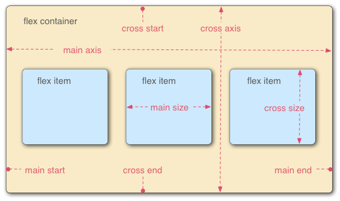

----

### Flexbox
<!-- .slide: style="font-size: 0.80em" -->
- **Eje principal o main axis:** Es el eje que corre en la dirección en que se colocan los elementos flexibles (por ejemplo, según se disponen las filas en una página o hacia abajo según se disponen las columnas en una página). El inicio y el final de este eje se denominan inicio principal **(main start)** y final principal **(main end)**.
- **Eje transversal o cross axis:** Es el eje que corre perpendicular a la dirección en la que se colocan los elementos flexibles. El inicio y el final de este eje se denominan inicio transversal (cross start) y extremo cruzado (cross end).
- El elemento padre que tiene establecido *display: flex* se llama contenedor flexible.
- Los elementos que se presentan como cajas flexibles dentro del contenedor flexible se denominan elementos flexibles.

---
## Grid
Permite de cierta forma reemplazar el position en algunos casos, y 
simplifica muchas tareas para las que antes era necesario incluir algun framework como flexbox.

Es un sistema de rejilla en 2 dimensiones, creado dentro standard del lenguaje CSS.

---
## Grid Básico
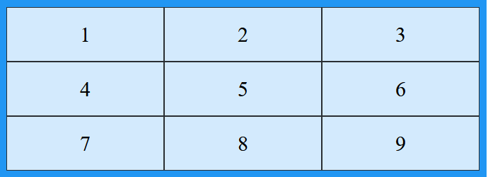

----

## Grid Básico
````html
<style>
.grid-container {
  display: grid;
  grid-template-columns: auto auto auto;
  background-color: #2196F3;
  padding: 10px;
}
.grid-item {
  background-color: rgba(255, 255, 255, 0.8);
  border: 1px solid rgba(0, 0, 0, 0.8);
  padding: 20px;
  font-size: 30px;
  text-align: center;
}
</style>
</head>
<body>
<div class="grid-container">
  <div class="grid-item">1</div>
  <div class="grid-item">2</div>
  <div class="grid-item">3</div>  
  <div class="grid-item">4</div>
  <div class="grid-item">5</div>
  <div class="grid-item">6</div>  
  <div class="grid-item">7</div>
  <div class="grid-item">8</div>
  <div class="grid-item">9</div>  
</div>

</body>
````

---
## Grid: Columnas
Las líneas verticales de los elementos de grid se denominan columnas.

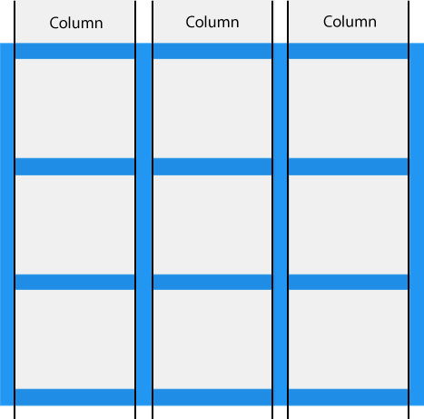

----

## Grid: Columnas
````html
<style>
.grid-container {
  display: grid;
  column-gap: 50px;
  grid-template-columns: auto auto auto;
}
</style>
</head>
<body>
<div class="grid-container">
  <div class="grid-item">1</div>
  <div class="grid-item">2</div>
  <div class="grid-item">3</div>  
  <div class="grid-item">4</div>
  <div class="grid-item">5</div>
  <div class="grid-item">6</div>  
  <div class="grid-item">7</div>
  <div class="grid-item">8</div>
  <div class="grid-item">9</div>  
</div>

</body>
````


---
## Grid: Filas
Las líneas horizontales de los elementos de grid se denominan filas.


---
## Grid: Filas
````html
<style>
.grid-container {
  display: grid;
  row-gap: 50px;
  grid-template-columns: auto auto auto;
}
</style>
</head>
<body>
<div class="grid-container">
  <div class="grid-item">1</div>
  <div class="grid-item">2</div>
  <div class="grid-item">3</div>  
  <div class="grid-item">4</div>
  <div class="grid-item">5</div>
  <div class="grid-item">6</div>  
  <div class="grid-item">7</div>
  <div class="grid-item">8</div>
  <div class="grid-item">9</div>  
</div>

</body>
````

---
## Grid: gap
El espacio entre cada columna/fila se denomina gap.


---

### Ejercicio: Grid
- Crea un archivo: **productos.html**
- Puedes usar una hoja de estilos **enlazada**
- Debes crear un contenedor **main** y dentro tarjetas **div**
- Cada tarjeta debe contener una imagen y un título
- Las imágenes pueden obtenerse combinando **https://ucc-tallerdesarrolloweb.github.io/filminas/images/ejercicios/** con **3-Js/tienda.js -> imagen**

----

### Ejercicio: Grid

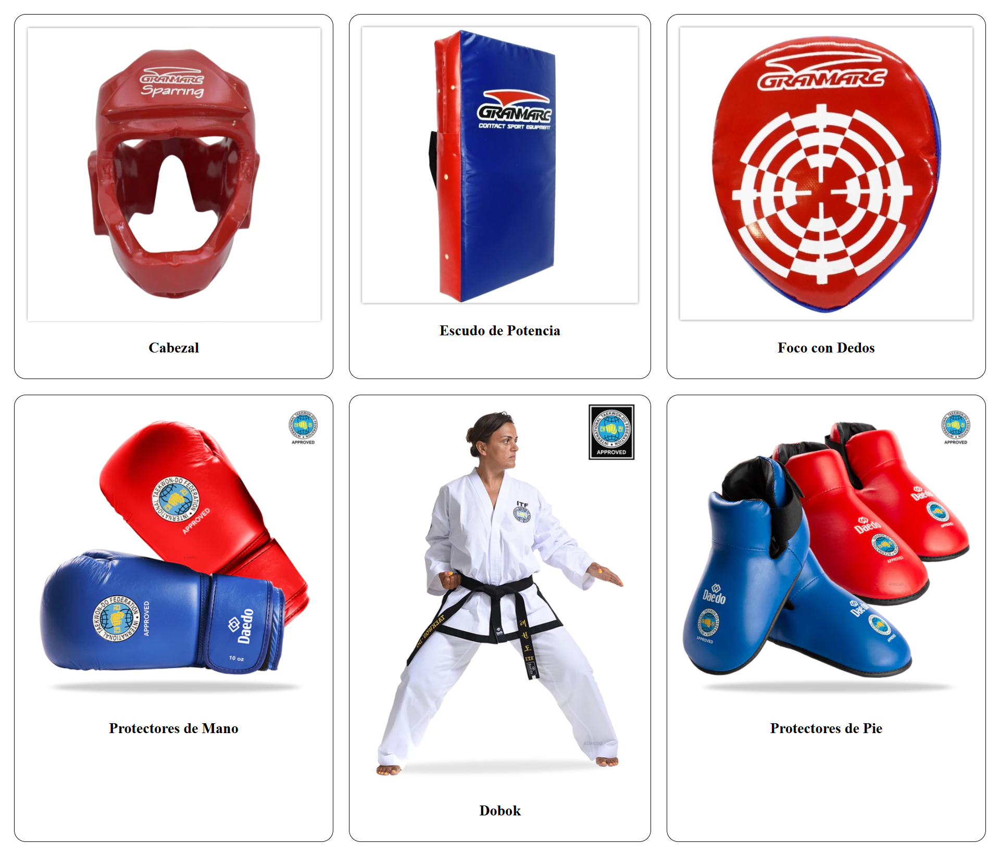

----

### Ejercicio: Grid

<iframe width="560" height="315" src="https://www.youtube.com/embed/wENoFAsqUaY?si=6sNozhvOmMrc_iDJ" title="YouTube video player" frameborder="0" allow="accelerometer; autoplay; clipboard-write; encrypted-media; gyroscope; picture-in-picture; web-share" referrerpolicy="strict-origin-when-cross-origin" allowfullscreen></iframe>

---
## Grid: Complejo
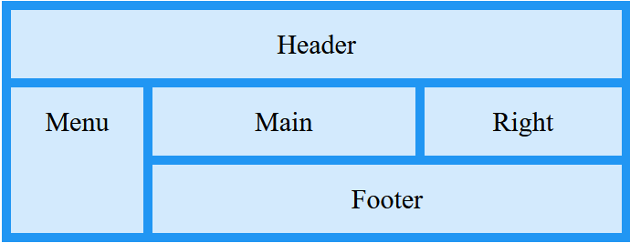

----

## Grid: Complejo
````html
<style>
.item1 { grid-area: header; }
.item2 { grid-area: menu; }
.item3 { grid-area: main; }
.item4 { grid-area: right; }
.item5 { grid-area: footer; }

.grid-container {
  display: grid;
  grid-template-areas:
    'header header header header header header'
    'menu main main main right right'
    'menu footer footer footer footer footer';
  gap: 10px;
  background-color: #2196F3;
  padding: 10px;
}

.grid-container > div {
  background-color: rgba(255, 255, 255, 0.8);
  text-align: center;
  padding: 20px 0;
  font-size: 30px;
}
</style>
</head>
<body>
<div class="grid-container">
  <div class="item1">Header</div>
  <div class="item2">Menu</div>
  <div class="item3">Main</div>  
  <div class="item4">Right</div>
  <div class="item5">Footer</div>
</div>

</body>
````

---

### Ejercicio: grid-areas

- Emplea **grid-container** en el body
- Agrega etiquetas semánticas para: cabecera de la página, links de navegación, menú lateral, principal y pie de página.
- cree las clases **itemN** con el grid-area de cada una.
- Las clases de cabecera, links y footer deben ocupar 4 "columnas imaginarias"
- La clase de aside debe ocupar 1, y la clase de main debe ocupar 3

----

### Ejercicio: grid-area

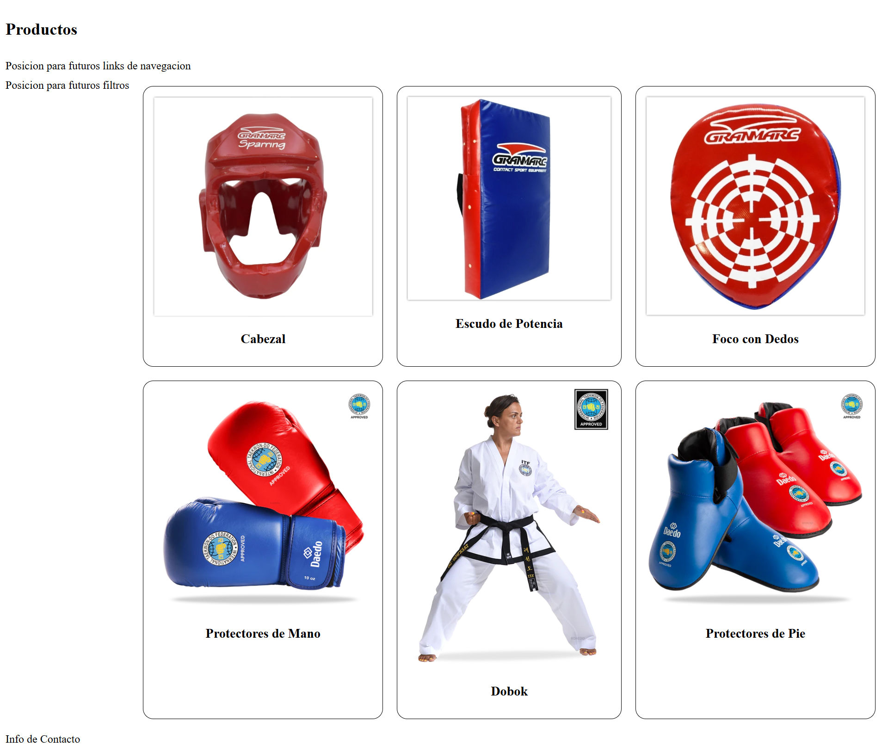

----

### Ejercicio: grid-area

<iframe width="560" height="315" src="https://www.youtube.com/embed/BDV5_djtQqs?si=EORiIurJ9GWAJI7N" title="YouTube video player" frameborder="0" allow="accelerometer; autoplay; clipboard-write; encrypted-media; gyroscope; picture-in-picture; web-share" referrerpolicy="strict-origin-when-cross-origin" allowfullscreen></iframe>

---

### Ejercicio: Mejora
Empleando las etiquetas html vistas en clase agrega:

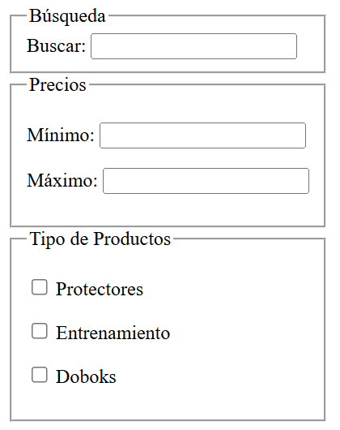

----

### Ejercicio: Mejora

<iframe width="560" height="315" src="https://www.youtube.com/embed/kgPttinEOnk?si=iSfrp0Z7NSNeOmvY" title="YouTube video player" frameborder="0" allow="accelerometer; autoplay; clipboard-write; encrypted-media; gyroscope; picture-in-picture; web-share" referrerpolicy="strict-origin-when-cross-origin" allowfullscreen></iframe>

---
## Grid
Puedes acceder a más documentación en:

[W3School Grid](https://www.w3schools.com/css/css_grid.asp)

[DesarrolloWeb.com](https://desarrolloweb.com/articulos/que-es-css-grid-layout.html)

[LenguajeCSS](https://lenguajecss.com/p/css/propiedades/grid-css)

---
## Transitions
Es una forma de animar los cambios de las propiedades CSS, para que no surtan efecto de manera instantánea.
````css
transition: <propiedad> <duracion> <funcion-tiempo> <retraso>;
````
La sintaxis puede ser también separada:
````css
a {
    transition-property: text-decoration;
    transition-duration: 0.8s;
    transition-timing-function: linear;
    transition-delay: 0.2s;
}
````

---
## Transitions
<!-- .slide: style="font-size: 0.80em" -->
* **transition-poperty**: propiedad a la que se le va a aplicar el efecto de transición. Puede ser cualquier propiedad de CSS: width, height, color, border, etc.
* **transition-duration**: duración del efecto. Puede ser en segundos (s) o milisegundos (ms).
* **trasition-timing-function**: define la curva de velocidad a la que se produce el efecto. Puede ser: ease, linear, ease-in, ease-out, ease-in-out, cubic-bezier, initial, inherit
* **transition-delay**: retraso en el comienzo de la transición. Puede ser en segundos (s) o milisegundos (ms).

----

## Transitions

Por ejemplo:
````css
a {
    text-decoration: none;
    color: blue;
    transition: color 0.8s linear 0.2s;
}
a:hover {
    color: red;
}
````

----

## Transitions
````css
div {
   width: 100px;
   height: 100px;
   background: red;
   -webkit-transition: width 2s; /* For Safari 3.1 to 6.0 */
   transition: width 2s;
}
   
div:hover {
   width: 300px;
}
````

<div class="divTran"></div>

----

## Transitions 2
<!-- .slide: style="font-size: 0.90em" -->
````css
div {
   width: 100px;
   height: 100px;
   background: red;
   -webkit-transition: width 2s, height 2s, -webkit-transform 2s; /* Safari */
   transition: width 2s, height 2s, transform 2s;
}
   
div:hover {
   width: 200px;
   height: 200px;
   -webkit-transform: rotate(180deg); /* Safari */
   transform: rotate(180deg);
}
````

<div class="divTran2"></div>

---

### Variables

Para reutilizar los colores de manera más sencilla:
```css
:root {
        --color-primario: rgb(120, 11, 11);
        --color-secundario: rgb(35, 11, 120);
        --color-texto: white;
      }

a {background-color: var(--color-primario);}
```

---
## Ejercicio de Transitions
- Agregar 2 botones "Catálogo" y "Carrito de Compras" en la sección **nav**
- Agregar los estilos para que se visualice de la siguiente manera: (el cambio de color de fondo y de padding no debe ser abrupto)
- Reutilice los colores empleando **VAR**

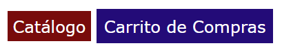

----

### CSS: Ejercicio de Transitions

<iframe width="560" height="315" src="https://www.youtube.com/embed/QT9Cjx3H3GY?si=sVir4PkJkfqh0KE0" title="YouTube video player" frameborder="0" allow="accelerometer; autoplay; clipboard-write; encrypted-media; gyroscope; picture-in-picture; web-share" referrerpolicy="strict-origin-when-cross-origin" allowfullscreen></iframe>

---

### Animaciones (@keyframes)

Fuera de las transitions, que responden a un cambio de estado como *:hover*, 
las animaciones permiten secuencias continuas y complejas:

```css
@keyframes miAnimacion {
  0% { opacity: 0; transform: translateY(-10px); }
  100% { opacity: 1; transform: translateY(0); }
}

.elemento {
  animation: miAnimacion 1s ease-in-out infinite;
}
```

<div class="divAni"></div>

---
## CSS
<!-- .slide: style="font-size: 0.90em" -->
¿Por qué una Web no funciona igual en diferentes navegadores?
<ul>
<li style="list-style-image: url('images/html/chrome.png');">
<b>Google Chrome</b>
Utiliza para interpretar JavaScript un motor <b>V8</b>, y para el renderizado antes <b>WebKit</b> y ahora <b>Blink</b>.

<li style="list-style-image: url('images/html/firefox.png');">
<b>Firefox</b>
Empleaba <b>JagerMonkey</b> y ahora <b>SpiderMonkey</b> para JavaScript y para el renderizado <b>Gecko</b>.

<li style="list-style-image: url('images/html/explorer.png');">
<b>Internet Explorer & Edge</b>
Empleaba <b>Chakra</b>, posteriormente <b>ChakraCore</b> para JavaScript e inicialmente <b>Trident</b> para renderizado, luego <b>EdgeHTML</b>.
</ul>

---

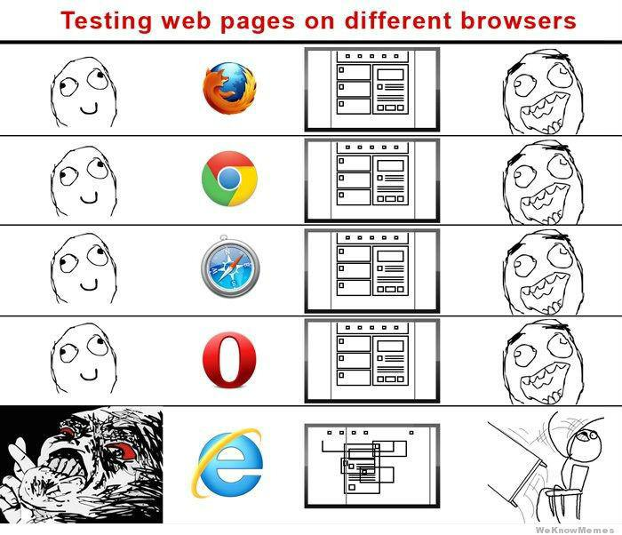

---

### Reset CSS
<!-- .slide: style="font-size: 0.85em" -->
Es eliminar absolutamente todos los estilos por defecto que aplican los navegadores. 
Reduce prácticamente todas las propiedades de margen, relleno, bordes y tamaños de fuente a un estado "cero" o plano.

Ejemplo conceptual (Eric Meyer Reset)
```css
/* Elimina márgenes, rellenos y bordes de casi todos los elementos */
html, body, div, span, h1, h2, h3, p, a, ul, li, form, label {
  margin: 0;
  padding: 0;
  border: 0;
  font-size: 100%;
  font: inherit;
  vertical-align: baseline;
}

/* Quita las viñetas de las listas */
ul, ol {
  list-style: none;
}
```

----

### Reset CSS

#### Ventaja
Te otorga control total. Sabes que ningún elemento tendrá un margen o un estilo indeseado que no hayas escrito tú mismo.

#### Desventaja
Es drástico. Quita estilos útiles por defecto (por ejemplo, deja las negritas `<b>` sin peso visual, desalinea los encabezados y elimina el espaciado natural de los párrafos), obligándote a redefinir cada detalle desde cero.

---

### Normalize.css
Su objetivo es preservar los estilos por defecto que son útiles y estandarizar solo las diferencias inconsistentes entre navegadores. También corrige errores habituales de renderizado en formularios y elementos multimedia.

----

### Normalize.css
- **Preserva estilos útiles:** Conserva las negritas, los itálicos, los encabezados y las viñetas de las listas con proporciones consistentes.
- **Normaliza los elementos:** Corrige inconsistencias en los campos de formulario (`<input>, <button>, <select>`), que suelen verse muy distintos entre sistemas operativos.
- **Mantiene el estándar:** No necesitas volver a declarar estilos básicos para el texto legible.

----

### Normalize.css
```css
/* Ejemplo de lo que hace Normalize: homologa tamaños y márgenes de encabezados */
h1 {
  font-size: 2em;
  margin: 0.67em 0;
}

/* Corrige la tipografía de los botones para que hereden la fuente del sistema */
button, input, select, textarea {
  font-family: inherit;
  font-size: 100%;
  line-height: 1.15;
  margin: 0;
}
```

---

### Modern CSS Reset
Combina la limpieza de márgenes innecesarios con reglas globales indispensables como box-sizing: border-box y soporte para imágenes responsivas.

```css
/* 1. Uso global de border-box */
*, *::before, *::after {
  box-sizing: border-box;
}

/* 2. Remover márgenes por defecto en elementos clave */
* {
  margin: 0;
}

/* 3. Mejorar la altura de línea y el renderizado tipográfico */
body {
  line-height: 1.5;
  -webkit-font-smoothing: antialiased;
}

/* 4. Hacer que las imágenes y elementos multimedia sean fluidos */
img, picture, video, canvas, svg {
  display: block;
  max-width: 100%;
}

/* 5. Evitar que los campos de texto mantengan fuentes del sistema desalineadas */
input, button, textarea, select {
  font: inherit;
}

/* 6. Evitar desbordamiento de texto */
p, h1, h2, h3, h4, h5, h6 {
  overflow-wrap: break-word;
}
```

----

### Modern CSS Reset: Implementación
La hoja de estilo de reinicio siempre debe cargarse antes que cualquier otra hoja de estilo:
```css
<head>
  <!-- 1. Estilos de normalización/reinicio primero -->
  <link rel="stylesheet" href="normalize.css">
  
  <!-- 2. Tus estilos propios después -->
  <link rel="stylesheet" href="estilos.css">
</head>
```

---
## CCS3
Buenas Prácticas:
* Comprobar el diseño en varios navegadores
* Depuración (Ej. firebug)
* Comentar el código
* Identar y hacer el código fácil de leer
* Usar sistema común de nombrado
* Evitar tamaños absolutos en fuentes o elementos
* Utilizar notación de colores en hexadecimal
* Ordenar los elementos según pertenezcan a cabecera, contenido principal o pie de página

---

## Diseño Responsivo
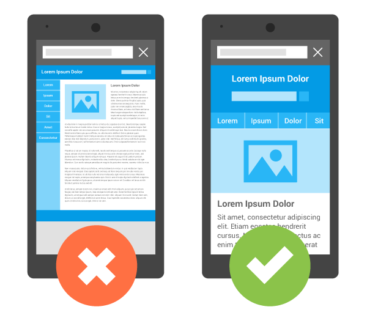

----

## Diseño Responsivo
Diseño web adaptable, donde la apariencia de las páginas web se adapta al dispositivo que se esté utilizando para visualizarla.

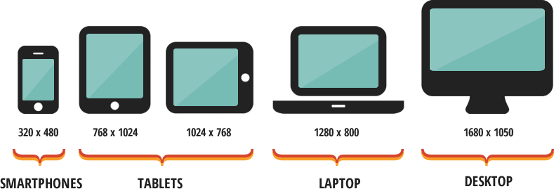

----

## Diseño Responsivo
Se trata de redimensionar y colocar los elementos de la web de forma que se adapten al ancho de cada dispositivo permitiendo una correcta visualización y una mejor experiencia de usuario.
    
Se caracteriza porque los layouts (contenidos) e imágenes son fluidos y se usa código media-queries de CSS3.

----

## Diseño Responsivo
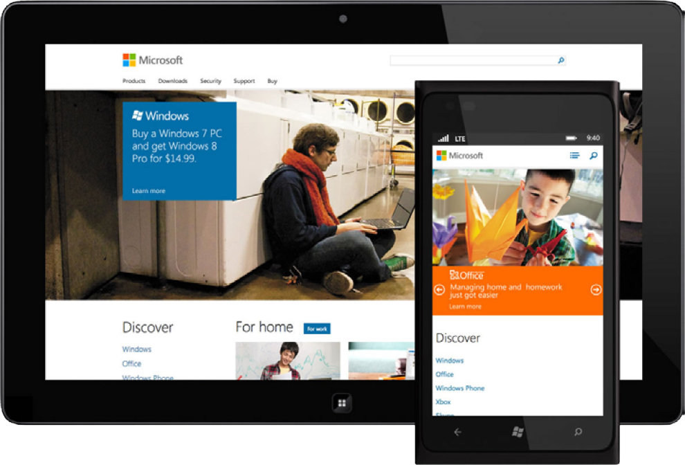

---
## [Media Query](https://developer.mozilla.org/es/docs/CSS/Media_queries)
Fue introducido en CSS3. Estas construcciones del lenguaje CSS permiten definir estilos condicionales, aplicables 
únicamente en determinadas situaciones.

<small>
- Si la pantalla del usuario tiene estas características, entonces aplica estos estilos
- Si se imprime el documento en la impresora, aplica estos estilos.
- Si la pantalla del dispositivo tiene estas dimensiones y además está situado en posición horizontal (landscape), entonces aplica este CSS. 
</small>
    
````css
@media (max-width: 600px) {
  .facet_sidebar {
    display: none;
  }
}

@media (min-width: 700px) and (orientation: landscape) { ... }

````

---
## [Media Query](https://desarrolloweb.com/articulos/css-media-queries.html)
Formas de Aplicación:
* Media Query por etiqueta LINK
* Media Query mediante @media

---
## Media Query por Etiqueta Link
Se debe agregar un atributo media de la etiqueta *Link*, que permite enlazar el HTML con el CSS.
````css
<link rel="stylesheet" media="print" href="estilo-imprimir.css" >
<link rel="stylesheet" media="(min-width:1200px)" href="estilo-pantallas-grandes.css">
````
<small>
1. Estos estilos aplican solo cuando la página se está mostrando para la impresión. <br>
2. Estos estilos aplican cuando la página tenga una anchura mínima de 1200px
</small>

---
### Media Query mediante @media
Es el más empleado. En la definición de los estilos se emplea @media con la condición/es que deben cumplirse.
````css
@media (min-width: 500px) {
    h1{
        margin: 1%;
    }
    .estiloresponsive{
        float: right;
        padding-left: 15px; 
    }
}
````
Cuando la sentencia entre paréntesis se evalúe como verdadera, se aplicarán todos los estilos definidos entre llaves. 

---
### Operadores lógicos para Media Query
<!-- .slide: style="font-size: 0.80em" -->
* **and:** las dos condiciones deben cumplirse para que se evalúe como verdadera.
* **not**: es una negación de una condición. Cuando esa condición no se cumpla se aplicarán las media queries.
* **only**: se aplican las reglas solo en el caso que se cumpla cierta circunstancia.
* **or**: no existe como tal, pero puedes poner varias condiciones separadas por comas y cuando se cumpla cualquiera de 
ellas, se aplicarán los estilos de las media queries. 
````css
//Ejemplo and
@media (max-width: 600px) and (orientation: landscape) {
    h1{
        color: red;
    }
}
````

---
### [Media Types](https://developer.mozilla.org/es/docs/Web/CSS/Media_Queries/Using_media_queries)
Describen la categoría general de un dispositivo. 
* **all:** Apto para todos los dispositivos.
* **print:** Destinado a material impreso y visualización de documentos en una pantalla en el modo de vista previa de impresión. 
* **screen:** Destinado principalmente a las pantallas.
* **speech:** Destinado a sintetizadores de voz. 
<small>
Fueron deprecados los Medios: tty, tv, projection, handheld, braille, embossed y aural
</small>

----

### Media Types
````css
@media print {
    /* … */
}

@media screen, print {
    /* … */
}

````

---
## Media Queries
<!-- .slide: style="font-size: 0.90em" -->
"Responsive Design" es la estrategia para hacer que un sitio se adapte al navegador y dispositivo en el que se muestra
````css
@media screen and (min-width:600px) {
    nav {
        float: left;
        width: 25%;
    }
    section {
        margin-left: 25%;
    }
}
@media screen and (max-width:599px) {
    nav li {
        display: inline;
    }
}
````
[Learn Layout](http://learnlayout.com/media-queries.html)

---
### Media Queries
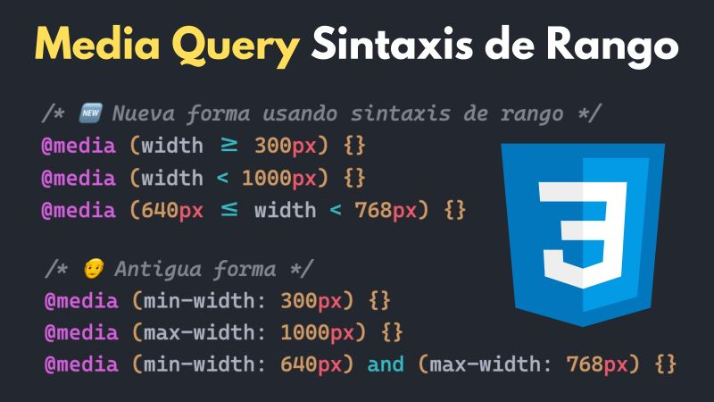

---

## HTML5: Viewport
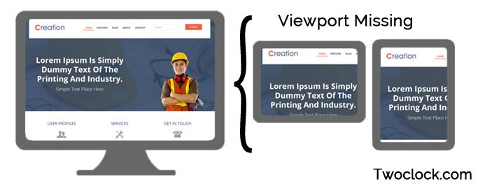

----

## [HTML5: Viewport](https://developer.mozilla.org/es/docs/M%C3%B3vil/Viewport_meta_tag)
Es el área de la ventana en donde el contenido web está visible. Generalmente no es del mismo tamaño que la página 
renderizada, en donde se brindan barras de desplazamiento para que el usuario pueda acceder a todo el contenido.

----

## HTML5: Viewport
Dispositivos con pantallas angostas muestran la página en una ventana virtual o viewport, que es usualmente más ancho 
que la pantalla y la comprimen de manera que pueda verse completa. El usuario podrá recorrerla y hacer zoom para ver 
diferentes áreas de la página. Por ejemplo, si una pantalla móvil tiene un ancho 640px, las páginas pueden ser procesadas 
con un viewport de 980px, y después comprimidas para que entren en 640px.

----

## HTML5: Viewport
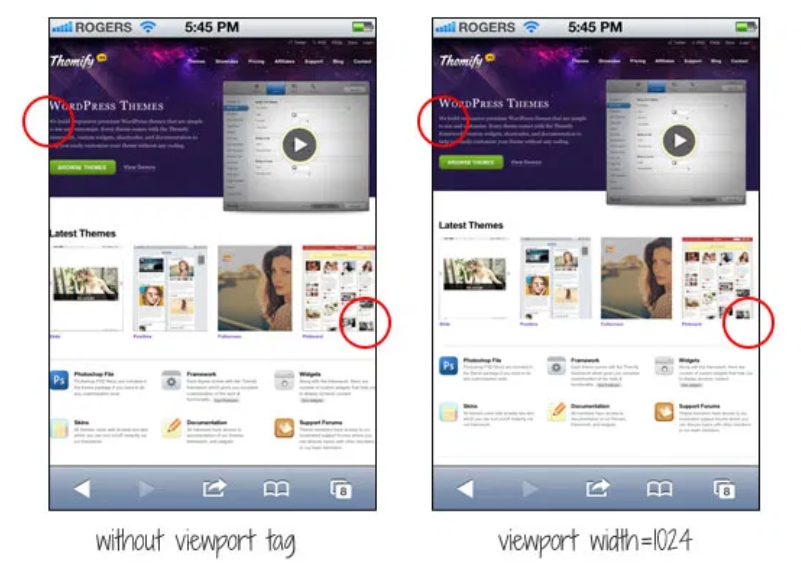

----

## HTML5: Viewport
Esto se hace porque muchas páginas no están optimizadas para dispositivos móviles y se ven mal cuando son procesadas a un 
ancho de viewport pequeño. El viewport virtual es una forma de resolver el problema de sitios no optimizados para móviles, 
logrando que se vean mejor.

---

## HTML5: Viewport
<!-- .slide: style="font-size: 0.80em" -->
La etiqueta viewport permite definir el ancho, alto y escala del área usada por el navegador para mostrar contenido.
Sino por defecto una web tiene siempre 980px de ancho.

Se le puede configurar
* **width:** Ancho virtual (emulado) de la pantalla
* **Height:** altura virtual de la pantalla
* **initial-scale:** zoom que va tener como inicio (min 0.1)
* **minimum-scale:** zoom mínima permitido
* **maximum-scale:** zoom máximo permitido
* **user-scalable:** si se permite o no al usuario hacer zoom.

````css
<meta name="viewport" content="width=device-width, user-scalable=no, initial-scale=1">
````

----

## HTML5: Viewport
Prueba como se ve la página Ejercicios-CSS/ej_cv.html con F12 SIN la etiqueta de viewport... Luego agregale la etiqueta y mira que pasa
````css
<meta name="viewport" content="width=device-width, user-scalable=no, initial-scale=1">
````

---
## Ejercicio: Responsive
Empleando Ejercicios-CSS el template ej_instagram, el contenido debe visualizarse:
* Se deben mostrar 3 columnas las imagenes si la pantalla si la pantalla tiene un mínimo de 601px
* Se debe mostrar 1 columna si la pantalla tiene como máximo 600px
* Las imagenes deben ocupar el 100% de su columna

----

## Ejercicio: Responsive
<iframe width="560" height="315" src="https://www.youtube.com/embed/nLImEsvaP2g" frameborder="0" allow="accelerometer; autoplay; encrypted-media; gyroscope; picture-in-picture" allowfullscreen></iframe>

---
## Diseño Responsivo: Características
* Los layouts o imagenes son fluidos y se adaptan a cada pantalla.
* Permite reducir el tiempo de desarrollo.
* Evita los contenidos duplicados.
* Permite compartir los contenidos de una forma más rápida y natural.

---

### Dark Mode
El soporte para modo oscuro (Dark Mode) permite que un sitio web se adapte automáticamente al tema de color (claro u oscuro) que el usuario tiene configurado en su sistema operativo (Windows, macOS, Android, iOS).

----

### Dark Mode
```css
/* 1. Valores por defecto (Tema Claro) */
:root {
  --bg-color: #f8f9fa;
  --text-color: #212529;
  --card-bg: #ffffff;
  --border-color: #e0e0e0;
  --accent-color: #3b82f6;
}

/* 2. Redefinición para Modo Oscuro */
@media (prefers-color-scheme: dark) {
  :root {
    --bg-color: #121212;
    --text-color: #e0e0e0;
    --card-bg: #1e1e1e;
    --border-color: #333333;
    --accent-color: #60a5fa;
  }
}

/* 3. Estilos de la aplicación usando las variables */
body {
  background-color: var(--bg-color);
  color: var(--text-color);
  transition: background-color 0.3s ease, color 0.3s ease;
}

.card {
  background-color: var(--card-bg);
  border: 1px solid var(--border-color);
}
```

----

### Dark Mode con Toggle con Js
```css
/* Paleta base (Tema Claro) */
:root {
  --bg-color: #ffffff;
  --text-color: #111111;
}

/* Tema oscuro cuando se agrega la clase .dark-theme al body o html */
[data-theme="dark"] {
  --bg-color: #121212;
  --text-color: #ffffff;
}
```

```js
// Ejemplo simple en JavaScript para alternar el tema
const toggleButton = document.querySelector("#theme-toggle");

toggleButton.addEventListener("click", () => {
  const currentTheme = document.documentElement.getAttribute("data-theme");
  const newTheme = currentTheme === "dark" ? "light" : "dark";
  
  document.documentElement.setAttribute("data-theme", newTheme);
});
```

---

### Evitar el uso de !important
- Rompe la regla de la cascada y la especificidad, lo que hace que el código sea difícil de mantener y modificar
- Dificultad para depurar, quita la predictibilidad al código. En lugar de seguir la lógica normal de las clases o IDs, debes buscar manualmente dónde se aplicó esta regla forzada.
- En proyectos grandes, complica el trabajo con otros desarrolladores que intenten sobrescribir estilos sin éxito.

---
## ¿Dudas, Preguntas, Comentarios?

