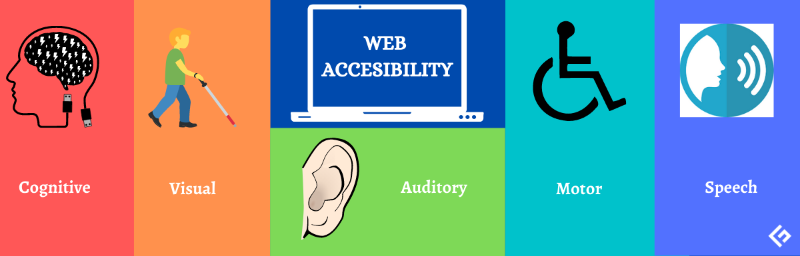
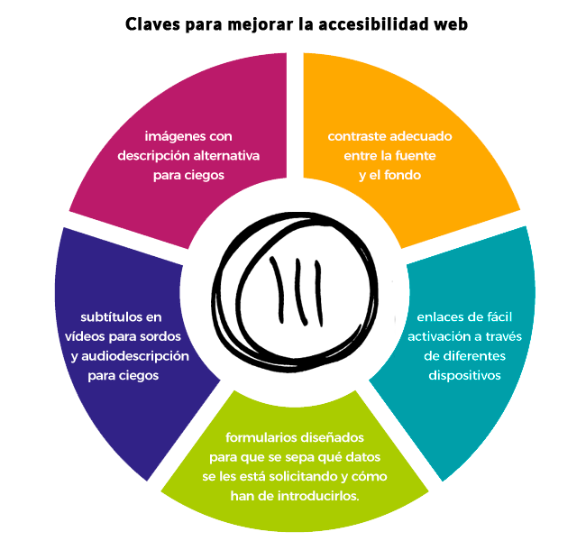

# Tutorial de HTML II
### en HTML (que recursivo :P)
Created by <i class="fab fa-telegram"></i>
[edme88]("https://t.me/edme88")

---
<style>
.grid-container2 {
    display: grid;
    grid-template-columns: auto auto;
    font-size: 0.8em;
    text-align: left !important;
}

.grid-item {
    border: 3px solid rgba(121, 177, 217, 0.8);
    padding: 20px;
    text-align: left !important;
}
</style>
<!-- .slide: style="font-size: 0.80em" -->
## Temario
<div class="grid-container2">
<div class="grid-item">


</div>
<div class="grid-item">

### Accesibilidad
* Fieldset, legend, label
* Caption
* Consejos de accesibilidad

[Ejercicio: Accesibilidad](U4_HTML_avanzado.html#/24)

### Otras etiquetas

* Etiquetas anidadas
* Canvas
* Multimedia (video, audio)

[Ejercicio: Multimedia](U4_HTML_avanzado.html#/32)

* Buenas Prácticas

</div>
</div>

----

### ¿Qué etiquetas recuerdan de la clase anterior?
<!-- .slide: style="font-size: 0.85em" -->

<div class="grid-container2">
<div class="grid-item">
<ul>
<li class="fragment">DOCTYPE</li>
<li class="fragment">html</li>
<li class="fragment">head</li>
<li class="fragment">body</li>
<li class="fragment">title</li>
<li class="fragment">meta</li>
<li class="fragment">header</li>
<li class="fragment">nav</li>
<li class="fragment">main</li>
<li class="fragment">aricle</li>
<li class="fragment">section</li>
<li class="fragment">aside</li>
<li class="fragment">footer</li>
<li class="fragment">div</li>
<li class="fragment">h1-h6</li>
<li class="fragment">p</li>
</div>
<div class="grid-item">
<li class="fragment">strong</li>
<li class="fragment">em</li>
<li class="fragment">u</li>
<li class="fragment">sub</li>
<li class="fragment">sup</li>
<li class="fragment">ol</li>
<li class="fragment">ul</li>
<li class="fragment">li</li>
<li class="fragment">a</li>
<li class="fragment">img</li>
<li class="fragment">form</li>
<li class="fragment">input</li>
<li class="fragment">select</li>
<li class="fragment">option</li>
<li class="fragment">textarea</li>
<li class="fragment">button</li>
</ul>
</div></div>

----

### ¿Qué atributos recuerdan de la clase anterior?
<!-- .slide: style="font-size: 0.85em" -->

<div class="grid-container2">
<div class="grid-item">
<ul>
<li class="fragment">content</li>
<li class="fragment">name</li>
<li class="fragment">charset</li>
<li class="fragment">lang</li>
<li class="fragment">src</li>
<li class="fragment">href</li>
<li class="fragment">target</li>
<li class="fragment">colspan</li>
<li class="fragment">rowspan</li>
<li class="fragment">id</li>
<li class="fragment">type</li>
</div>
<div class="grid-item">
<li class="fragment">placeholder</li>
<li class="fragment">size</li>
<li class="fragment">maxlength</li>
<li class="fragment">min</li>
<li class="fragment">max</li>
<li class="fragment">value</li>
<li class="fragment">step</li>
<li class="fragment">checked</li>
</ul>
</div></div>

---

### Más sobre formularios...
* datalist
* optgroup

---

### [Datalist](https://www.w3schools.com/tags/tag_datalist.asp)
Permite mostrar opciones pre-definidas en un input, o dejar que el usuario complete con cualquier valor deseado:
````html
<input list="browsers" name="browser" id="browser">
<datalist id="browsers">
  <option value="Edge">
  <option value="Firefox">
  <option value="Chrome">
  <option value="Opera">
  <option value="Safari">
</datalist>
````

<input list="browsers" name="browser" id="browser">
<datalist id="browsers">
  <option value="Edge">
  <option value="Firefox">
  <option value="Chrome">
  <option value="Opera">
  <option value="Safari">
</datalist>

---

### [optgroup](https://www.w3schools.com/tags/tag_optgroup.asp)
Permite agrupar opciones de un **select** según categorías:
````html
<select  name="materias" id="materias">
  <option value="" disabled selected>Seleccione una materia</option>
  <optgroup label="Comunes">
    <option value="mat1">Análisis Matemático</option>
    <option value="fis1">Física 1</option>
  </optgroup>
  <optgroup label="Ing. Informática">
    <option value="web">Taller de Desarrollo Web</option>
    <option value="arqSoft">Arquitectura de Software</option>
  </optgroup>
</select>
````

<select  name="materias" id="materias">
  <option value="" disabled selected>Seleccione una materia</option>
  <optgroup label="Comunes">
    <option value="mat1">Análisis Matemático</option>
    <option value="fis1">Física 1</option>
  </optgroup>
  <optgroup label="Ing. Informática">
    <option value="web">Taller de Desarrollo Web</option>
    <option value="arqSoft">Arquitectura de Software</option>
  </optgroup>
</select>

---

### [Progress](https://www.w3schools.com/tags/tag_progress.asp) & [Meter](https://www.w3schools.com/tags/tag_meter.asp)
- **progress:** Representa el progreso de una tarea en curso (descarga, carga, renderizado, etc.). Se le puede agregar: value, max.
- **meter:** Representa un valor dentro de un rango conocido (ej: nivel de batería, puntuación, temperatura, calificación). Se le puede configurar: value, min, max, low, high, optimun.

````html
<progress id="file" value="32" max="100"> 32% </progress>
<meter id="disk_c" value="2" min="0" max="10">2 out of 10</meter>
````

<progress id="file" value="32" max="100"> 32% </progress>
<meter id="disk_c" value="2" min="0" max="10">2 out of 10</meter>

---

## Accesibilidad
La accesibilidad web tiene como objetivo lograr que las páginas web sean utilizables por el máximo número de personas, 
independientemente de sus conocimientos o capacidades personales.

[Accesibilidad Web](http://accesibilidadweb.dlsi.ua.es/?menu=guiabreve-1)

---
## Accesibilidad


---
## Fieldset, Legend y Label
<!-- .slide: style="font-size: 0.85em" -->
* **Fieldset**: representa un conjunto de elementos en un formulario (form), opcionalmente agrupados bajo un mismo nombre. 
Este elemento puede ser útil en formularios grandes, donde la legibilidad y la facilidad de acceso pueden ser mejoradas mediante la segmentación. 
Lo navegadores mostrarán normalmente un marco alrededor de los controles agrupados. 
* **Legend**: Crea un título para un grupo de campos (**fieldset**) de un formulario.
* **label**: representa una etiqueta que puede ser asociada a un campo de formulario.

---
## Fieldset, Legend y Label
<!-- .slide: style="font-size: 0.85em" -->
````html
<fieldset>
    <legend>Persona:</legend>
    <label for="nombre"> Nombre:</label>
    <input type="text" size="30" id="nombre"><br>
    <label for="email"> Email:</label>
    <input type="text" size="30" id="email">
</fieldset>
````
(el **for** del label debe contener el mismo texto que el **id** del input)
<div align="left">
    <fieldset style="border: 5px white solid;padding: 20px">
        <legend>Persona:</legend>
            <label for="nombre"> Nombre:</label>
            <input type="text" size="30" id="nombre"><br>
            <label for="email"> Email:</label>
            <input type="text" size="30" id="email">
    </fieldset>
</div>

---
## [Caption](https://developer.mozilla.org/es/docs/Web/HTML/Elemento/caption)
Es el encargado de darle un título descriptivo a las tablas.
````html
<table border='1'>
    <caption>Tabla con caption</caption>
    <tr> <td> Celda 1 </td><td> Celda 2 </td>  </tr>
    <tr> <td> Celda 3 </td><td> Celda 4 </td>  </tr>
</table>
````

<table border='1'>
    <caption>Tabla con caption</caption>
    <tr> <td> Celda 1 </td><td> Celda 2 </td>  </tr>
    <tr> <td> Celda 3 </td><td> Celda 4 </td>  </tr>
</table>

---
## Accesibilidad: Consejos


---
## Accesibilidad: Consejos
<!-- .slide: style="font-size: 0.75em" -->
* Use el atributo **alt** en las **imágenes** para describir la función del elemento visual.
*  Emplee el tag **caption** para los titulos de las tablas
*  Emplee la etiqueta **label** y el atributo **for** en los input 
*  Use el elemento map para las zonas activas.
*  Emplee programas **lector de pantalla** (JAWS, NVDA, ETC) para comprobar el correcto funcionamiento de la web. (Fangs Screenenders muestra una version de texto de la pagina web)
*  Utilice correctamente los hipervinculos (deben tener sentido por si mismo. No emplear 'Click Aqui')
*  Utilice encabezados, listas y estructura de manera consistente
*  Describir figuras, diagramas o animaciones con el atributo longdesc
*  Utilice herramientas o servicios como [Accesibility Validator W3](https://validator.w3.org/) para comprobar el adecuado funcionamiento de la página

---
## Ejercicios: Accesibilidad
* En el formulario que creado, emplee la etiqueta **label for=”mismo_id”**
* Agregue el atributo **alt** con el texto alternativo a todas las imágenes de su sitio web.
* Emplee el tag **caption** para agregar títulos a todas las tablas del sitio web.

---
## Ejercicios: Accesibilidad
<iframe width="560" height="315" src="https://www.youtube.com/embed/ZdyJMznlgJ8" frameborder="0" allow="accelerometer; autoplay; encrypted-media; gyroscope; picture-in-picture" allowfullscreen></iframe>

---

### Ejercicios: Axe
1. Instala el plugin de [Axe](https://chromewebstore.google.com/detail/axe-devtools-web-accessib/lhdoppojpmngadmnindnejefpokejbdd?hl=es-419) en Chrome.
2. Ejecuta las validaciones de accesibilidad en tu página

---
## Lienzo Canvas
Proporciona una Interfaz de Programación de Aplicaciones (API) para dibujar líneas en dos dimensiones, imágenes y textos.

El lienzo es un contenedor de gráficos y se debe utilizar un script para dibujar o pintar.

Cada pixel dentro del lienzo(canvas) puede ser controlado.

---
## Lienzo Canvas
````html
<canvas id="myCanvas" width="200" height="100" style="border:1px solid #d3d3d3;">
    Your browser does not support the HTML5 canvas tag.
</canvas>
````
<canvas id="myCanvas" width="200" height="100" style="border:1px solid #d3d3d3;">
    Your browser does not support the HTML5 canvas tag.
</canvas>

---
## Multimedia
HTML5 permite incluir audio y video de forma nativa sin incluir pluing de terceros.
    
Para los navegadores que no soporten esta tecnología, se pueden incluir textos que indiquen que es incompatible.
    
---

## [Video](https://www.w3schools.com/tags/tag_video.asp)
Permite añadir archivos de video a la página.
Si quieres permitir varios formatos (el navegador prueba en orden hasta encontrar uno que soporte)
````html
<video controls>
    <source src="forrest_gump.mp4" type="video/mp4">
    <source src="forrest_gump.ogg" type="video/ogg">
    <track src="fgsubtitles_en.vtt" kind="subtitles" srclang="en" label="English">
    Tu navegador no implementa el elemento <code>video</code>.
</video>
````
- **Formatos**: mp4, webm, ogg.
- **Track**: subtítulos o descripciones en video/audio.

---

### Video
````html
<video src="http://v2v.cc/~j/theora_testsuite/320x240.ogg" controls>
    Tu navegador no implementa el elemento <code>video</code>.
    <track src="fgsubtitles_en.vtt" kind="subtitles" srclang="en" label="English">
</video>
````

<video width="320" height="240" autoplay muted controls>
  <source src="https://www.w3schools.com/html/mov_bbb.mp4" type="video/mp4">
Your browser does not support the video tag.
</video> 

Atributos: controls (play, pause, volumen), width, height, autoplay, muted

---
## [Audio](https://lenguajehtml.com/p/html/multimedia/etiquetas-html-de-audio)
Permite añadir archivos de audio a la página.
````html
<audio src="/test/audio.ogg" controls autoplay>
<p>Tu navegador no implementa el elemento audio.</p>
</audio>
````
<audio src="/test/audio.ogg" controls autoplay>
    Tu navegador no implementa el elemento audio.</p>
</audio>

- **Atributos:** src, preload (auto, metadata, none), mediagroup, autoplay, loop, muted, controls
- **Formato:** mp3, ogg, aac, opus, flac, wav

---

### iframe
Permite incrustar otro documento html dentro del actual.
````html
<iframe src="https://ucc-tallerdesarrolloweb.github.io/filminas/index.html" title="Taller de Desarrollo Web">
</iframe>
````

<iframe src="https://ucc-tallerdesarrolloweb.github.io/filminas/index.html" title="Taller de Desarrollo Web">
</iframe>

---
## Ejercicio 7: Multimedia
Empleando el template “ej_animales”, agregue las etiquetas necesarias para:
* Agregar un audio (el mismo se encuentra en la carpeta “resources”)
* Agregar un video (el mismo se encuentra en la carpeta “resources”)
* Agregar un video de youtube

---
## Ejercicio 7: Multimedia
<iframe width="560" height="315" src="https://www.youtube.com/embed/AFtAFhgGDE8" frameborder="0" allow="accelerometer; autoplay; encrypted-media; gyroscope; picture-in-picture" allowfullscreen></iframe>

---
## RECUERDA!!!!
Puedes versionar código, documentos de texto plano...

Pero recuerda que GIT no está optimizado para subir VIDEOS o imágenes muy pesadas, o archivos binarios (como instaladores).

Usa Git sabiamente pequeño padawan.

---

### Figure & Figcaption
Sirve para agrupar una foto con un pie de página:
```html
<figure>
  
  <figcaption>Fig.1 - Trulli, Puglia, Italy.</figcaption>
</figure>
```

---

### Small
Sirve para escribir textos más pequeños:
```html
<p><small>This is some smaller text.</small></p>
```

---

### br
Salto de línea:
```html
<p>To force<br> line breaks<br> in a text,<br> use the br<br> element.</p>
```

---

### hr
separador temático entre secciones de texto.
```html
<hr>
```

<hr>

---
## Verifica tu Web
Permite encontrar con facilidad algunos errores que puede haber en tu página:

[W3C Markup Validation Service](https://validator.w3.org/#validate_by_input)

---
# Bibliografia xD
[](http://www.w3schools.com/html)

[](https://developer.mozilla.org/es/)

---

## Buenas Prácticas
* Cerrar las etiquetas
* Nombre de las etiquetas siempre en minúscula
* Poner comillas a todos los atributos
* Validar el código
* Identar el código correctamente
* Tener en cuenta la accesibilidad (alt, title para img-label para inputs)
* No utilizar etiquetas deprecadas
* Usar ficheros externos para CSS y JavaScript

---
## ¿Dudas, Preguntas, Comentarios?

