# Fundamentos de HTML+CSS
Created by <i class="fab fa-telegram"></i>
[edme88]("https://t.me/edme88")
---

<style>
.grid-container2 {
    display: grid;
    grid-template-columns: auto auto;
    font-size: 0.8em;
    text-align: left !important;
}

.grid-item {
    border: 3px solid rgba(121, 177, 217, 0.8);
    padding: 20px;
    text-align: left !important;
}
</style>
<!-- .slide: style="font-size: 0.80em" -->
## Temario
<div class="grid-container2">
<div class="grid-item">

### Aplicaciones web
* Definición
* Ejemplos
* Aplicación web vs. página web
* Ventajas
* Tipo de acceso
* Estructura

</div>
<div class="grid-item">

### Página web
* Estátitca vs Dinámica
* Procesamiento
* Servidor
* Evolución de la web

## Programación
* Lenguajes de programación
* Características de HTML
</div>
</div>

---

## Capas del Diseño Web


---
## Estructura de Aplicaciones Webs
Normalmente posee 3 capas:
* Capa del Cliente
* Capa Intermedia
* Capa de Servidor

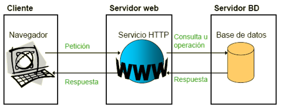

---
## Estructura
* Capa de Presentación, de Usuario/Cliente
<p class="fragment"> <small> 
front-end que es el responsable de proporcionar la lógica de presentación. También es conocida como interfaz gráfica.
</small> </p>
* Capa del Servidor Web o del Negocio o Intermedia
<p class="fragment"> <small> 
es donde residen los programas que se ejecutan, se reciben las peticiones del usuario y se envían las respuestas tras 
el proceso. Aquí es donde se establecen todas las reglas que deben cumplirse. Esta capa se comunica con la capa de 
presentación, para recibir las solicitudes y presentar los resultados, y con la capa de datos, para solicitar al gestor 
de base de datos almacenar o recuperar datos de él. 
</small> </p>
* Capa del Servidor de BD
<p class="fragment"> <small> 
 es donde residen los datos y es la encargada de acceder a los mismos. Está formada por uno o más gestores de bases de 
 datos que realizan todo el almacenamiento de datos, reciben solicitudes de almacenamiento o recuperación de información 
 desde la capa de negocio.
</small> </p>

---
## Tipos de Páginas web
Una **aplicación Web** es un conjunto de páginas Web estáticas y dinámicas.

* **Web Estática:** No cambia cuando un usuario la solicita.
  El servidor Web envía la página al navegador Web solicitante sin modificarla.

* **Web Dinámica:** Contiene elementos que permiten la comunicación activa entre el usuario y la
  aplicación, y cuyo contenido se genera a partir de lo que el usuario introduce.

---
## Procesamiento Web Estática

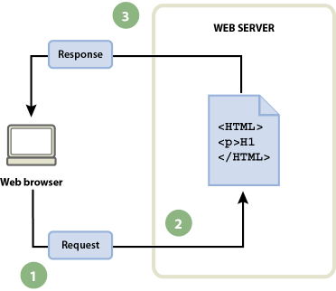

<small> 
1. El navegador Web solicita la página estática. <br>
2. El servidor localiza la página. <br>
3. El servidor Web envía la página al navegador solicitante.
</small>

---
## Procesamiento Web Dinámica
<!-- .slide: style="font-size: 0.9em" -->

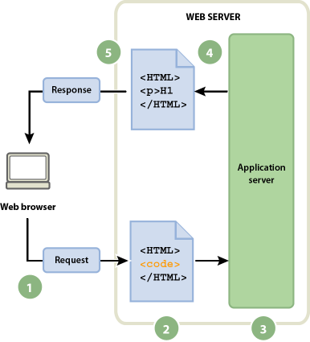

<small>
1. El navegador web solicita la página dinámica.
2. El servidor web localiza la página y la envía al servidor de aplicaciones.
3. El servidor de aplicaciones busca instrucciones en la página y la termina.
4. El servidor de aplicaciones pasa la página terminada al servidor web.
5. El servidor web envía la página finalizada al navegador solicitante.  
</small>

---

## Procesamiento Web Dinámica+DB

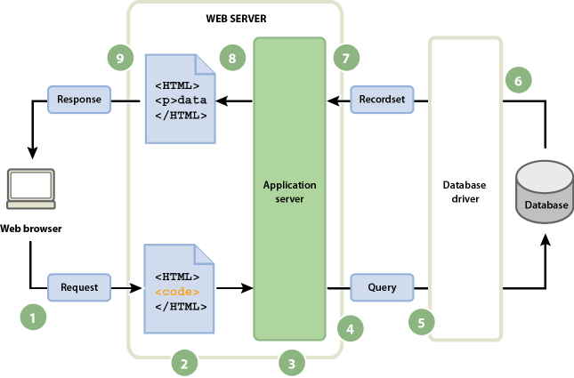

---
## Procesamiento Web Dinámica+DB
<!-- .slide: style="font-size: 0.7em" -->
1. El navegador web solicita la página dinámica. 
2. El servidor web localiza la página y la envía al servidor de aplicaciones. 
3. El servidor de aplicaciones busca instrucciones en la página. 
4. El servidor de aplicaciones envía la consulta al controlador de la base de datos. 
5. El controlador ejecuta la consulta en la base de datos. 
6. El juego de registros se devuelve al controlador. 
7. El controlador pasa el juego de registros al servidor de aplicaciones. 
8. El servidor de aplicaciones inserta los datos en una página y luego pasa la página al servidor web. 
9. El servidor Web envía la página finalizada al navegador solicitante.  

---
## Servidor de Aplicaciones
Software que ayuda al servidor Web a procesar las páginas que contienen scripts o etiquetas del lado del servidor. 
Cuando se solicita al servidor una página de este tipo, el servidor Web pasa la página al servidor de aplicaciones para su procesamiento antes de enviarla al navegador.

---
## Evolución de la Web
* Web 1.0
* Web 2.0
* Web 3.0
* Web 4.0

---
## Web 1.0
El comienzo de la web data de los años 90, donde el usuario es un mero consumidor del contenido que es subido a 
servidores por parte de expertos informáticos. Los navegadores eran solo de texto.

La web 1.0 mejora con la aparición del lenguaje HTML, que proporciona contenido con mejor estructuras y más atractivos 
para leer. Aun así, el usuario aún no podía interactuar y la web era como una especie de libro donde buscar y leer información.

---
## Web 1.0
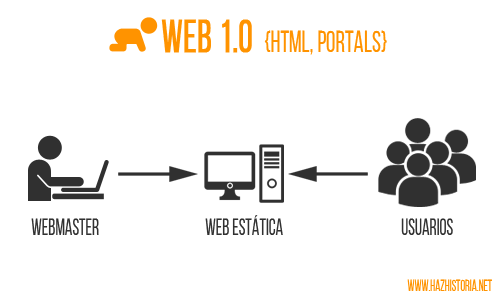

---
## Web 2.0
A partir del año 2001, surge un cambio importante: el usuario empieza a interactuar con las webs. 
Se siguen tres principios:
* La web como plataforma.
* La inteligencia colectiva.
* La arquitectura de participación.

Aparecen grupos de usuarios, redes sociales, blogs y wikis entre otras. Se fomenta la colaboración entre usuarios. 
El usuario ahora no solo accede a la información, sino que la crea.

---
## Web 2.0
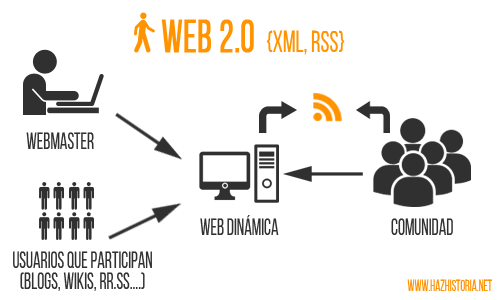

---
## Web 3.0
Surge en 2006 para relacionar las webs de forma semántica, lo que permite que la información pueda ser encontrada de 
forma más rápida y eficiente debido a su estructuración.

Además de navegadores, se accede desde otros dispositivos y tecnologías.

---
## Web 3.0
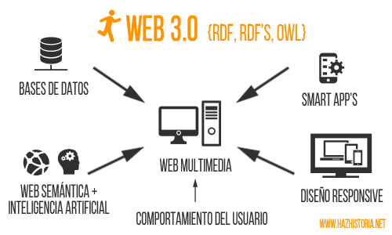

---
## Web 4.0
En esta etapa la inteligencia artificial aparece como principal tecnología.
 
Algunas de las características de la web 4.0 son:
* Comprensión del lenguaje cotidiano o natural. (comandos de voz ej “llama a un contacto” )
* Comunicación entre dispositivos (m2m, máquina a máquina).
* Uso de información relacionada (GPS, sensores de temperatura, etc.).
* Nuevas formas de interacción con el usuario.

---
## Evolución Web
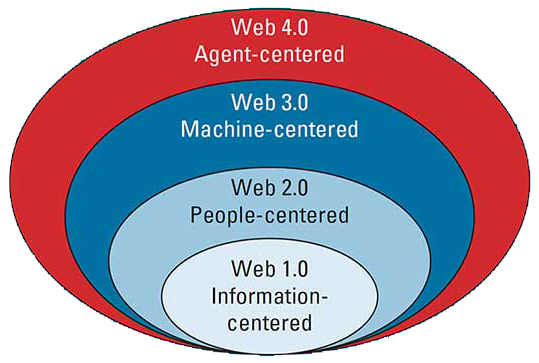

---
## Lenguajes de Programación Web
* HTML (HyperText Markup Language)
* JavaScript
* NodeJs
* Go
* Python
* PHP (Hypertext Pre-processor)
* ASP (Active Server Pages)
* ASP.Net
* JSP (Java Server Pages)
* Ruby

---
## Elige tu Propia Aventura xD
<!-- .slide: style="font-size: 0.75em" -->
* **Programador de Servidores o Back-end:** Go, NodeJs, Python, Ruby, PHP, Java, .Net.
    Conocimientos de bases de datos y de administración de sistemas.

* **Programador de clientes o Front-end:** HTML, CSS, Javascript. Conocimientos de diseño.
* **Programador móvil:** Objective C, Swift, Java (para Android). HTML/CSS para sitios web móviles.
    Conocimientos sobre servidores.
* **Programador 3D o de videojuegos:** C/C++, OpenGL, Animación. Conocimientos de diseño y artísticos.
* **Programador de alto rendimiento:** C/ C++, Java, conocimientos en matemáticas y análisis cuantitativo.

---
##  El mejor lenguaje de programación para empezar depende del tipo de proyectos que se quiera hacer.

---
## Para programación web recomendamos...

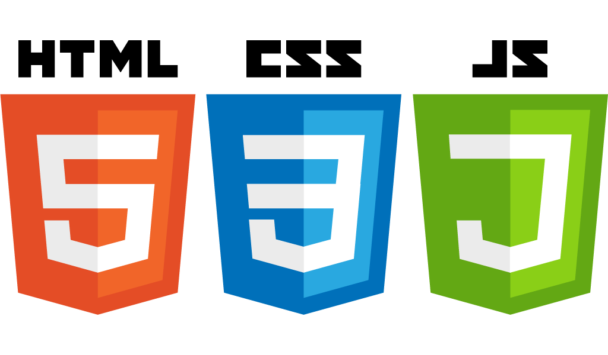

---
## HTML5
HTML5 es la última evolución de la norma que define HTML (HyperText Markup Language)

---
## Características
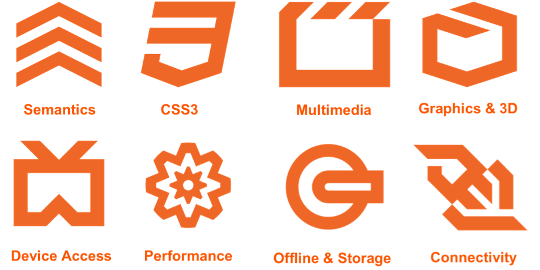

---
## Características
<!-- .slide: style="font-size: 0.90em" -->
* ***Semántica:***
  lo que le permite describir con mayor precisión cuál es su contenido.

* ***Conectividad:***
  lo que le permite comunicarse con el servidor de formas nuevas e innovadoras.

* ***Desconectado y almacenamiento:***
  permite a páginas web almacenar datos, localmente, en el lado del cliente y operar fuera de línea de manera más eficiente.

* ***Multimedia:***
  permite hacer vídeo y audio en la Web abierta.

---
## Características
<!-- .slide: style="font-size: 0.90em" -->
* ***Gráficos y efectos 2D/3D:***
  permite una gama mucho más amplia de opciones de presentación.
    
* ***Rendimiento e Integración:***
  proporcionar una mayor optimización de la velocidad y un mejor uso del hardware del equipo.
    
* ***Dispositivo de Acceso:***
  admite el uso de varios dispositivos de entrada y salida.
    
* ***Styling:***
  deja a los autores escribir temas más sofisticados.
  
---
## SEMÁNTICA
````html
<section>
<article>
<nav>
<header>
<footer>
<aside>
````

---
## SEMÁNTICA
### Formularios
````html
<mark>
<figure>
<figcaption>
<data>
<time>
<output>
<progress>
<progress max="100" value="50"></progress>
````

---


---
## Versiones de HTML
* HTML 1
* HTML 2
* HTML 3
* HTML 3.2
* HTML 4
* HTML 5
* HTML 6 ???

---
## HTML 1
La primera versión del HTML nace en 1989 como un subconjunto de SGML (lenguaje de marcado generalizado estándar) y es
especificada mediante un documento que se denomina HTML Tags.

HTML1 intenta contemplar estructura, formato y semántica, los cuales han ido derivando a la creación de otros lenguajes como CSS y XML.

También aparece el primer navegador para poder visualizar las páginas: WorldWideWeb.

---
## HTML 2
Aparece en noviembre de 1995, HTML 2.0, desarrollada por el IETF (Internet Engineering Task Force). Fue más estándar,
ya que fue definida por un organismo oficial.

Entre las novedades podíamos encontrar cosas como imágenes, mapas de imágenes, formularios, barras separadoras… así como
una definición inicial del DTD HTML (Definición de tipo de documento).

---
## HTML 3.0
Se plantea en noviembre de 1995 el borrador de HTML 3.0 por parte de el consorcio W3C (World Wide Web Consortium),
con la idea de definir estándares para Internet.

Se empieza a hablar de elementos como tablas, textos alrededor de las imágenes, y un elemento llamado MATH que permite crear fórmulas dentro del documento HTML.

---
## HTML 3.2
En enero de 1997 aparece HTML 3.2.  Aparecen elementos definidos por los fabricantes de navegadores: Netscape e Internet Explorer.

Así podemos encontrar en HTML 3.2 la capacidad de crear código script, capas, formularios, posibilidad de meter Applets
de Java, entre otros.

---
## HTML 4
HTML 4 y HTML 4.01 surge en 1998 y 1999, siendo esta última la versión más longeva del estándar.

En HTML 4.01 la W3C empieza con la separación de la estructura del documento con la de la representación visual.
Se crea un nuevo lenguaje llamado CSS.

Los elementos nuevos que aparecen son las hojas de estilo (CSS), los objetos (para poder insertar elementos externos
como vídeo y música) y los frameset para dividir la pantalla en partes.

---
## HTML 5
<!-- .slide: style="font-size: 0.70em" -->
Empieza su definición apoyándose en dos puntos:
* Compatibilidad hacía atrás de todo lo que hay creado
* Capacidad de absorber todas las funcionalidades que los nuevos fabricantes de la web habían ido construyendo (Google, Apple u Opera).

Nuevas funcionalidades: simplicidad para reproducir audio y vídeo, el disponer de un lienzo de dibujo denominado Canvas, entre otros.

Además alrededor de HTML5 nacen una gran cantidad de especificaciones para la mejora de las Webapps como son Websockets, Geolocalización, Webstorage.

Se publicada oficialmente el 28 de octubre de 2014.

---
### [HTML 6](https://programacion.net/articulo/9_caracteristicas_que_deseamos_que_esten_en_html6_1189)
Algunos cambios que se vienen:
* Librerías dedicadas (como un jQuery integrado)
* Mayor control sobre los objetos de vídeo
* Integración con la cámara
* Pre-procesadores que se puedan conectar
* Mejores anotaciones
* Lenguajes conectables
* Muchos más microformatos
* Dimensionamiento de imágenes según el navegador
* Mejor gestión de la información de contacto


---
### Y los estilos?
Con el HTML 3.2 se daba formato en HTML con los elementos específicos para ello: <b>, <font>... y sus respectivos
atributos face="arial,helvetica,sans-serif", size="3", align="center"...

Implementarlo requería mucho tiempo, actualizarlo era molesto y no resultaba productivo.

---
### CSS
Con la llegada del HTML 4 se quitaron los estilos, pero se crearon las hojas de estilo en cascada, Cascading Style Sheet o CSS.

La primera versión data del 17 de diciembre de 1996, cuando salio HTML 3.2

---
### CSS 2
Aparece el 12 de mayo de 1998. Se trataba de una versión con demasiadas novedades, y los navegadores no pudieron adaptarse bien.

El W3C volvió a retrabajarlo, y entre 2004-2006, lanzó la versión level 2 revisión 1, que se conoce como CSS 2.1.
La versión 2.1 de las CSS fue publicada como Recommendation el 7 de junio de 2011.

---
### CSS 3
Los primeros borradores aparecieron en 1999. El W3C publicó varios "módulos" independientes los unos de los otros.

Esto resulta bastante práctico para los navegadores, que pueden así implementar las novedades progresivamente.

---
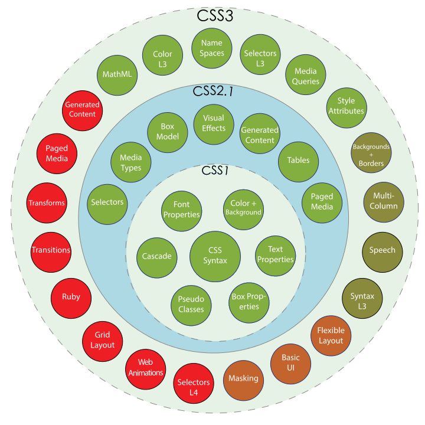

---
## ¿Dudas, Preguntas, Comentarios?

