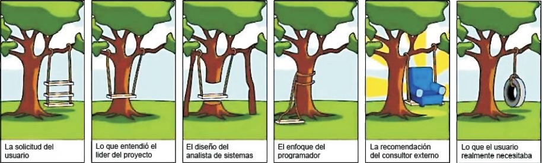
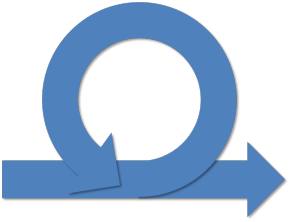
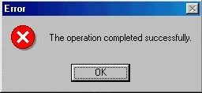
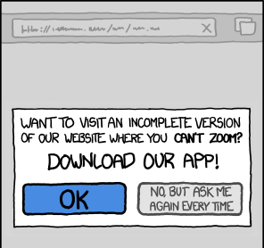
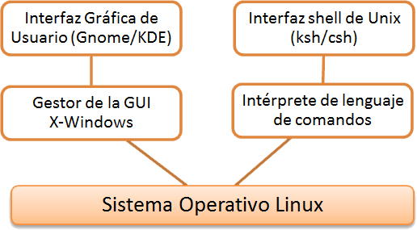
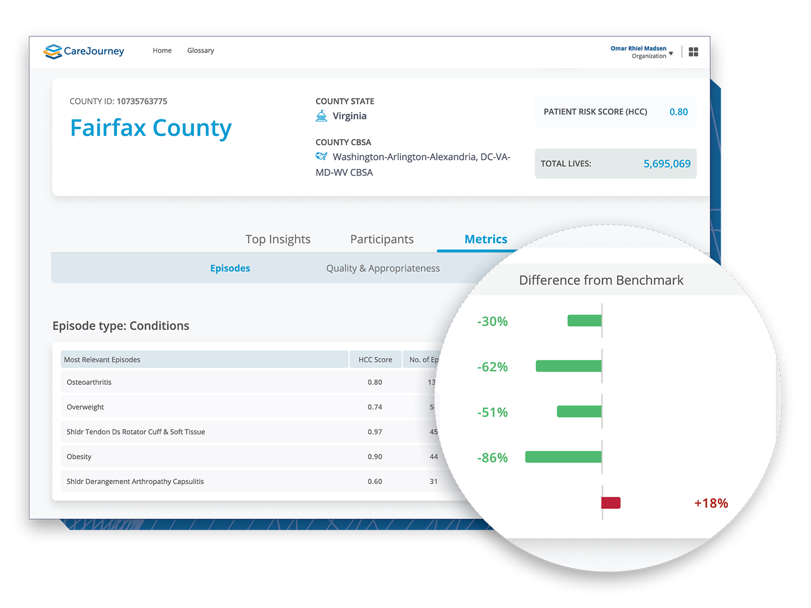
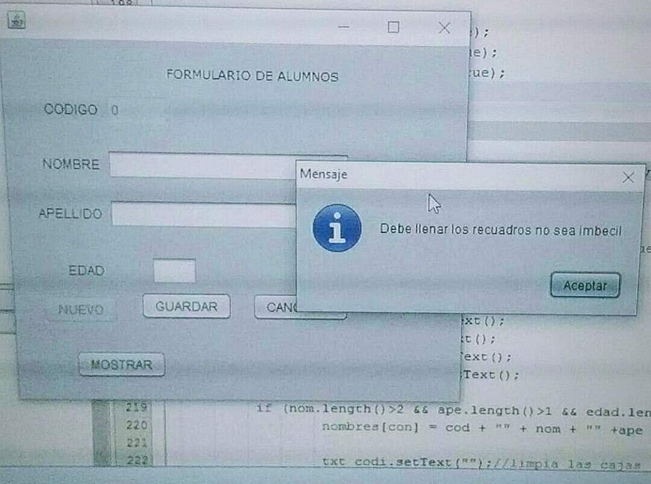
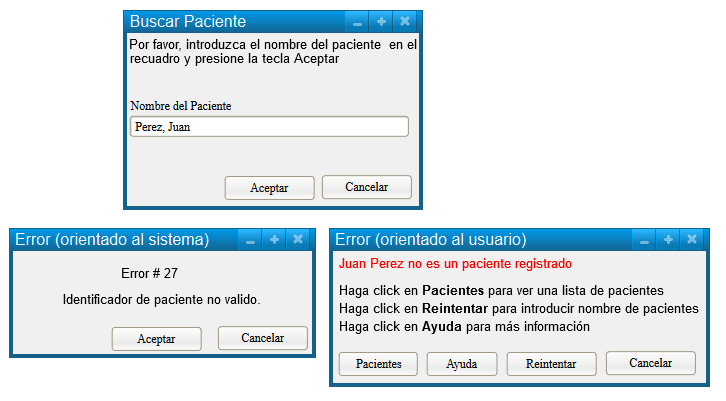

# Diseño de Interface de Usuario

Created by <i class="fab fa-telegram"></i>
[edme88]("https://t.me/edme88")

---

## Temario

### Interfaz de usuario

- Qué es
- Quién lo diseña
- Por qué es importante
- Pasos para el diseño
- Requisitos mínimos

- Factores a considerar
- **Principios de diseño**
- Estilos de Interacción: Ventajas y Desventajas
- Modelo de Seeheim
- Presentación de Información

- Pautas de **Shneiderman** para uso de color
- Mensajes del sistema
- Mensajes de error
- Atributos de usabilidad
- Evaluación de la interfaz

---

## Libros:

“Ingeniería del software” séptima edición de Ian Sommervill
(Capítulo N°16: Diseño de Interfaces de Usuario)

“Ingeniería del Software: Un enfoque práctico 6ta ed.” de Roger Pressman
(Capítulo N°11: Diseño de la Interfaz de Usuario)

---

## ¿Qué es?

El diseño de la interfaz de usuario crea un medio eficaz de comunicación entre los seres humanos y la computadora.

Siguiendo un conjunto de principios de diseño de la interfaz, el diseño identifica los objetos y acciones de ésta y luego crea una plantilla de pantalla que constituye la base del prototipo de la interfaz de usuario.

---

## ¿Quién lo hace?

Un "UX Designer" diseña la interfaz de usuario con la aplicación de un proceso iterativo que sigue principios de diseño predefinidos.

---

## ¿Por qué es importante?

Si el software es difícil de usar, fuerza al usuario a cometer errores, o si frustra sus esfuerzos para alcanzar las metas, entonces no le gustará, sin que importe el poder computacional que tenga, el contenido que entregue o las funciones que ofrezca.

La interfaz tiene que estar bien hecha porque moldea la percepción que el usuario tiene del software.

---

## ¿Cuáles son los pasos?

### Paso 1

El diseño de la interfaz de usuario comienza con la identificación de los requerimientos del usuario, la tarea y el ambiente.

---

### Paso 2

Una vez identificadas las tareas del usuario, se crean y analizan los escenarios para éste y se define un conjunto de objetos y acciones de la interfaz.

---

### Paso 3

Esto forma la base para crear una plantilla o prototipo que ilustra el diseño gráfico y la colocación de los iconos,
la definición de textos descriptivos, la especificación y títulos de las ventanas, y la especificación de aspectos
mayores y menores del menú.

---

### Paso 4

Con el empleo de herramientas, se hace el prototipo, se implementa en definitiva el modelo del diseño y se evalúa la
calidad del resultado.

---

---

## ¿Cuál es el producto final?

Se crean los escenarios del usuario y se generan los formatos de la pantalla.
Se desarrolla un prototipo de la interfaz y se modifica de manera iterativa.

---

## ¿Cómo me aseguro de que lo hice bien?

Los usuarios “prueban” un prototipo de la interfaz y la retroalimentación de esta prueba se utiliza para la siguiente modificación iterativa del prototipo.

---

## Interfaz de Usuario

Debe ser diseñada para ajustarse a:

- Habilidad
- Experiencia
- Expectativas
  del usuario.

---

## Factores que se deben considerar

<!-- .slide: style="font-size: 0.90em" -->

Se deben tener en cuenta capacidades físicas y mentales de las personas que utilizarán el software.

1. Las personas tienen una memoria limitada a corto plazo
2. Cuando el sistema falla, y emite avisos y mensajes generan estrés en el usuario
3. Las personas poseen un amplio rango de capacidades físicas
4. Las personas poseen diferentes preferencias de interacción

---

## Principios de Diseño

Se utilizan para crear interfaces que sean fáciles de usar y que permitan a los usuarios realizar sus tareas de manera eficiente.

---

## Principios de Diseño

1. Visibilidad
2. Consistencia
3. Retroalimentación
4. Flexibilidad y Eficiencia de Uso
5. Jerarquía Visual
6. Estética y Diseño
7. Tolerancia a errores
8. Ayuda y Documentación

----

## Principios de Diseño

<!-- .slide: style="font-size: 0.85em" -->

1. **Visibilidad:** los usuarios deben poder ver las opciones y controles que necesitan para realizar sus tareas de manera
  clara y fácilmente accesible.
2. **Consistencia:** las interfaces de usuario deben ser coherentes en su diseño y comportamiento en toda la aplicación o
  el sistema, lo que permite a los usuarios aprender de una experiencia para aplicarla a otra.
3. **Retroalimentación:** los usuarios deben recibir una respuesta clara y oportuna después de realizar una acción en la
  interfaz de usuario para comprender que su acción tuvo efecto.

----

## Principios de Diseño

<!-- .slide: style="font-size: 0.85em" -->

4. **Flexibilidad y eficiencia de uso:** la interfaz debe permitir a los usuarios realizar tareas de manera eficiente, ya
  sea mediante atajos o cualquier otra forma de personalización.
5. **Jerarquía visual:** los elementos más importantes y relevantes en la interfaz deben ser visibles y accesibles en
  primer lugar para que los usuarios puedan encontrarlos fácilmente.
6. **Estética y diseño:** el diseño debe ser atractivo y estéticamente agradable, además de funcional.

----

## Principios de Diseño

<!-- .slide: style="font-size: 0.85em" -->

7. **Tolerancia a errores:** la interfaz debe ser capaz de prevenir errores o proporcionar una forma clara y fácil de
  recuperación cuando se produzcan errores.
8. **Ayuda y documentación:** la interfaz de debe proporcionar suficiente información y ayuda para que los usuarios puedan comprender cómo utilizarla y encontrar soluciones a los problemas.

---

## Principio de Recuperabilidad

Recursos que le permiten al usuario recuperarse de un error:

1. Confirmación de acción destructiva
2. Proporcionar un recurso para deshacer error
3. Generar puntos de control

---

## Interacción del Usuario

La interacción del usuario significa emitir comandos y datos asociados al sistema informático.

En un inicio era sólo a través de lineas de comando

---

## Estilos de Interacción

Según Shneiderman existen 5 estilos de interacción:

1. Manipulación Directa
2. Selección de menús
3. Rellenado de Formularios
4. Lenguaje de Comandos
5. Lenguaje Natural

---

## Estilos de Interacción

<!-- .slide: style="font-size: 0.5em" -->

<table>
  <thead>
    <th>Estilo de Interacción</th> <th>Ventajas</th>
    <th>Desventajas</th>
    <th>Aplicación</th>
  </thead>
  <tbody>
    <tr>
      <td> <strong>Manipulación Directa</strong> </td>
      <td> Interacción rápida   Intuitiva   Fácil de Aprender </td>
      <td> Difícil de Implementar   Sólo adecuada para sistemas visuales </td>
      <td> Videojuegos   Sistemas CAD </td>
    </tr>
    <tr>
      <td> <strong>Selección de menús</strong> </td>
      <td> Evita errores de usuario   Requiere teclear poco </td>
      <td> Lenta para usuarios experimentados   Compleja si hay muchas opciones </td> <td> Sistemas de propósito general </td>
    </tr>
    <tr>
      <td> <strong>Rellenado de Formularios</strong> </td>
      <td>Introducción de datos sencilla </td>
      <td> Ocupa espacio en pantalla   Opciones del usuario no se ajustan a los campos  </td>
      <td> Control de Stock   Préstamos personales </td>
    </tr>
    <tr>
      <td> <strong>Lenguaje de Comandos</strong></td>
      <td> Poderoso y Flexible </td>
      <td> Difícil de aprender   Gestión pobre de errores   
      Requiere más tecleo </td>
      <td> Sistemas operativos   Sistemas de comandos y control </td>
    </tr>
    <tr>
      <td> <strong>Lenguaje Natural</strong></td>
      <td> Accesible a usuarios casuales   Fácil de ampliar</td>
      <td> Los sistemas de comprensión de LN no son fiables </td> 
      <td>Asistentes virtuales</td>
    </tr>
  </tbody>
</table>

---

## Modelo de Seeheim

Se separa la presentación de la información, la gestión del diálogo y la aplicación.

Es posible tener una interfaz separada para diferentes tipos de usuario.

---

## Presentación de Información

- Presentación directa
- Presentación Gráfica
  - 2d
  - 3d
  - Árboles
  - Redes

---

#### Presentación de Información

Directa y Gráfica

---

## Pautas de Shneiderman para la utilización efectiva del COLOR

<!-- .slide: style="font-size: 0.85em" -->

- Limitar el número de colores utilizados y ser conservador en la forma de utilizarlos
- Utilizar un cambio de color para mostrar un cambio en el estado del sistema
- Utilizar el código de colores para apoyar la tarea que los usuarios están tratando de llevar a cabo
- Utilizar el código de colores de una forma consciente y uniforme
- Ser cuidadoso al utilizar pares de colores

---

<!-- .slide: data-background="#0000ff" -->
<h1 style="color: #ff0000;font-size: 3.5em; font-weight: bolder;">ESTO NO</h1>
   
---
## Diseño de Mensajes del sistema
<!-- .slide: style="font-size: 0.85em" -->
Factores a tener en cuenta:
* **Contexto:** Generar mensajes relacionados con la actividad actual del usuario.
* **Experiencia:** Proporcionar 2 tipos de mensajes: Cortos y concisos, largos y significativos.
* **Nivel de Habilidad:** El mensaje se debe adaptar a diferentes clases de usuarios.
* **Estilo:** Los mensajes deben ser: positivos y activos, fomales, concisos, uniformes y constructivos. Nunca: negativos, pasivos, insultantes.
* **Cultura:** Adaptado a la cultura del país donde se utilizará el sistema.

---

#### Mensajes de error: Cuidado con el Estilo!

---

## Mensajes de error

- Orientado al Usuario
- Orientado al Sistema

---

## Usabilidad

Medición cualitativa de la facilidad y eficiencia con la que un humano emplea las funciones y características que ofrece el producto (software o hardware).

---

## Atributos de Usabilidad

1. Facilidad de aprendizaje
2. Eficiencia
3. Memorabilidad
4. Errores
5. Satisfacción del usuario
6. Accesibilidad
7. Utilidad
8. Integridad
9. Consistencia

----

## Atributos de Usabilidad

1. **Facilidad de aprendizaje:** cuánto esfuerzo se necesita para que un usuario aprenda a utilizar la interfaz.
2. **Eficiencia:** rapidez con la que los usuarios pueden realizar tareas en una interfaz de usuario.
3. **Memorabilidad:** facilidad con la que los usuarios pueden recordar cómo utilizar una interfaz después de un período de tiempo sin usarla.

----

## Atributos de Usabilidad

4. **Errores:** cantidad de errores que los usuarios cometen al utilizar una interfaz, y cómo la misma ayuda a los usuarios a recuperarse de los errores.
5. **Satisfacción del usuario:** nivel de satisfacción del usuario al utilizar una interfaz.
6. **Accesibilidad:** capacidad de la interfaz para ser utilizada por personas con discapacidades, como problemas de visión o audición.
7. **Utilidad:** capacidad de la interfaz para cumplir con los objetivos y necesidades del usuario.

----

## Atributos de Usabilidad

8. **Integridad:** capacidad de la interfaz para proteger contra errores de entrada de datos y garantizar la integridad mismos.
9. **Consistencia:** capacidad de la interfaz para ser coherente en su diseño y comportamiento en toda la aplicación o el sistema.

---

## Técnicas de Evaluación de la Interfaz

- Cuestionarios de la opinión de los usuarios sobre la interfaz
- Observación de los usuarios cuando usan el sistema
- Videos del uso típico del sistema
- Incluir código en el software que recopila información de los recursos utilizados y errores comunes

---

## ¿Dudas, Preguntas, Comentarios?

