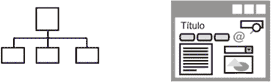

# Prototipado y Proceso de Diseño

Created by <i class="fab fa-telegram"></i>
[edme88]("https://t.me/edme88")

---

<!-- .slide: style="font-size: 0.80em" -->

## Temario

### Interfaz de usuario

- Definición
- Arquitectura de información
- Proceso de diseño
- Análisis de usuario (AGT, Etnografico, entrevistas)
- Prototipado

### Proceso de Diseño

- Tipos de diagramas (planos, maquetas) ó (organización, funcionamiento, presentación)
- Tipos de prototipo (Sketch, Wireframe, Mockup, prototipo)
- Evaluación de interfaz

[Ejercicio: Sketch](U3_prototipado.html#/23)

- Ventajas de las técnicas de diseño
  [Ejercicio: Wireframe](U3_prototipado.html#/45)
- Errores comunes
[Ejercicio: Evaluación](U3_prototipado.html#/47)

---

## Interfaz de Usuario

Es el medio con que el usuario puede comunicarse con una máquina, equipo, computadora o dispositivo, y comprende todos los puntos de contacto entre el usuario y el equipo.

Incluyen elementos como menús, ventanas, contenido gráfico, cursor, etc.

---

## Arquitectura de Información

El Arquitecto define la organización, etiquetado, navegación y sistema de búsqueda de un sitio web, elementos que ayudan a los usuarios a encontrar y gestionar la información de manera efectiva.

---

## Proceso de Diseño de Interfaz de Usuario

Proceso iterativo donde los usuarios interactúan con los diseñadores y prototipados de la interfaz para decidir las características, organización, apariencia y funcionamiento de la interfaz de usurio del sistema.

---

## Proceso de Diseño de Interfaz de Usuario

---

## Proceso de Diseño de Interfaz de Usuario

Actividades para el proceso de Diseño de Interfaz de Usuario:

- Análisis del usuario
  - Análisis Jerárquico de Tareas (HTA)
  - Estudios Etnográficos
  - Entrevistas de Usuarios
- Prototipado del sistema
- Evaluación de la Interfaz

---

### Análisis Jerárquico de Tareas

---

## Estudio Etnográfico

Observación de los usuarios en su contexto y dentro de su entorno, tratando de no interferir en sus acciones, usos y costumbres para determinar los requerimientos de usabilidad.

---

## Entrevistas de Usuarios

Reunirse con los usuarios para entender mejor sus necesidades, motivaciones, cultura laboral y otros aspectos. Pueden ser reuniones individuales o a través de grupos de enfoque.

## <!--http://www.nosolousabilidad.com/articulos/diagramacion.htm-->

---

## Tipos de diagramas

- **Planos:** Blueprints, architecture map  
  Diagramas de organización y funcionamiento
- **Maquetas:** wireframe, mockup, prototype  
  Diagramas de presentación

---

## Tipos de diagramas

Otros autores sugieren:

- **Diagramas de organización**
- **Diagramas de funcionamiento**
- **Diagramas de presentación**

---

## Diagrama de Organización

Diagrama básico para entender la estructura general del producto (Planos - Blueprints)

---

## Diagrama de Funcionamiento: Elementos

Representación de las estructuras con los flujos de navegación (Planos avanzados - Blueprints)

---

---

## Diagrama de Funcionamiento

---

## Diagrama de Presentación

Muestra las formas de organización visual de los contenidos en las páginas principales (maquetas - wireframes)

---

## Maquetas: Diagramas de Presentación

El objetivo es mostrar el contenido de las páginas, mostrando los elementos que se plantearon en los primeros planos (blueprints) y ubicándolos en las páginas o pantallas del producto final.

---

## Tipos de Prototipo

<!-- .slide: style="font-size: 0.85em" -->

- **Baja Fidelidad:** Conjunto de dibujos que representan cómo estarán organizados los elementos en las páginas en aspectos generales, sin entrar en detalle.
  - Sketch
  - Wireframe
  - StoryBoard
- **Alta Fidelidad:** Se representan aspectos más precisos. Sirven para detallar el proceso interactivo de una o varias tareas.
  - Mockup
  - Prototipo

---

## Tipos de Diseño

- Sketch
- Thumbnail Sketches
- Wireframe
- StoryBoard
- Mockup
- Prototipo

---

## Sketch

---

## Sketch

- Es un bosquejo o dibujo rápido e informal
- No tiene muchos detalles
- Guía general que reproduce un concepto o idea de un proyecto de una manera sencilla
- Se realiza a mano con lápiz y borrador

---

## Thumbnail Sketches

Secuencia de Sketchs que muestran cómo se realiza una tarea.

---

## Ejercicio: Sketch

<!-- .slide: data-background="images/interfazUsuario/sketch-fondo.jpg" style="font-size: 0.85em" -->

Realice Sketchs formando un 'Thumbnail Sketch' de la interfaz de usuario del sistema en papel.
Debe tener en cuenta:

- ¿Qué opciones debe ofrecer al usuario?
- ¿Qué campos hay para ingresar datos?
- ¿Hay ejercicios de ejemplo?
- ¿Hay una introducción teórica?
- [Sistemas similares](images/interfazUsuario/tiroOblicuo.jpg)
- ¿Qué acciones puede realizar el usuario?
- ¿Qué mensajes de Error se visualizan y cuando?
- Física: ¿Hay conversión de unidades?

---

## Ejercicio: Sketch

<iframe width="560" height="315" src="https://www.youtube.com/embed/tKIROgQj1wM" title="YouTube video player" frameborder="0" allow="accelerometer; autoplay; clipboard-write; encrypted-media; gyroscope; picture-in-picture" allowfullscreen></iframe>

---

## Ejercicio: Sketch

RECUERDA en el repositorio Proyecto2024-Apellido1-Apellido2 crear una carpeta con el nombre "Sketch" y subir una o varias fotos
de tu diseño hecho prolijamente a mano.

(No es necesario hacer esto ahora! pero mantén tu sketch a mano para evitar re-trabajar)

---

## Wireframe

---

## Wireframe

- Es una representación estática en baja calidad de un diseño
- Esta representación muestra:
  - Principales grupos de contenido
  - Estructura de la información
  - Descripción y visualización básica del usuario
  - Interacción de la interfaz
- Representación de cada parte importante del producto final
- El entregable es una imagen

---

## StoryBoard o WireFlows

<!-- .slide: style="font-size: 0.75em" -->

Secuencia de wireframes que muestran cómo se realiza una tarea.

---

## Mockup

---

## Mockup

---

## Mockup

- Representación estática de un diseño en calidad media o alta
- Representa la estructura de la información
- Visualiza el contenido
- Demuestra las funcionalidades básicas de una manera estática
- El entregable es una imagen.

---

## Prototipo

---

## Prototipo

- La calidad pueda variar entre media y alta
- Representación navegable del producto final
- Simula la interacción interfaz de usuario
- Permitir que el usuario:
  - Experimente interactuando con la interfaz y contenido del proyecto
  - Pruebe las principales interacciones de una manera similar al producto final
- El entregable es un HTML, PPT, Animación o formato navegable.

---

<!-- .slide: style="font-size: 0.85em" -->

## Utilización de Técnicas de Diseño

#### Ventajas:

- Definir funcionalidades del proyecto
- Mejora la comunicación entre el equipo de desarrollo y los usuarios
- Definir el recorrido del usuario (work flow)
- Permite mostrar al usuario el sistema y recibir un feedback temprano
- Método intuitivo para identificar características y requerimientos
- Mejoran la calidad y la completitud de las especificaciones funcionales del sistema.

---

## Ventajas del Pre-Diseño

- El equipo y el cliente se centran en el diseño de contenidos e interacción y no en el diseño visual.
- El cliente ve y comprende cómo será la aplicación, mucho mejor que si se ofrece descrita en un documento.
- Evita malentendidos entre el equipo de desarrollo y el cliente.
- Ayuda a especificar los requerimientos y a detectar inconsistencias o falta de funcionalidad.
- Complemento para el análisis.

---

## Ventajas del Pre-Diseño

- Se puede modificar el diseño con facilidad y rapidez.
- Se evitan modificaciones posteriores mucho más costosas cuando la aplicación ya está implementada.
- Se reduce costo y tiempo.

---

## Ventajas del Pre-Diseño

- Permite realizar pruebas de usabilidad, como test con usuarios, en etapas tempranas del proyecto.
- Se detectan y solucionan los problemas antes de comenzar su implementación.
- El resultado son aplicaciones web más fáciles de entender, de usar y se ajustan mejor a las necesidades de los usuarios.

---

## Proceso de Prototipado de la IU

1. **Prototipo en papel:** Maquetas de los diseños de pantalla
2. **Prototipo Automatizado:** Permite al usuario realizar pruebas y simulación

---

## Comparación

---

## Antes de dibujar...

- Realizar entrevistas con el cliente y el equipo de desarrollo para definir los requisitos, los objetivos y el público objetivo.
- Analizar la web actual (si existe): problemas de usabilidad y accesibilidad, estadísticas de acceso, test con usuarios y encuestas.
- Benchmarking, estudio comparativo de la competencia.
- Definir de la arquitectura de informacón y mapa web.

---

## Evaluación de la Interfaz

Proceso de evaluar la forma en que se utiliza una interfaz y verificar que cumple los requerimientos del usuario.

Es parte del proceso de verificación y validación de los sistemas software.

---

## Evaluación de la Interfaz

---

<!-- ---
## Ejercicio: Evaluacion de Interfaz
Intercambie su diseño de interfaz con otro grupo:
* ¿Qué opciones tiene este sistema que no estén disponibles en el propio?
* ¿Es deseable introducir en un futuro rediseño del sistema estas características?
* ¿Qué ventajas y desventajas presenta el otro sistema con respecto al propio?

Presente un documento al otro equipo con el análisis realizado. -->

<!--
## Ejercicio: Rediseño
Realice un rediseño del sistema teniendo en cuenta el documento de sugerencias recibido.

Si son pocas modificaciones, puede marcarlas con un color diferente sobre los sketches.
En caso de ser varias modificaciones, se sugiere dibujar el sketch nuevamente.

-->

## Información en un wireframe

<!-- .slide: style="font-size: 0.90em" -->

- **Inventario de contenido:** Contenido que debe estar presente en cada página
- **Elementos de la página:** Cabeceras, enlaces, listas, imágenes, formularios, etc.
- **Etiquetado:** De vínculos, títulos, etc.
- **Layout:** Ubicación, colocación y agrupación de los elementos de la página cabeceras, pies, navegación, áreas de contenido, titulares, etc.)
- **Comportamiento:** Notas asociadas a los elementos para indicar cómo se deben mostrar o el comportamiento funcional cuando se activa.

---

## Ejemplo de wireframe

---

## Ejercicio: Wireframe

<!-- .slide: style="font-size: 0.80em" -->

Emplee algún programa para confeccionar Wireframes y generar un wireflow.

---

### Ejercicios: Wireframe (Videos)

 [Diseño Web + Mobile con Figma](https://youtu.be/9xP9vlz6s7k)

 [Diseño con Pencil y NinjaMock](https://youtu.be/BR1YqiSAuVw)

 [Diseño con Draw.io (Desktop)](https://youtu.be/ZV9NFPVev34)  
[Diseño con Draw.io (Mobile)](https://youtu.be/iFwfgU_fhiU)

---

### Ejercicios: Wireframe

<iframe width="560" height="315" src="https://www.youtube.com/embed/9xP9vlz6s7k?si=qiRKL3IqTTrAde6p" title="YouTube video player" frameborder="0" allow="accelerometer; autoplay; clipboard-write; encrypted-media; gyroscope; picture-in-picture; web-share" referrerpolicy="strict-origin-when-cross-origin" allowfullscreen></iframe>

---

#### Errores comunes al crear un Wireframe para nuestro proyecto web

- No indicar campos obligatorios
- No indicar las unidades que se introducen (m, cm, kg, etc)
- No describir el flow normal (que botón o link me lleva a donde)
- No mostrar ejemplos o brindar información teórica
- Texto que indique cuál es la finalidad de la página
- No especificar mensajes de error

---

## Ejercicio: Evaluación de la Interfaz

Si un valiente se anima, que comparta su pantalla con su diseño, y entre todos le damos un feedback de como mejorarlo.

(Paso: El usuario evalúa la interfaz)

---

<!-- .slide: data-background="images/interfazUsuario/prototipado-de-paginas-web.jpg" -->
<h3 style="text-shadow: -1px -1px 1px #73a4f6, 1px 1px 1px #000, -1px 1px 1px #c1ebeb, 1px -1px 1px #000;">
“Es mejor diseñar la experiencia del usuario que rectificarla.”</h3>

---

---

## ¿Dudas, Preguntas, Comentarios?

