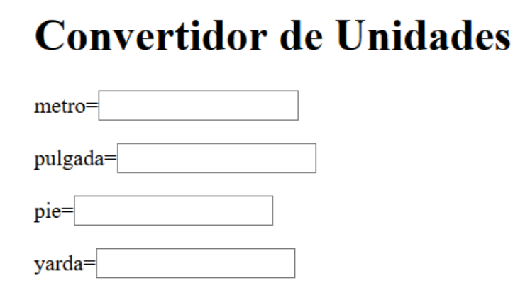
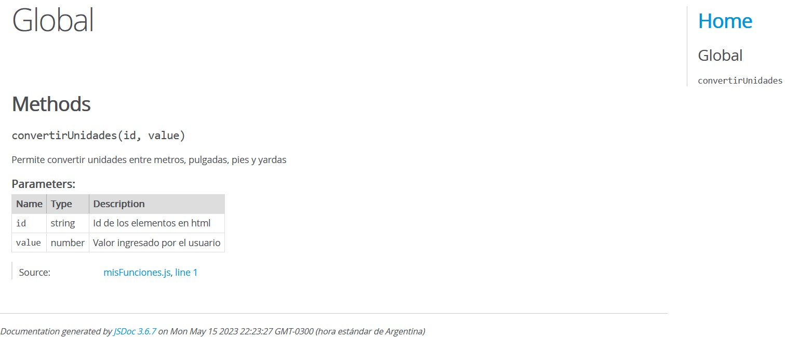
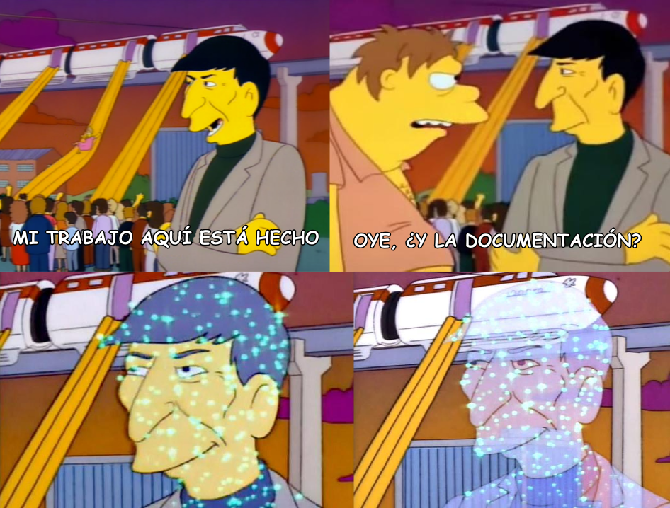
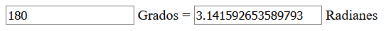

# JavaScript
Created by <i class="fab fa-telegram"></i> 
[edme88]("https://t.me/edme88")

---
<style>
.grid-container2 {
    display: grid;
    grid-template-columns: auto auto;
    font-size: 0.8em;
    text-align: left !important;
}

.grid-item {
    border: 3px solid rgba(121, 177, 217, 0.8);
    padding: 20px;
    text-align: left !important;
}
</style>
<!-- .slide: style="font-size: 0.80em" -->
## Temario
<div class="grid-container2">
<div class="grid-item">

### JavaScript
* Definición
* Características
* Incluir Js
* Sintaxis
* Variables
* Identificadores
* Funciones
* Funciones predefinidas
* Condicionales
* Switch
* Bucles
* Funciones Callback
* Buenas Prácticas

</div>
<div class="grid-item">

* Eventos y Objetos
* Eventos de formularios

[Ejercicio: Hola Mundo!](U5_javaScript.html#/24)

[Ejercicio: Conversor de Unidades](U5_javaScript.html#/26)

* Documentar

[Ejercicio: Documentación](U5_javaScript.html#/35)

* getElementBy
* Obtener valores
* Objeto Math

[Ejercicio: Grados a Radianes](U5_javaScript.html#/43)

</div>
</div>

---
## Bibliografía:


[Guía de JavaScript](https://developer.mozilla.org/es/docs/Web/JavaScript/Guide)
[Curso: Introduction to JavaScript](https://testautomationu.applitools.com/javascript-tutorial/)

---
## Incluir JavaScript
* En el mismo documento, agregando ```<script></script>```
* En un archivo externo
````javascript
<script type="text/javascript" src="/js/codigo.js"></script>
````
* En linea
````javascript
<button onclick="alert('Hola Mundo!!!')">Enviar</button>
<!--el onclick es el eventhandler-->
Puedes ver mas EventsHandlers aqui:
https://www.w3schools.com/jsref/dom_obj_event.asp
````
---
## Sintaxis
<!-- .slide: style="font-size: 0.80em" -->
Conjunto de reglas que deben seguirse al escribir el código:
* No se tienen en cuenta los espacios en blanco y las nuevas líneas.
* Se distinguen las mayúsculas y minúsculas (case-sensitive).
* No se define el tipo de las variables.
* Se pueden incluir comentarios.
* No es necesario un punto y coma después de una declaración si está escrita en su propia línea. Pero si se deseas más de una declaración en una línea, entonces debes separarlas con punto y coma.

---
## Variables
Existen 3 tipos de declaraciones de variables:
* **var** Declara una variable.
* **let** Declara una variable local con ámbito de bloque.
* **const** Declara un nombre de constante de solo lectura y ámbito de bloque. 

````javascript
var num;
var texto = "hola";
num = 5;
var ambos;
ambos = texto + ' ' + num; // ambos == "hola 5"
const nombre = "Agus";
let nota = 10;
var arr[5];
````

---
## Identificadores
Los nombres de las variables deben cumplir ciertas reglas:
* Debe comenzar con una letra, un guión bajo (_) o un signo de pesos ($). 
* Los siguientes caracteres también pueden ser dígitos (0-9).
* Distinción entre mayúsculas y minúsculas

---
## Funciones Clásicas
* Emplea palabra reservada **function** + nombre de la función + los parámetros.
````javascript
function miFuncionSuma(parametro1, parametro2){
   let res;
   res = parametro1 + parametro2;
   return res;
}
console.log(miFuncionSuma(2,3));
````

* **Hoisting**: la función puede ser llamada desde cualquier parte del código (antes o después de definir la función).

---
## Funciones Anónimas
* Al no tener nombre es necesario almacenarlas en una variable para poder llamarlas después.
* No admite **Hoisting**
````javascript
let sumar = function(parametro1, parametro2){
   let res = parametro1 + parametro2;
   return res;
}
console.log(sumar(2,3));
````

---
## Funciones Flecha
* Es una función **anónima**
* No necesita de la palabra reservada **function**
* Sintaxis simplificada, que permite optimizar el código.
````javascript
let suma = (parametro1, parametro2) => {
  return parametro1 + parametro2;
};
console.log(suma(2, 3));
````

---
## Funciones Flecha
* Si la función tiene solo un parámetro, pueden omitirse los paréntesis
* Si el cuerpo de la función es una sola línea, pueden omitirse las llaves y el return
````javascript
let saludo = nombre =>  'Hola ' + nombre + '!!!' ;
````

---
## Funciones Flecha

* Si la función no lleva parámetros, los parentesis vacios son obligatorios.
* Si la función necesita de un objeto o si no lleva parámetros, debe emplearse un paréntesis
````javascript
let obj = () =>  ({nombre: 'Agus', edad: 37}) ;
````

---

| Tipo de función      | Sintaxis | Ejemplo | Notas |
|----------------------|----------|---------|-------|
| **Declarada**        | `function nombre(params) { ... }` | ```function sumar(a, b) { return a + b; } console.log(sumar(2, 3)); // 5 ``` | Tiene nombre propio, se "eleva" (hoisting). |
| **Anónima**          | `let nombre = function(params) { ... }` | ```let sumar = function(a, b) { return a + b; }; console.log(sumar(2, 3)); // 5 ``` | No tiene nombre propio, se guarda en una variable. |
| **Flecha (arrow)**   | `let nombre = (params) => expr` | ```let sumar = (a, b) => a + b; console.log(sumar(2, 3)); // 5 ``` | Sintaxis simplificada. No tiene su propio `this`. Puede omitir `return`, llaves o paréntesis en casos simples. |


---
## Funciones Predefinidas
<!-- .slide: style="font-size: 0.80em" -->
* [isNaN()](https://developer.mozilla.org/es/docs/Web/JavaScript/Reference/Global_Objects/Number/isNaN) Verifica si la variable 'is not a number'.
* [parseFloat()](https://developer.mozilla.org/es/docs/Web/JavaScript/Reference/Global_Objects/parseFloat) Convierte una cadena de texto a número de punto flotante.
* [paseInt()](https://developer.mozilla.org/es/docs/Web/JavaScript/Reference/Global_Objects/Number/parseInt) Convierte una cadena de texto en un entero.
* [varNum.toFixed(X)](https://www.w3schools.com/jsref/jsref_tofixed.asp) Convierta un número en una cadena, redondeando el número para mantener **X** cantidad de decimales.

Hay otros...
eval(), uneval(), isFinite(), decodeURI(), encodeURI(), encodeURIComponent(), escape(), unescape()...

---
## Condicionales
<!-- .slide: style="font-size: 0.80em" -->
````javascript
if(saludo == "Whatsup!"){
   console.log("Whatsup!");
}else if(saludo == "Como va?"){
    console.log("Como va?");
}else{
    console.log("Hola mundo!");
}
````
* **==** iguales
* **!=** distintos
* **>** mayor
* **>=** mayor o igual
* **<** menor
* **<=** menor o igual
* **===** exactamente igual

---
## Ternarios
Se emplea como atajo de if/else
````javascript
condición ? expr1 : expr2
````

Un ejemplo aplicado:
````javascript
edad >=18 ? console.log('Puede conducir un auto'): console.log('Menor de edad!';
````

---
## Switch
````javascript
switch(nombre){
   case "Juan":
    console.log("Se llama Juan");
    break;
   case "Pedro":
    console.log("Se llama Pedro");
    break;
   case "Pancracio":
    console.log("Se llama Pancracio");
    break;
}
````

---
## Bucles
````javascript
for(var i=0; i<20;i++){
   console.log(`El valor es ${i}`);
}
````

````javascript
var i = 0;
while(i < 20){
   console.log(`El valor es ${i}`);
   i++;
}
````

````javascript
var i = 0; 
do { 
    i += 1; console.log(i); 
} while(i < 5);
````

---
## Bucles
Llama a una función por cada elemento en el array.
````javascript
const arrayPalabras = ['Laboratorio', 'Computacion', 'Universidad'];

arrayPalabras.forEach((palabra, index) => {
    console.log(`La palabra ${index} es: ${palabra}`)
})
````

---
## Funciones Callback
Funciones que se pasan como parámetros de otras funciones y que se ejecutan dentro de éstas.
````javascript
   setInterval(function(){ alert("Hello"); }, 3000);
````
El codigo de arriba y abajo hace lo mismo... Abre una ventana de alert que dice Hello cada 3000ms=3seg

(lo que volveria loco a un usuario xD )
````javascript
function miFunc(){
   alert("Hello");
}
setInterval(miFunc, 3000);
````

---
## [Buenas Prácticas](https://www.w3schools.com/js/js_best_practices.asp)
<!-- .slide: style="font-size: 0.90em" -->
* Evitar las variables globales
* Declarar variables locales
* Declarar variables primero
* Inicializar variables
* Declarar los objetos y arrays con **const**
* No declarar objetos como Number, String o Boolean
* Conocer el tipo de variables
* Terminar un Switch con **default:**
* Para comparar, usar **===**
* Evitar usar [eval()](https://www.etnassoft.com/2011/01/05/javascript-eval-uso-y-alternativas/) (evalúa el código JavaScript representado como una cadena.)

<!--http://www.williammalone.com/articles/create-html5-canvas-javascript-drawing-app/#demo-simple-->

---
## Eventos y objetos
* Los eventos estan asociados a un objeto.
* Los eventos se producen porque sobre un objeto se produce alguna acción

---
## Eventos de elementos de Formularios
Se producen durante el uso de campos de formulario, como cajas de texto, listas desplegables, etc.

Se producen cuando un elemento recibe foco,lo pierde o se cambia el contenido.

---
## Eventos de elementos de Formularios
* **OnSelect:** Se produce cuando se selecciona texto en un campo
* **OnChange:** Se produce cuando se cambia algo en un elemento de formulario, y se pierde foco.

````javascript
<input type="text" onselect="alert('Se ejecuto onSelect')">
<input type="text" value="Cambiar Valor" onchange="alert('Se ejecuto onChange')">
````
<input type="text" onselect="alert('Se ejecuto onSelect')">
<input type="text" value="Cambiar Valor" onchange="alert('Se ejecuto onChange')">

---
## Ejercicio: Hola Mundo!
Mostrar un “alert()” con el texto “Hola Mundo!” que se ejecute en el onload del body.

---
## Ejercicio: Hola Mundo!
<iframe width="560" height="315" src="https://www.youtube.com/embed/iW5fADdHwGM" frameborder="0" allow="accelerometer; autoplay; encrypted-media; gyroscope; picture-in-picture" allowfullscreen></iframe>

---
## Ejercicio: Conversor de Unidades
Escribir funciones JavaScript para que, al escribir un número en cualquiera de los inputs, la unidad sea convertida.
* Emplear **OnChange** en los campos
* Los campos deben contener un nombre o id
* La función debe enviar el valor y el nombre del campo cambiado

---
## Ejercicio: Conversor de Unidades


---
## Ejercicio: Conversor de Unidades
<iframe width="560" height="315" src="https://www.youtube.com/embed/ETZtCd1sCxk" frameborder="0" allow="accelerometer; autoplay; encrypted-media; gyroscope; picture-in-picture" allowfullscreen></iframe>

---
## Ejemplo Conversion de Unidades
<script>
let convertirUnidades = (unidad, valor) => {
    const form = document.lasUnidades;
    if(isNaN(valor)){
        alert("Se ingreso un valor invalido en " + unidad);
        form.yarda.value = "";
        form.metro.value = "";
        form.pulgada.value = "";
        form.pie.value = "";
    } else if (unidad == "metro") {
        form.pulgada.value = valor * 39.3701;
        form.pie.value = valor * 3.28084;
        form.yarda.value = valor * 1.09361;
    } else if (unidad == "pulgada") {
        form.metro.value = valor * 0.0254;
        form.pie.value = valor * 0.08333;
        form.yarda.value = valor * 0.027778;
    } else if (unidad == "pie") {
        form.metro.value = valor * 0.3048;
        form.pulgada.value = valor * 12;
        form.yarda.value = valor * 0.333333;
    } else if (unidad == "yarda") {
        form.metro.value = valor * 0.9144;
        form.pulgada.value = valor * 36;
        form.pie.value = valor * 3;
    }
}
</script>

<form name="lasUnidades" style="text-align: right; width: 450px; margin:auto;">
metro=<input style="font-size: 22px" type="text" name="metro" onchange="cambioUnidades(this.value,this.name)">
<br>
pulgada=<input style="font-size: 22px" type="text" name="pulgada" onchange="cambioUnidades(this.value,this.name)">
<br>
pie=<input style="font-size: 22px" type="text" name="pie" onchange="cambioUnidades(this.value,this.name)">
<br>
yarda=<input style="font-size: 22px" type="text" name="yarda" onchange="cambioUnidades(this.value,this.name)">
<br>
</form>

---
## Ejemplo Conversion de Unidades
````javascript
function cambioUnidades(valor, unidad) {
    const form = document.lasUnidades;
    if(isNaN(valor)){
        alert("Se ingreso un valor invalido en " + unidad);
        form.yarda.value = "";
        form.metro.value = "";
        form.pulgada.value = "";
        form.pie.value = "";
    } else if (unidad == "metro") {
        form.pulgada.value = valor * 39.3701;
        form.pie.value = valor * 3.28084;
        form.yarda.value = valor * 1.09361;
    } else if (unidad == "pulgada") {
        form.metro.value = valor * 0.0254;
        form.pie.value = valor * 0.08333;
        form.yarda.value = valor * 0.027778;
    } else if (unidad == "pie") {
        form.metro.value = valor * 0.3048;
        form.pulgada.value = valor * 12;
        form.yarda.value = valor * 0.333333;
    } else if (unidad == "yarda") {
        form.metro.value = valor * 0.9144;
        form.pulgada.value = valor * 36;
        form.pie.value = valor * 3;
    }
}
````

---
## Porque Documentar Código
* Ayuda a entender nuestro código
* Ayuda a los demás
* Te ayuda a corregir errores fácilmente
* Mantiene claro el objetivo
* El código se vuelve reutilizable

---
## Documentar Código
Podemos emplear [JsDoc](https://jsdoc.app/) para generar nuestra documentación... Solo debemos documentar de esta manera:
````javascript
   /**
   * Descripción
   * @method Nombre de la función
   * @param Parámetro A
   * @param Parámetro B
   * @return Valor que retorna
   */
````
Y luego correr el comando `jsdoc misFunciones.js`

---
## Documentar Código
Ejemplo:
````javascript
/**
 * Permite convertir unidades entre metros, pulgadas, pies y yardas
 * @method convertirUnidades
 * @param {string} id - Id de los elementos en html
 * @param {number} value - Valor ingresado por el usuario
 */
````

---
## Documentar Código
Ejemplo:


---
## Ejercicio: Documentación
Documentar las funciones del “Conversor de Unidades” adecuadamente,  indicando que hacen las funciones, el nombre del método, que parámetros se le envía y que valor retorna.

---
## Ejercicio: Documentación
<iframe width="560" height="315" src="https://www.youtube.com/embed/OHcgwdimliE" frameborder="0" allow="accelerometer; autoplay; encrypted-media; gyroscope; picture-in-picture" allowfullscreen></iframe>

---


---
## Get element By
<!-- .slide: style="font-size: 0.90em" -->
Es una forma sencilla de encontrar elementos HTML en el DOM.
* document.getElementById('id_del_elemento');
* document.getElementsByName('name_del_elemento');
* document.getElementsByTagName('elemento')[índice_del_elemento]; 

(Ej. document.getElementsByTagName('p')[3];)
* document.getElementsByClassName("clase_del_elemento"); 
* CSS Selector: document.querySelectorAll("p.intro"); 
    
Para más Info ver [Ejemplos](http://www.codexexempla.org/curso/curso_4_3_a.php)

---
## JavaScript: Leer Inputs
<form name="sumaNum">
    <input size="1" style="font-size: 28px" type="text" id="num1">+
<input size="1" style="font-size: 28px" type="text" id="num2">=
<input size="1" style="font-size: 28px" type="text" id="resultado" disabled>
</form>
<button style="font-size: 28px" onclick="sumaN()"> Calcular</button>

````javascript
let sumaN = () => {
   let num1 = document.getElementById("num1").value;
   let num2 = document.getElementById("num2").value;
   let resultado = Number(num1) + Number(num2);
   document.getElementById("resultado").value = resultado;
}
````

---
## Objeto Math
Math es un objeto incorporado por javascript que posee propiedades y métodos creados por constantes y funciones matemáticas.

Todas las propiedades y métodos de Math son estáticos y no se pueden modificar.

---
## Ejemplo: Potencias
X<sup>n</sup>

<form name="sumaNum">
    <input size="1" style="font-size: 28px" type="text" id="num3">
    <button type="button" style="font-size: 28px" onclick="potenciaN();raizN()"> Calcular</button>
</form>

````javascript
let potenciaN = () => {
   let numP = document.getElementById("num3").value;
   numP = Math.pow(numP,3);
   alert(`El cubo del numero ingresado es ${numP}`);
}
````
   
````javascript
let raizN = () => {
   let numP = document.getElementById("num3").value;
   numP = Math.pow(numP,1/3);
   alert(`La raiz cubica del numero ingresado es ${numP}`);
}
````

---
## Ejemplo: Sen y Cos
Sen(ang)

<form name="sumaNum">
    <input size="1" style="font-size: 28px" type="text" id="num4">
    <button style="font-size: 28px" onclick="senN()"> Calcular</button>
</form>

````javascript
let senN = () => {
   let senNum = document.getElementById("num4").value;
   //Math.sin(x) donde x en radianes
   let valorSen = Math.sin(senNum*Math.PI/180);
   alert(`El seno de ${senNum} = ${Math.round(valorSen*100)/100}`);
}
````

---
## Ejercicio: Grados a Radianes
Empleando la pagina grados_radianes haga una conversion de grados a radianes.

* Emplear **OnChange** en los campos
* Los campos deben contener un id
* Se debe emplear Math.PI



---
## Ejercicio: Grados a Radianes
<iframe width="560" height="315" src="https://www.youtube.com/embed/UdspGRMvxIQ" frameborder="0" allow="accelerometer; autoplay; encrypted-media; gyroscope; picture-in-picture" allowfullscreen></iframe>

---
## ¿Dudas, Preguntas, Comentarios?

