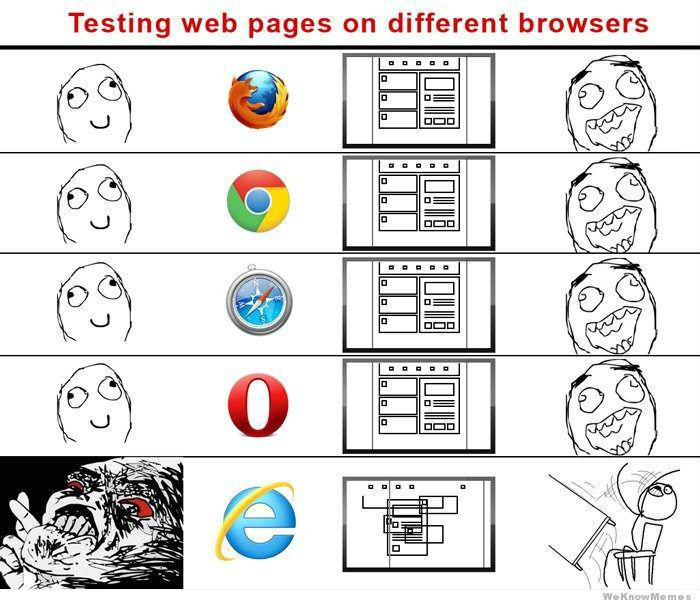
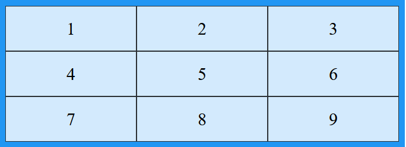
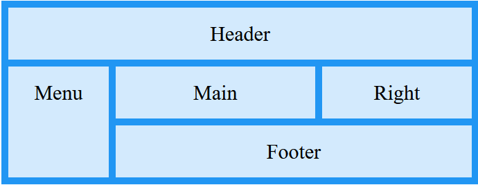

# CSS: 2da parte
Created by <i class="fab fa-telegram"></i>
[edme88]("https://t.me/edme88")

---
<style>
.grid-container2 {
    display: grid;
    grid-template-columns: auto auto;
    font-size: 0.8em;
    text-align: left !important;
}

.grid-item {
    border: 3px solid rgba(121, 177, 217, 0.8);
    padding: 20px;
    text-align: left !important;
}
</style>
<!-- .slide: style="font-size: 0.90em" -->
## Temario
<div class="grid-container2">
<div class="grid-item">

### CSS
* Backgrounds

[Ejercicio: Backgrounds](U4_CSS_avanzado.html#/5)

* Position
* Z-index
* Float
* Clear

</div>
<div class="grid-item">

[Ejercicio: 2 columnas](U4_CSS_avanzado.html#/16)

* Por qué funciona diferente? 
* Transiciones
* Grid (NEW)
* Recomendaciones
* Media Queries

</div>
</div>

---
## Fondos o Backgrounds
<!-- .slide: style="font-size: 0.70em" -->
La propiedad compuesta background permite definir simultáneamente todas las propiedades relacionadas con el fondo de 
cualquier elemento: 
* backgroud-color: color de fondo
* background-image: imagen de fondo
* background-position: posición
* background-size: tamaño de la imagen de fondo (cover, auto, contain, inherit, etc)
* background-repeat: si la imagen se repite o no (repeat, repeat-y, repeat-x)
* background-attachment: si la imagen es fija o tiene scroll con el resto de la página
* background-origin: desde donde la imagen debe empezar a mostrarse (content-box, padding-box, border-box)
* background-clip: hasta donde debe extenderse el fondo dentro de un elemento. (content-box, padding-box, border-box)

---
## Background: Ejemplo
Estas líneas:
````css
div {
  background-image: url("images/imagen_pequena.png");
  background-repeat: no-repeat;
  background-position: 2em 1.5cm;
  background-attachment: fixed;
}
````
Se pueden colocar todas juntas de la siguiente forma:
````css
div {
  background: url("images/imagen_pequena.png") no-repeat 2em 1.5cm fixed;
}
````

---
## Fondos o Backgrounds
Puedes ver más documentación en:

[Mclibre](https://www.mclibre.org/consultar/htmlcss/css/css-fondos.html)

[W3Shool - Background](https://www.w3schools.com/cssref/css3_pr_background.asp)

---
## Ejercicio: Backgrounds
Cree una página nueva, emplee de fondo la imagen “fondo_mario.jpg” ubicada en la carpeta de  “imagenes”. 
Pruebe  los  diferentes  atributos  de  background:  image, color, origin, position, repeat, size, etc.

---
## Ejercicio: Backgrounds
<iframe width="560" height="315" src="https://www.youtube.com/embed/1h4RYPkQ4qE" title="YouTube video player" frameborder="0" allow="accelerometer; autoplay; clipboard-write; encrypted-media; gyroscope; picture-in-picture" allowfullscreen></iframe>

---
## Position
Como posicionar elementos dentro de la pagina.
* static
* relative
* fixed
* absolute
* inherit

[W3School](https://www.w3schools.com/cssref/pr_class_position.asp)

Ejemplos: [Learns Layout](http://learnlayout.com/position.html)

---
## Position: static;
Los elementos posicionados con "Static" no son afectados por las propiedades top, bottom, left y right.

Por defecto, todos los elementos HTML son Static.

---
## Position: relative
El elemento es posicionado relativo respecto a su posición normal.
Los valores top, left, right, bottom lo mueven respecto a su posición original
Permite que un elemento se desplace respecto a lo que hubiera sido su posición normal; 
el resto de elementos continúan en su posición ignorando al que se desplaza, 
lo que puede crear superposiciones; el espacio libre que deja el elemento queda libre.

---
## Position: fixed
El elemento "fixed" es posicionado respecto al area visible.
Los valores top, left, right, bottom lo mueven respecto a su posición original
Permite que un elemento se desplace respecto al origen de coordenadas del primer 
elemento contenedor posicionado ó respecto a la esquina superior izquierda de la ventana de 
visualización; el resto de elementos actúan como si el desplazado no existiera, por lo que su 
espacio será ocupado por otros elementos; puede crear superposiciones.

---
## position: absolute
<!-- .slide: style="font-size: 0.90em" -->
Los elementos con position: absolute; son posicionados mediante top, left... 
respecto a su ancestro mas cercano que este posicionado.
Un elemento posicionado es aquel que tenga en su propiedad position algo distinto a static.

Permite fijar un elemento en una posición respecto al origen de coordenadas del primer 
elemento contenedor posicionado ó respecto a la esquina superior de la ventana de visualización; el 
elemento se mantendrá en la ventana de visualización o viewport, siempre en una misma posición aunque 
el usuario se desplace por la web haciendo scroll.

---
## position: inherit;
Se heredan las características del elemento padre.

---
## superposición con z-index
La propiedad z-index indica que elemento va estar posicionado sobre otro elemento.
Los elementos con z-index mayor tapan a los elementos con z-index menor 

---
## Float
Especifica si un elemento debe salir del flujo normal y aparecer a la izquierda o a la derecha de su contenedor.

[Learns Layout](http://learnlayout.com/float.html)

---
## Clear
Especifica si un elemento puede estar al lado de elementos flotantes que lo preceden o si debe ser movido (cleared) 
debajo de ellos. La propiedad clear aplica a ambos elementos flotantes y no flotantes.

[Learns Layout](http://learnlayout.com/clear.html)

---
## Ejercicio: 2 Columnas
Emplear div con style para lograr que el estilo del texto quede en 2 columnas fluidas.
Pruebe
* Forma 1 (CSS2): Float (left, right) y Width (50%) - (para div columna1 y div columna2)
* Forma 2 (CSS3): Column-count y column-gap (para el article)

---
## Ejercicio: 2 Columnas
<iframe width="560" height="315" src="https://www.youtube.com/embed/4BEX3s6ucDs" title="YouTube video player" frameborder="0" allow="accelerometer; autoplay; clipboard-write; encrypted-media; gyroscope; picture-in-picture" allowfullscreen></iframe>

---
## CSS
¿Por qué una Web no funciona igual en diferentes navegadores?
<ul>
<li style="list-style-image: url('images/html/chrome.png');">
<b>Google Chrome</b>
Utiliza para interpretar JavaScript un motor <b>V8</b>, y para el renderizado antes <b>WebKit</b> y ahora <b>Blink</b>.

<li style="list-style-image: url('images/html/firefox.png');">
<b>Firefox</b>
Empleaba <b>JagerMonkey</b> y ahora <b>SpiderMonkey</b> para JavaScript y para el renderizado <b>Gecko</b>.

<li style="list-style-image: url('images/html/explorer.png');">
<b>Internet Explorer & Edge</b>
Empleaba <b>Chakra</b>, posteriormente <b>ChakraCore</b> para JavaScript e inicialmente <b>Trident</b> para renderizado, luego <b>EdgeHTML</b>.
</ul>

---


---
## Transitions
Es una forma de animar los cambios de las propiedades CSS, para que no surtan efecto de manera instantánea.
````css
transition: <propiedad> <duracion> <funcion-tiempo> <retraso>;
````
La sintaxis puede ser también separada:
````css
a {
    transition-property: text-decoration;
    transition-duration: 0.8s;
    transition-timing-function: linear;
    transition-delay: 0.2s;
}
````

---
## Transitions
<!-- .slide: style="font-size: 0.80em" -->
* **transition-poperty**: propiedad a la que se le va a aplicar el efecto de transición. Puede ser cualquier propiedad de CSS: width, height, color, border, etc.
* **transition-duration**: duración del efecto. Puede ser en segundos (s) o milisegundos (ms).
* **trasition-timing-function**: define la curva de velocidad a la que se produce el efecto. Puede ser: ease, linear, ease-in, ease-out, ease-in-out, cubic-bezier, initial, inherit
* **transition-delay**: retraso en el comienzo de la transición. Puede ser en segundos (s) o milisegundos (ms).

---
## Transitions

Por ejemplo:
````css
a {
    text-decoration: none;
    color: blue;
}
a:hover {
    color: red;
}
a {
    transition: color 0.8s linear 0.2s;
}
````


---
## Transitions
````css
div {
   width: 100px;
   height: 100px;
   background: red;
   -webkit-transition: width 2s; /* For Safari 3.1 to 6.0 */
   transition: width 2s;
}
   
div:hover {
   width: 300px;
}
````

<div class="divTran"></div>

---
## Transitions 2
<!-- .slide: style="font-size: 0.90em" -->
````css
div {
   width: 100px;
   height: 100px;
   background: red;
   -webkit-transition: width 2s, height 2s, -webkit-transform 2s; /* Safari */
   transition: width 2s, height 2s, transform 2s;
}
   
div:hover {
   width: 200px;
   height: 200px;
   -webkit-transform: rotate(180deg); /* Safari */
   transform: rotate(180deg);
}
````

<div class="divTran2"></div>

---
## Ejercicio de Transitions
Emplea el template **ej_columna** y aplica un estilo de transición de color al **a** que contiene el enlace a la página de leyes.

Se debe realizar un cambio de color lineal en 1seg.

---
## Grid
Permite de cierta forma reemplazar el position en algunos casos, y 
simplifica muchas tareas para las que antes era necesario incluir algun framework como flexbox.

Es un sistema de rejilla en 2 dimensiones, creado dentro standard del lenguaje CSS.

---
## Grid Básico


---
## Grid Básico
````html
<style>
.grid-container {
  display: grid;
  grid-template-columns: auto auto auto;
  background-color: #2196F3;
  padding: 10px;
}
.grid-item {
  background-color: rgba(255, 255, 255, 0.8);
  border: 1px solid rgba(0, 0, 0, 0.8);
  padding: 20px;
  font-size: 30px;
  text-align: center;
}
</style>
</head>
<body>
<div class="grid-container">
  <div class="grid-item">1</div>
  <div class="grid-item">2</div>
  <div class="grid-item">3</div>  
  <div class="grid-item">4</div>
  <div class="grid-item">5</div>
  <div class="grid-item">6</div>  
  <div class="grid-item">7</div>
  <div class="grid-item">8</div>
  <div class="grid-item">9</div>  
</div>

</body>
````

---
## Grid: Columnas
Las líneas verticales de los elementos de grid se denominan columnas.


---
## Grid: Columnas
````html
<style>
.grid-container {
  display: grid;
  column-gap: 50px;
  grid-template-columns: auto auto auto;
}
</style>
</head>
<body>
<div class="grid-container">
  <div class="grid-item">1</div>
  <div class="grid-item">2</div>
  <div class="grid-item">3</div>  
  <div class="grid-item">4</div>
  <div class="grid-item">5</div>
  <div class="grid-item">6</div>  
  <div class="grid-item">7</div>
  <div class="grid-item">8</div>
  <div class="grid-item">9</div>  
</div>

</body>
````


---
## Grid: Filas
Las líneas horizontales de los elementos de grid se denominan filas.


---
## Grid: Filas
````html
<style>
.grid-container {
  display: grid;
  row-gap: 50px;
  grid-template-columns: auto auto auto;
}
</style>
</head>
<body>
<div class="grid-container">
  <div class="grid-item">1</div>
  <div class="grid-item">2</div>
  <div class="grid-item">3</div>  
  <div class="grid-item">4</div>
  <div class="grid-item">5</div>
  <div class="grid-item">6</div>  
  <div class="grid-item">7</div>
  <div class="grid-item">8</div>
  <div class="grid-item">9</div>  
</div>

</body>
````

---
## Grid: gap
El espacio entre cada columna/fila se denomina gap.


---
## Grid: Complejo


---
## Grid: Complejo
````html
<style>
.item1 { grid-area: header; }
.item2 { grid-area: menu; }
.item3 { grid-area: main; }
.item4 { grid-area: right; }
.item5 { grid-area: footer; }

.grid-container {
  display: grid;
  grid-template-areas:
    'header header header header header header'
    'menu main main main right right'
    'menu footer footer footer footer footer';
  gap: 10px;
  background-color: #2196F3;
  padding: 10px;
}

.grid-container > div {
  background-color: rgba(255, 255, 255, 0.8);
  text-align: center;
  padding: 20px 0;
  font-size: 30px;
}
</style>
</head>
<body>
<div class="grid-container">
  <div class="item1">Header</div>
  <div class="item2">Menu</div>
  <div class="item3">Main</div>  
  <div class="item4">Right</div>
  <div class="item5">Footer</div>
</div>

</body>
````

---
## Grid
Puedes acceder a más documentación en:

[W3School Grid](https://www.w3schools.com/css/css_grid.asp)

[DesarrolloWeb.com](https://desarrolloweb.com/articulos/que-es-css-grid-layout.html)

[LenguajeCSS](https://lenguajecss.com/p/css/propiedades/grid-css)

---
##  CSS: Recomendación 
Revisar documentación:
[W3 School](http://www.w3schools.com/css/default.asp)

Autogenerar algunos estilos complicados:

http://css3generator.com/

http://westciv.com/tools/shadows/

---
## Media Queries
<!-- .slide: style="font-size: 0.90em" -->
"Responsive Design" es la estrategia para hacer que un sitio se adapte al navegador y dispositivo en el que se muestra
````css
@media screen and (min-width:600px) {
    nav {
        float: left;
        width: 25%;
    }
    section {
        margin-left: 25%;
    }
}
@media screen and (max-width:599px) {
    nav li {
        display: inline;
    }
}
````
[Learn Layout](http://learnlayout.com/media-queries.html)

---
## ¿Dudas, Preguntas, Comentarios?

