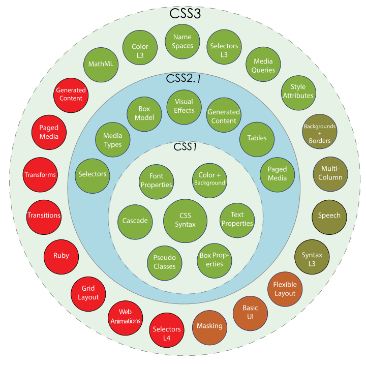

# Breve Historia del Desarrollo Web
Created by <i class="fab fa-telegram"></i>
[edme88]("https://t.me/edme88")

---

<!-- .slide: style="font-size: 0.80em" -->
## Temario

### Versiones de HTML
* HTML 1
* HTML 2
* HTML 3
* HTML 3.2
* HTML 4
* HTML 5
* HTML 6 ???

### Versiones de CSS
* CSS
* CSS 2
* CSS 3

---
## Versiones de HTML
* HTML 1
* HTML 2
* HTML 3
* HTML 3.2
* HTML 4
* HTML 5
* HTML 6 ???

---
## HTML 1
La primera versión del HTML nace en 1989 como un subconjunto de SGML (lenguaje de marcado generalizado estándar) y es 
especificada mediante un documento que se denomina HTML Tags.

HTML1 intenta contemplar estructura, formato y semántica, los cuales han ido derivando a la creación de otros lenguajes como CSS y XML.

También aparece el primer navegador para poder visualizar las páginas: WorldWideWeb.

---
## HTML 2
Aparece en noviembre de 1995, HTML 2.0, desarrollada por el IETF (Internet Engineering Task Force). Fue más estándar, 
ya que fue definida por un organismo oficial.

Entre las novedades podíamos encontrar cosas como imágenes, mapas de imágenes, formularios, barras separadoras… así como 
una definición inicial del DTD HTML (Definición de tipo de documento).

---
## HTML 3.0
Se plantea en noviembre de 1995 el borrador de HTML 3.0 por parte de el consorcio W3C (World Wide Web Consortium),
con la idea de definir estándares para Internet.

Se empieza a hablar de elementos como tablas, textos alrededor de las imágenes, y un elemento llamado MATH que permite crear fórmulas dentro del documento HTML.

---
## HTML 3.2
En enero de 1997 aparece HTML 3.2.  Aparecen elementos definidos por los fabricantes de navegadores: Netscape e Internet Explorer.

Así podemos encontrar en HTML 3.2 la capacidad de crear código script, capas, formularios, posibilidad de meter Applets 
de Java, entre otros.

---
## HTML 4
HTML 4 y HTML 4.01 surge en 1998 y 1999, siendo esta última la versión más longeva del estándar.

En HTML 4.01 la W3C empieza con la separación de la estructura del documento con la de la representación visual. 
Se crea un nuevo lenguaje llamado CSS.

Los elementos nuevos que aparecen son las hojas de estilo (CSS), los objetos (para poder insertar elementos externos 
como vídeo y música) y los frameset para dividir la pantalla en partes.

---
## HTML 5
<!-- .slide: style="font-size: 0.70em" -->
Empieza su definición apoyándose en dos puntos: 
* Compatibilidad hacía atrás de todo lo que hay creado 
* Capacidad de absorber todas las funcionalidades que los nuevos fabricantes de la web habían ido construyendo (Google, Apple u Opera).

Nuevas funcionalidades: simplicidad para reproducir audio y vídeo, el disponer de un lienzo de dibujo denominado Canvas, entre otros. 

Además alrededor de HTML5 nacen una gran cantidad de especificaciones para la mejora de las Webapps como son Websockets, Geolocalización, Webstorage.

Se publicada oficialmente el 28 de octubre de 2014.

---
### [HTML 6](https://programacion.net/articulo/9_caracteristicas_que_deseamos_que_esten_en_html6_1189)
Algunos cambios que se vienen:
* Librerías dedicadas (como un jQuery integrado)
* Mayor control sobre los objetos de vídeo 
* Integración con la cámara
* Pre-procesadores que se puedan conectar
* Mejores anotaciones
* Lenguajes conectables
* Muchos más microformatos
* Dimensionamiento de imágenes según el navegador
* Mejor gestión de la información de contacto

---
### Y los estilos?
Con el HTML 3.2 se daba formato en HTML con los elementos específicos para ello: <b>, ... y sus respectivos 
atributos face="arial,helvetica,sans-serif", size="3", align="center"... 

Implementarlo requería mucho tiempo, actualizarlo era molesto y no resultaba productivo.

---
### CSS
Con la llegada del HTML 4 se quitaron los estilos, pero se crearon las hojas de estilo en cascada, Cascading Style Sheet o CSS. 

La primera versión data del 17 de diciembre de 1996, cuando salio HTML 3.2

---
### CSS 2
Aparece el 12 de mayo de 1998. Se trataba de una versión con demasiadas novedades, y los navegadores no pudieron adaptarse bien.
 
El W3C volvió a retrabajarlo, y entre 2004-2006, lanzó la versión level 2 revisión 1, que se conoce como CSS 2.1. 
La versión 2.1 de las CSS fue publicada como Recommendation el 7 de junio de 2011.

---
### CSS 3
Los primeros borradores aparecieron en 1999. El W3C publicó varios "módulos" independientes los unos de los otros. 

Esto resulta bastante práctico para los navegadores, que pueden así implementar las novedades progresivamente.

---
### Preprocesadores
Extienden las características de HTML y CSS promoviendo la escritura de código reutilizable y modular. 
Los más empleados son:
* SASS
* LESS
* Stylus

---
## SASS & LESS
Son pre-procesadores CSS. Son herramientas permiten escribir pseudo-código CSS que luego será convertido a CSS real.
Ese pseudo-código se conforma de variables, condiciones, bucles o funciones.

El objetivo es tener un código más sencillo de mantener y editar.

---

---
## ¿Dudas, Preguntas, Comentarios?

