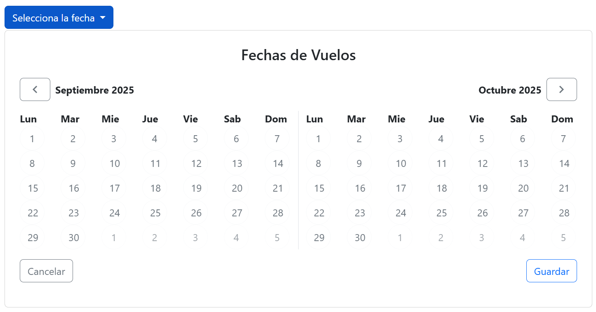
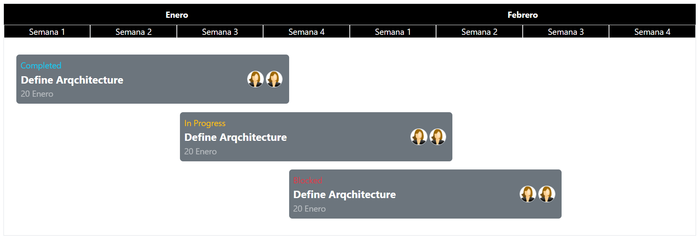
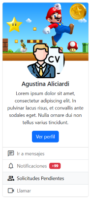
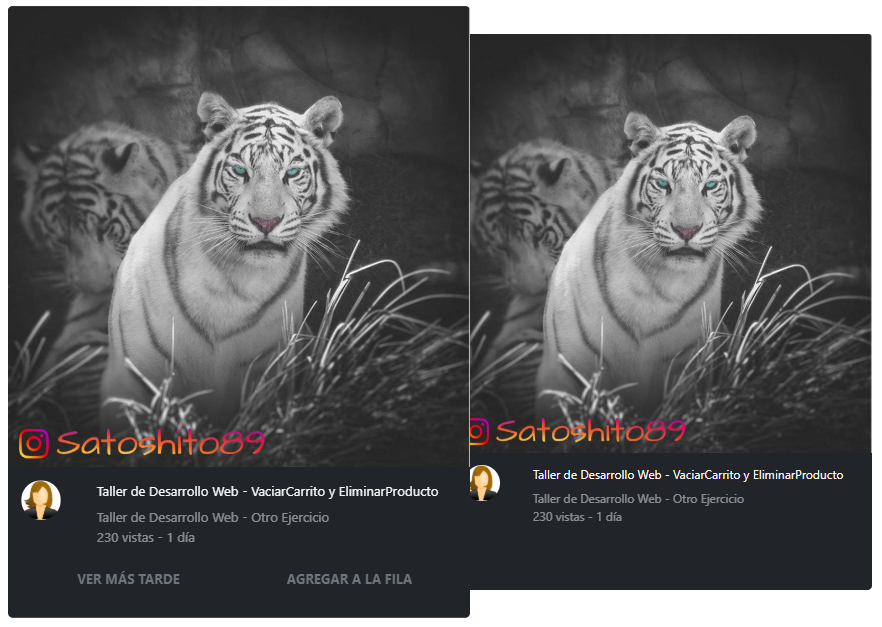
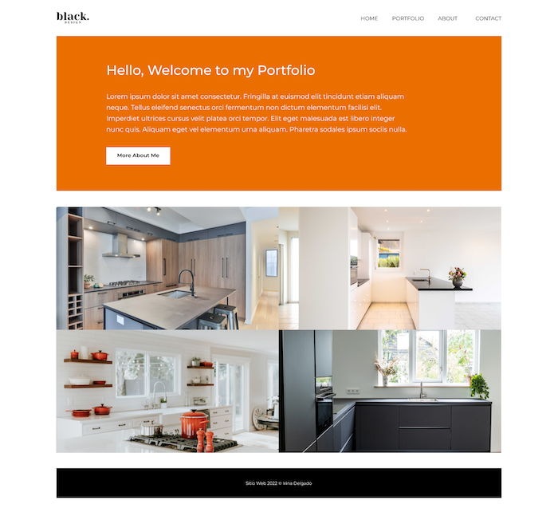

# BootStrap & SASS
Created by <i class="fab fa-telegram"></i>
[edme88]("https://t.me/edme88")

---
<!-- .slide: style="font-size: 0.60em" -->
<style>
.grid-container2 {
    display: grid;
    grid-template-columns: auto auto;
    font-size: 0.8em;
    text-align: left !important;
}

.grid-item {
    border: 3px solid rgba(121, 177, 217, 0.8);
    padding: 20px;
    text-align: left !important;
}
</style>
## Temario
<div class="grid-container2">
<div class="grid-item">

- Framework en CSS
- Ventajas y Desventajas
- Bootstrap
- Ejercicios Bootstrap
- TailwindCSS

</div>
<div class="grid-item">

- Preprocesadores CSS
- Ventajas y Desventajas
- Ejercicios SASS

</div>
</div>

---

### Ejercicio: BootStrap & Instagram
Empleando Ejercicios-CSS el template ej_instagram, el contenido debe visualizarse:
- Se deben mostrar 3 columnas las imagenes si la pantalla es mediana
- Se debe mostrar 1 columna si la pantalla es pequeña
- Las imagenes deben ocupar el 100% de su columna

---

### Ejercicio: Componente para selección de vuelos
<!--Ejercicio tomado de https://www.youtube.com/watch?v=7sDWDVODy8c-->
Elaborar el siguiente componente para la selección de vuelos empleando clases de bootstrap.



----

### Ejercicio: Componente para selección de vuelos
<iframe width="560" height="315" src="https://www.youtube.com/embed/YeWg5_vBBRE?si=jKvzmVu1LjmvMx-D" title="YouTube video player" frameborder="0" allow="accelerometer; autoplay; clipboard-write; encrypted-media; gyroscope; picture-in-picture; web-share" referrerpolicy="strict-origin-when-cross-origin" allowfullscreen></iframe>

----

### Ejercicio: Componente para selección de vuelos
<iframe width="560" height="315" src="https://www.youtube.com/embed/gLcHn837_S4?si=1RGjAdgEIk9-BreZ" title="YouTube video player" frameborder="0" allow="accelerometer; autoplay; clipboard-write; encrypted-media; gyroscope; picture-in-picture; web-share" referrerpolicy="strict-origin-when-cross-origin" allowfullscreen></iframe>

----

### Ejercicio: Componente para selección de vuelos
<!-- .slide: style="font-size: 0.70em" -->
#### Componentes (Dropdowns y Botones)
- **dropdown:** Contenedor que define un menú desplegable.
- **dropdown-toggle:** Estilo y comportamiento para el botón que abre/cierra el dropdown.
- **dropdown-menu:** Contenedor del menú que se despliega.
- **btn:** Clase base para botones.
- **btn-primary:** Variante de botón con color primario.
- **btn-outline-secondary:** Botón con borde y texto “secondary” (fondo transparente).
- **btn-outline-light:** Botón contorneado en tono “light”.
- **btn-outline-primary:** Botón contorneado en tono “primary”.

#### Atributos Bootstrap
- **data-bs-toggle="dropdown"** habilita el comportamiento del menú;
- **data-bs-auto-close="outside"** evita que se cierre al hacer clic dentro del menú.

----

### Ejercicio: Componente para selección de vuelos
<!-- .slide: style="font-size: 0.70em" -->
#### Grid / Layout
- **row:** Fila del sistema de grilla.
- **col:** Columna flexible (toma el ancho disponible equitativamente).
- **border-end:** Borde en el lado “end” (derecho en LTR) del elemento, útil para separar columnas.

#### Utilidades de espaciado y alineación
- **p-4:** Padding en todos los lados (4).
- **py-3:** Padding vertical (y) tamaño 3.
- **gap-2:** Espacio entre ítems en contenedores flex/grid (gap = 2).
- **d-flex:** Convierte el elemento en contenedor flex.
- **justify-content-end:** Alinea contenido al final del eje principal (derecha por defecto).
- **justify-content-between:** Distribuye los elementos con espacio entre ellos.
- **align-items-center:** Centra verticalmente (eje cruzado) los ítems en un contenedor flex.

----

### Ejercicio: Componente para selección de vuelos
<!-- .slide: style="font-size: 0.80em" -->
#### Tipografía / color / forma
- **fw-bold:** Texto en negrita.
- **text-center:** Texto centrado.
- **text-secondary:** Color de texto con el color “secondary” del tema.
- **rounded-circle:** Bordes completamente redondeados (círculo), típico para botones/avatares.

### Ejercicio: Clases propias
- **calendar-container:** Clase propia (la usás en tu CSS para ancho/alto de botones).
- **calendar-grid:** Clase propia.
- **material-symbols-outlined:** Propia de Google Fonts/Material Symbols.

---

### Ejercicio: Timeline
<!--Ejercicio tomado de https://www.youtube.com/watch?v=7sDWDVODy8c-->
Elaborar el siguiente timeline (similar a Jira) empleando clases de bootstrap.



----

### Ejercicio: Timeline

<iframe width="560" height="315" src="https://www.youtube.com/embed/7G3kyOIOxGg?si=2ulSrJemV5bRfluO" title="YouTube video player" frameborder="0" allow="accelerometer; autoplay; clipboard-write; encrypted-media; gyroscope; picture-in-picture; web-share" referrerpolicy="strict-origin-when-cross-origin" allowfullscreen></iframe>

----

### Ejercicio: Timeline
<!-- .slide: style="font-size: 0.80em" -->
#### Disposición (Grid / Layout)
- **container:** contenedor centrado con anchos máximos responsivos; crea el “lienzo” del timeline.
- **row:** fila del sistema de grilla. Agrupa columnas y gestiona gutters.
- **col / col-X (1-12):** columnas con fracciones fijas.

#### Espaciado y tamaño
- **mt-X:** margen superior grande al bloque principal.
- **p-X py-X:** padding general y vertical para airear los bloques.

#### Tipografía
- **fw-bold:** negrita.
- **fs-X:** tamaños de fuente semánticos.
- **text-center:** centra texto.
- **opacity-X:** baja opacidad del texto.

----

### Ejercicio: Timeline
<!-- .slide: style="font-size: 0.70em" -->
####  Colores / fondos / estados
- **bg-black + text-white:** cabecera con alto contraste.
- **bg-secondary + text-white:** “tarjetas” de ítems de timeline.
- **text-info, text-warning, text-danger:** estado visual para textos.

#### Bordes y formas
- **border:** borde por defecto).
- **border-light:** borde claro.
- **rounded-X:** radios suaves.
- **rounded-circle:** hace los avatares circulares.

#### Flexbox y alineación
- **d-flex:** activa flexbox.
- **align-items-center:** centra verticalmente elementos dentro del contenedor flex.
- **gap-X:** separación uniforme entre elementos.

---

### Ejercicio: Componente Perfil
<!--Ejercicio tomado de https://www.youtube.com/watch?v=7sDWDVODy8c-->
Elaborar el siguiente Perfil (tipo linkedin) empleando clases de bootstrap.



----

### Ejercicio: Componente Perfil

<iframe width="560" height="315" src="https://www.youtube.com/embed/cOlcjzI9xHk?si=93KpB4lAPM31WPJg" title="YouTube video player" frameborder="0" allow="accelerometer; autoplay; clipboard-write; encrypted-media; gyroscope; picture-in-picture; web-share" referrerpolicy="strict-origin-when-cross-origin" allowfullscreen></iframe>

----

### Ejercicio: Componente Perfil
#### Componentes de Bootstrap usados
<!-- .slide: style="font-size: 0.80em" -->
- **card / card-img-top / card-body / card-title / card-text:**
Estructura y estilos del componente Card (imagen arriba, cuerpo con título y texto).
- **btn btn-primary:** Botón con la variante de color primario del tema.
- **list-group / list-group-flush:**
Lista estilizada; flush elimina bordes/redondeos externos para que “pegue” con la card.
- **list-group-item / list-group-item-action:** Ítems de lista; la variante action da estados hover/active cuando el ítem es clickeable .
- **badge + bg-danger:** Insignia pequeña (contador “+99”) con fondo rojo del tema.

----

### Ejercicio: Componente Perfil
### Utilidades (Utilities) de Bootstrap

<!-- .slide: style="font-size: 0.50em" -->
Layout y flex
- **d-flex** display: flex.
- **justify-content-center** centra horizontalmente.
- **gap-2** espacio entre hijos en contenedores flex.
- **align-items-center** centra verticalmente ítems en flex.

Espaciado
- **my-5** margen vertical grande (arriba y abajo).
- **p-X** padding.

Tipografía y alineación
- **text-center** centra el contenido de la card.

Bordes y forma
- **rounded-circle:** hace circular la imagen de perfil (avatar).

Posicionamiento
- **position-relative** convierte el contenedor en contexto de posicionamiento (sirve si luego querés posicionar algo absolute dentro). Acá se usa junto con .profile (custom) para “superponer” el avatar sobre la imagen de portada.

---

### Ejercicio: Youtube
<!--Ejercicio tomado de https://www.youtube.com/watch?v=7sDWDVODy8c-->
Elaborar la siguiente pantalla similar a youtube empleando clases de bootstrap.



----

### Ejercicio: Youtube

<iframe width="560" height="315" src="https://www.youtube.com/embed/4QkRKllU-aM?si=zfo-4w8MbqJ6vw2y" title="YouTube video player" frameborder="0" allow="accelerometer; autoplay; clipboard-write; encrypted-media; gyroscope; picture-in-picture; web-share" referrerpolicy="strict-origin-when-cross-origin" allowfullscreen></iframe>

<small>Error: Cambiar **test-light** por **text-light** y cambiar **transition: scale 0.1s ease;** por **transition: transform 0.1s ease;**</small>

----

### Ejercicio: Youtube
<!-- .slide: style="font-size: 0.70em" -->
#### Container y layout
- **container:** contenedor centrado con márgenes automáticos y padding horizontal.
- **d-flex:** convierte el contenedor en flexbox (hijos en línea).
- **gap-1:** agrega un pequeño espacio entre las tarjetas.
- **my-5:** margen vertical grande (arriba y abajo).

#### Componente: Card
- **card:** clase base del componente (aplica borde, padding y sombra ligera).
- **card-img-top:** imagen superior de la card (por encima del cuerpo).
- **card-body:** contenedor del contenido textual.
- **card-title:** estilos para títulos dentro de una card.
- **text-bg-dark:** variante que combina texto blanco y fondo oscuro.
- **text-white:** asegura color blanco del texto.
- **border-0:** elimina el borde visible.

----

### Ejercicio: Youtube
<!-- .slide: style="font-size: 0.90em" -->
#### Tipografía y color
- **text-light:** texto gris claro.
- **text-decoration-none:** elimina subrayado de los enlaces.
- **opacity-50:** aplica 50 % de opacidad al texto (más tenue).
- **fw-bold:** texto en negrita.
- **fs-6:** tamaño de fuente base (≈16px).

#### Grid System
- **row:** fila de la grilla.
- **col-2, col-6, col-10:** columnas fijas (dividen la fila en 12 partes).
Se usan para separar el avatar (2 columnas) y el texto (10 columnas), y para dividir botones.

----

### Ejercicio: Youtube
<!-- .slide: style="font-size: 0.80em" -->
#### Flex y alineación
- **d-block:** convierte el enlace del botón en elemento bloque (ocupa todo el ancho).
- **w-100:** ancho completo del contenedor padre.

#### Botones
- **btn:** clase base del componente botón.
- **text-secondary:** texto gris (sin fondo de color).

#### Imagen y forma
- **rounded-circle:** redondea al 100 % (imagen circular, avatar).

#### Otras utilidades
- **overflow-hidden:** oculta contenido que se salga del contenedor (usado para animar las “action-buttons”).
- **p-1, p-2:** padding interno (espaciado dentro de los botones y filas).

----

### Ejercicio: Instalar Node.Js
<!-- .slide: style="font-size: 0.80em" -->
1. Ingresar a https://nodejs.org/en
2. Descargar e instalar Node 22.20.0 o superior (si trabajas en múltiples proyectos que requieren diferentes versiones de Node te recomiendo emplear [nvm](https://github.com/coreybutler/nvm-windows/releases))
3. En una terminal verificar que la instalación se realizó correctamente
```bash
node -v
npm -v
npx -v
```

Si tienen problemas de permisos, asegurarse de usar una terminal con permisos de administrador, y levantar las restricciones:
```bash
Set-ExecutionPolicy Unrestricted
```

---

### Instalación

1. Instala sass `npm install -g sass` y verifica `sass --version`
2. En el VSC instala el plugin necesario **Sass**(.sass only)

Si tienes problemas de permisos en Mac:
```bash
sudo chown -R $USER /usr/local/lib/node_modules
```

---

### Ejercicio: Sass básico
1. Crea un archivo **styles.scss**
2. Ejecuta **sass --watch styles.scss styles.css** en la consola del proyecto para transpilar el **scss** a **css**
3. Crea una variable para almacenar colores y usalo en algún elemento
4. Agrega estilos por (descendientes) anidación
5. Crea un nuevo archivo de **sass** para que los estilos anidados estén separados. Crea otro archivo para las variables.
6. Crea un mixin que reciba un color para el fondo y un color para las letras. Reutilizalo en diferentes elementos html.

----

### Ejercicio: Sass básico

<iframe width="560" height="315" src="https://www.youtube.com/embed/lr5bF2bgXcU?si=IITVLcMJt7ZrsTUF" title="YouTube video player" frameborder="0" allow="accelerometer; autoplay; clipboard-write; encrypted-media; gyroscope; picture-in-picture; web-share" referrerpolicy="strict-origin-when-cross-origin" allowfullscreen></iframe>

<!--Ejemplo tomado de: https://www.youtube.com/watch?v=BtiiM3jeb_c-->

---

### Ejercicio: Diseño de Interiores



----

### Ejercicio: Diseño de Interiores
1. Creamos un **index.html** con su header, nav, section, footer
2. Creamos una carpeta **scss** con el archivo **styles.scss** dentro
3. Ejecutamos `sass --watch scss/styles.scss css/styles.css`
4. Agregamos los estilos para desktop
5. Creamos un archivo **_mobile.scss** y agregamos los estilos mobile

----

### Ejercicio: Diseño de Interiores
Recursos:


----

### Ejercicio: Diseño de Interiores

<iframe width="560" height="315" src="https://www.youtube.com/embed/xq6UDznaar4?si=dMB8Mt03z6VzuYZK" title="YouTube video player" frameborder="0" allow="accelerometer; autoplay; clipboard-write; encrypted-media; gyroscope; picture-in-picture; web-share" referrerpolicy="strict-origin-when-cross-origin" allowfullscreen></iframe>

----

### Ejercicio: Diseño de Interiores

<iframe width="560" height="315" src="https://www.youtube.com/embed/NrkVUcpD0zc?si=vhNAhUehEZoRfuaz" title="YouTube video player" frameborder="0" allow="accelerometer; autoplay; clipboard-write; encrypted-media; gyroscope; picture-in-picture; web-share" referrerpolicy="strict-origin-when-cross-origin" allowfullscreen></iframe>

----

### Ejercicio: Diseño de Interiores

<iframe width="560" height="315" src="https://www.youtube.com/embed/Y5qrZwuJmOU?si=RyR3Z8oe3P1u-YEb" title="YouTube video player" frameborder="0" allow="accelerometer; autoplay; clipboard-write; encrypted-media; gyroscope; picture-in-picture; web-share" referrerpolicy="strict-origin-when-cross-origin" allowfullscreen></iframe>

---
## ¿Dudas, Preguntas, Comentarios?

