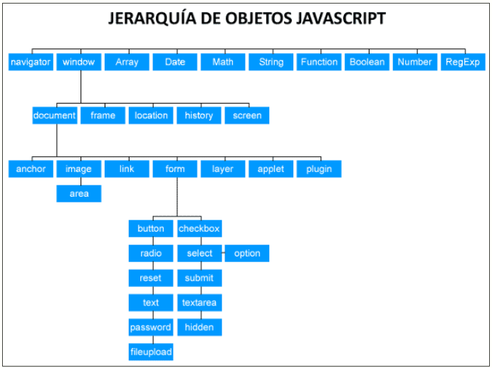

<script src="../js/pruebas.js"></script>

# JavaScript
Created by <i class="fab fa-telegram"></i> 
[edme88]("https://t.me/edme88")

---

<style>
.grid-container2 {
    display: grid;
    grid-template-columns: auto auto;
    font-size: 0.8em;
    text-align: left !important;
}

.grid-item {
    border: 3px solid rgba(121, 177, 217, 0.8);
    padding: 20px;
    text-align: left !important;
}
</style>
<!-- .slide: style="font-size: 0.80em" -->
## Temario
<div class="grid-container2">
<div class="grid-item">

* ECMAScript
* Jerarquía de Objetos
<br><br>


</div>
</div>

---
## ECMAScript
JavaScript está estandarizado por Ecma International, la asociación europea para estandarizar los sistemas de información 
y comunicación.

El último estándar es [ECMA-262](https://www.ecma-international.org/publications-and-standards/standards/ecma-262/), 
y también está aprobado por ISO (Organización Internacional de Normalización).

---
## Jerarquía de Objetos en Js
Podemos ver una página web como una colección de objetos. Por ejemplo, para JavaScript un formulario es un objeto, una imagen es un objeto, etc.

Los objetos tienen propiedades, métodos y eventos asociados.

Los objetos se organizan conforme a una jerarquía de forma que heredan métodos o propiedades de sus objetos padre, e incluso el nombre de un objeto se crea a partir de sus objetos padre.

---
## Jerarquía de Objetos en Js


---
## Jerarquía de Objetos en Js
<!-- .slide: style="font-size: 0.65em" -->
Todo documento HTML dispone de los siguientes objetos en la jerarquía de objetos JavaScript:
* **navigator:** tiene propiedades relacionadas con el nombre y la versión del navegador, protocolos de transferencia permitidos por el navegador (mime types) y sobre plugins instalados.

* **window:** considerado habitualmente el objeto global o de máximo nivel. Tiene propiedades relacionadas con la ventana del navegador. En caso de uso de frames (“subventanas”) hay un objeto window por cada “ventana hija” que exista.

* **document:** tiene propiedades relacionadas con el documento como título, links, formularios, etc.

* **location:** tiene propiedades relacionadas con la URL actual.

* **history:** tiene propiedades relacionadas con URLs previamente visitadas.

---
#### [Nombres dentro de laJerarquía de Objetos en Js](https://www.aprenderaprogramar.com/index.php?option=com_content&view=article&id=858:jerarquia-de-objetos-javascript-forms-elements-images-navigator-useragent-geolocation-online-cu01170e&catid=78&Itemid=206)
<!-- .slide: style="font-size: 0.85em" -->
Reglas al nombrar los objetos:

1. El nombre del objeto descendente incluye el nombre del objeto padre. 
Ej. window.document

2. Como todo desciende de window, podemos omitirlo:
Ej. document.body en lugar de window.document.body

3. Se organiza de forma automática ciertos objetos (forms, elements, images, links) en arrays. 
Ej. En caso de varios formularios window.document.forms[0] ó document.forms[0]

---
#### Jerarquía de Objetos en Js: Ejemplos
````javascript
windows.alert("Hola Mundo!!!");

document.getElementById("num1").value;

document.getElementsByName("miDiv")[0].style.display = 'none';

window.document.forms[0].nombreUsuario.value;
````

---
## ¿Dudas, Preguntas, Comentarios?

