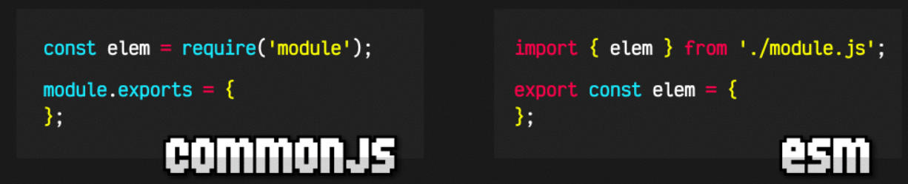

# NodeJS
Created by <i class="fab fa-telegram"></i>
edme88

---
<!-- .slide: style="font-size: 0.60em" -->
<style>
.grid-container2 {
    display: grid;
    grid-template-columns: auto auto;
    font-size: 0.8em;
    text-align: left !important;
}

.grid-item {
    border: 3px solid rgba(121, 177, 217, 0.8);
    padding: 20px;
    text-align: left !important;
}
</style>
## Temario
<div class="grid-container2">
<div class="grid-item">

- NodeJs
- npm

</div>
<div class="grid-item">

- npx

</div>
</div>

---

### Node.js 

Es un entorno de ejecución de JavaScript que permite ejecutar código JS fuera del navegador (por ejemplo, en la terminal o en un servidor).
Lo usamos porque muchas herramientas modernas de desarrollo frontend están escritas en JavaScript y necesitan un entorno para ejecutarse. 

----

### npm 

Son las siglas de **Node Package Manager**.
Es el sistema que usamos para instalar y gestionar librerías o herramientas escritas en JavaScript.
Se instala automáticamente cuando instalás Node.js.

Pensalo como un "App Store" para desarrolladores JavaScript.

Por ejemplo, si quisieras instalar Sass:

```bash
npm install -g sass
```

<small>Eso la instala globalmente en tu sistema (queda disponible para todos los proyectos).</small>

----

### npx

Son las siglas de **Node Package eXecutor**.
Es una herramienta que viene con npm.
Sirve para ejecutar paquetes que no tenemos instalados globalmente.

Ejemplo, si NO ejecute **npm install -g sass** y quiero usarlo puedo hacer:
```bash
npx sass estilos.scss estilos.css
```

---

### nvm

Son las siglas de **Node Version Manager**, una herramienta para gestionar múltiples versiones de Node.js

El uso de NVM resuelve los problemas de incompatibilidad entre varias versiones de Node.js, permitiendo a los desarrolladores cambiar rápidamente de entorno según los requisitos del proyecto.

https://www.nvmnode.com/es/guide/download.html

---

### Instalar node usando nvm
1. Ingresar a https://www.nvmnode.com/es/guide/download.html y descargar nvm
2. Instalarlo
3. En una terminal ejecutar
```bash
nvm help
```

----

### Instalar node usando nvm
4. Para instalar node
```bash
nvm install 24.18.1
```
5. Para visualizar todos los node instalados
```bash
nvm list
```
6. Para usar una versión de node instalada
```bash
nvm use 24.18.1
```

---

### Herramientas de desarrollo

Quedaron pendientes de instalar y configurar algunas herramientas, pero aún no lo hicimos porque no hemos empezado nuestro proyecto.

---

### Iniciar proyecto con Node.Js
1. Ejecutar
```bash
npm init
```
2. Colocar un nombre para el proyecto
```bash
package name: primer-node
```
3. Establecer la versión
4. Escribir una descripción
5. Establecer el entry point
6. Comando para ejecución de tests
7. Link del repositorio de git

----

### Iniciar proyecto con Node.Js
8. Palabras clave
9. Autor
10. Licencia: **MIT** (libre para usar, modificar, copiar y distribuir inlcuyendo la autoría original), 
**ISC** (incluye dependencias y librerías externas)
11. Type: commonjs o ESmodules



---

### Linter
Es un analizador de código estático, es una herramienta de software que verifica y analiza el código fuente de un programa en busca de posibles errores, problemas de estilo y faltas de las convenciones de codificación.

Su propósito es mejorar la calidad y legibilidad del código.

En **JavaScript** la herramienta más empleada es **ESLint**

----

### ESLint: características
<!-- .slide: style="font-size: 0.75em" -->
- **Análisis estático de código:** Busca de errores, problemas de estilo, inconsistencias y patrones sospechosos. Mejora la calidad y la mantenibilidad del software.
- **Reglas configurables** según las necesidades del proyecto y las preferencias del equipo de desarrollo. Proporciona reglas predefinidas y permite crear reglas personalizadas.
- **Integración flexible** con diferentes CI y diversos IDEs.
- **Mensajes de error y advertencias descriptivos** que ayudan a los desarrolladores a comprender y solucionar los problemas de código de manera eficiente. 
- **Configuración basada en archivos**, el **.eslintrc.js** ó **eslint.config.js**, esto permite mantener configuraciones diferentes para proyectos individuales y compartir configuraciones entre equipos de desarrollo.
- **Compatibilidad con plugins y extensiones**, lo que amplía su funcionalidad y permite agregar reglas adicionales.

---

### ESLint: Reglas
<!-- .slide: style="font-size: 0.80em" -->
- *no-unused-vars*: Detecta variables declaradas pero no utilizadas en el código.
- *no-undef*: Detecta el uso de variables no declaradas.
- *no-console*: Advierte sobre el uso de sentencias console.log()
- *no-extra-semi*: Detecta puntos y comas innecesarios en el código.
- *eqeqeq*: Exige el uso de operadores de igualdad estricta (=== y !==) en lugar de igualdad débil (== y !=).
- *camelcase*: Requiere el uso de convenciones de nomenclatura en estilo camelCase para variables y propiedades.
- *semi*: Exige el uso de punto y coma al final de las declaraciones.
- *quotes*: Establece el uso consistente de comillas simples o dobles para delimitar cadenas de texto.
- *indent*: Establece la regla de indentación para el código.
- *comma-dangle*: Establece si se debe permitir o exigir una coma final en listas y objetos.

---

### Ejercicio: ESLint
1. En la carpeta base del proyecto ejecutar
```bash
npm install eslint --save-dev
```
2. Crear un archivo de configuración usando el comando
```bash
npm init @eslint/config
```
3. Al ejecutarlo nos preguntará lo siguiente:
```bash
? What do you want to lint? ... 
(*) JavaScript
( ) JSON
( ) JSON with comments
( ) JSON5
( ) Markdown
( ) CSS
```
4. Que verificaremos?
```bash
? How would you like to use ESLint? ... 
> To check syntax only
  To check syntax and find problems
```

----

### Ejercicio: ESLint
5. Posteriormente
```bash
? What type of module does your project use?
> JavaScript modules (import/export)
  CommonJS (require/exports)
  None of these
```
6. Framework
```bash
? Which framework does your project use?
> React
  Vue.js
  None of these
```
6. Lenguaje
```bash
? Does your porject use TypeScript? No / Yes
```

----

### Ejercicio: ESLint
7. Luego nos pregunta:
```bash
? Where does your code run?
  Browser
  Node
```
8. Instalacion
```bash
Would you like to install them now? · No / Yes
```
8. Sobre que estilo aplicar:
```bash
Which package manager do you want to use? ... 
> npm
  yarn
  pnpm
  bun
```

---

### Prettier
Es un formateador de código, que permite que todo el equipo de desarrollo cumpla con los estándares de codificación definidos sin necesidad de acciones manuales.s

Prettier es compatible con múltiples frameworks de JavaScript (Angular, React, Vue y Svelte) y también funciona con TypeScript.

---

### Prettier: Configuración
1. Instalar la extensión **Prettier** en el VSC.
2. En el archivo de configuración del **.eslintrc**
```json
"extends": ["plugin:prettier/recommended"],
"plugins": ["prettier"],
```
3. En el menú de la izquierda presionar la rueda e ir a **Settings**
4. Buscar **formatter**
5. Seleccionar **ESLint**
6. Se recomienda checkear **Format on save**

---

### Ejercicio: JsDoc
1. Asegúrate de tener [nodeJs](https://nodejs.org/es/) instalado. Para eso puedes ejecutar en el cmd:
```shell
node --version
```
2. Instala la dependencia [jsdoc](https://www.npmjs.com/package/jsdoc)
```shell
npm install -g jsdoc
```

----

### Ejercicio: JsDoc
3. Crea un archivo .js básico con algunas funciones. Ejemplo:
```js
/**
 * Calcula el área de un rectángulo.
 * @param {number} ancho - El ancho del rectángulo
 * @param {number} alto - El alto del rectángulo
 * @returns {number} El área del rectángulo
 */
function calcularArea(ancho, alto) {
  return ancho * alto;
}

/**
 * @param {string} nombre - Nombre del usuario
 * @param {number} [edad] - Edad del usuario (opcional)
 * @param {Object} opciones - Opciones de configuración
 * @param {boolean} opciones.activo - Estado del usuario
 * @param {string} opciones.rol - Rol del usuario
 */
function crearUsuario(nombre, edad, opciones) {
  // Implementación
}
```

----

4. En la terminal ejecutar:
```shell
jsdoc ejemplo-doc.js
```

5. Verificar el contenido de la carpeta **out**

---

Si durante la ejecución de JsDoc tienes algún problema, puede que tu terminal no posea 
los permisos necesarios. Para habilitar los permisos:
```bash
Set-ExecutionPolicy -ExecutionPolicy RemoteSigned -Scope CurrentUser
```

---
## ¿Dudas, Preguntas, Comentarios?

