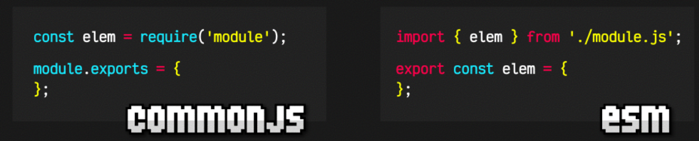

# NodeJS
Created by <i class="fab fa-telegram"></i>
edme88

---
<!-- .slide: style="font-size: 0.60em" -->
<style>
.grid-container2 {
    display: grid;
    grid-template-columns: auto auto;
    font-size: 0.8em;
    text-align: left !important;
}

.grid-item {
    border: 3px solid rgba(121, 177, 217, 0.8);
    padding: 20px;
    text-align: left !important;
}
</style>
## Temario
<div class="grid-container2">
<div class="grid-item">

- NodeJs
- npm
- npx
- nvm
- Instalar node usando nvm
- End of Life (EOL)
- Partes de un package.json

</div>
<div class="grid-item">

- iniciar proyecto nodeJs
- herramientas de desarrollo
- Linter
- ESlint
- Prettier


</div>
</div>

---

### [Node.js](https://nodejs.org/es) 
<!--https://www.freecodecamp.org/espanol/news/que-es-npm/-->
<!--https://coddy.tech/docs/es/javascript/package-json-->
Es un entorno de ejecución de JavaScript que permite ejecutar código JS fuera del navegador (por ejemplo, en la terminal o en un servidor).
Lo usamos porque muchas herramientas modernas de desarrollo frontend están escritas en JavaScript y necesitan un entorno para ejecutarse. 

---

### npm 

Son las siglas de **Node Package Manager**.
Es el sistema que usamos para instalar y gestionar librerías o herramientas escritas en JavaScript.
Se instala automáticamente cuando instalás Node.js.

Pensalo como un "App Store" para desarrolladores JavaScript.

Por ejemplo, si quisieras instalar Sass:

```bash
npm install -g sass
```

<small>Eso la instala globalmente en tu sistema (queda disponible para todos los proyectos).</small>

----

### npm
npm se compone de al menos 2 partes principales:
- Un [repositorio online](https://www.npmjs.com/) para publicar paquetes de software libre para ser utilizados en proyectos Node.js
- Una herramienta para la terminal (command line utility) para interactuar con dicho repositorio que te ayuda a la instalación de utilidades, manejo de dependencias y la publicación de paquetes.

----

### npx

Son las siglas de **Node Package eXecutor**.
Es una herramienta que viene con npm.
Sirve para ejecutar paquetes que no tenemos instalados globalmente.

Ejemplo, si NO ejecute **npm install -g sass** y quiero usarlo puedo hacer:
```bash
npx sass estilos.scss estilos.css
```

---

### nvm

Son las siglas de **Node Version Manager**, una herramienta para gestionar múltiples versiones de Node.js

El uso de NVM resuelve los problemas de incompatibilidad entre varias versiones de Node.js, permitiendo a los desarrolladores cambiar rápidamente de entorno según los requisitos del proyecto.

https://www.nvmnode.com/es/guide/download.html

---

### Instalar node usando nvm
1. Ingresar a https://www.nvmnode.com/es/guide/download.html y descargar nvm
2. Instalarlo
3. En una terminal ejecutar
```bash
nvm help
```

----

### Instalar node usando nvm
4. Para instalar node
```bash
nvm install 24.21.0
```
5. Para visualizar todos los node instalados
```bash
nvm list
```
6. Para usar una versión de node instalada
```bash
nvm use 24.18.1
```

---

### [End of Life (EOL)](https://endoflife.date/nodejs)
Es fin de vida útil de una versión de Node.js. Es la fecha en la que una versión deja de recibir:
- Soporte oficial
- Actualizaciones de seguridad
- Correcciones de errores

por parte del equipo de desarrollo

----

### End of Life (EOL)
<!-- .slide: style="font-size: 0.80em" -->
es importante verificarlo porque:
- **Evitar brechas de seguridad:** Los atacantes explotan fallos conocidos en versiones sin soporte porque saben que nunca serán reparados.
- **Cumplimiento normativo:** Muchas normativas y auditorías empresariales exigen usar software con soporte activo para proteger los datos de los usuarios.
- **Compatibilidad con servicios:** Proveedores de la nube y herramientas externas (como bases de datos o librerías) eliminan la compatibilidad con versiones EOL de forma progresiva.
- **Migración planificada:** Revisar el calendario permite actualizar la versión de Node.js de manera controlada antes de que represente una emergencia operativa.

---

### package.json
Es el archivo de manifiesto principal de un proyecto en Node.js, que contiene los metadatos, las dependencias y la configuración básica de la aplicación.

Se ubica en la raíz del proyecto y sirve como la guía que utiliza el gestor de paquetes **npm** para entender e instalar los elementos necesarios para que el software funcione.

----

### Partes de un package.json
<!-- .slide: style="font-size: 0.90em" -->
- **package name:** Es el nombre que permite reconocer al proyecto. Es importante que el nombre sea único si el proyecto se desea publicar en el registro de paquetes de npm.
- **version:** Sigue el formato de **Semantic Versioning**, que contiene MAJOR.MINOR.PATCH
- **description:** Una breve descripción de tu proyecto.
- **entry point:** Archivo que se ejecutará cuando se importe este proyecto dentro de otro. Es importante para paquetes de librerías.
- **test command:** Comandos que se ejecutaran al realizar un `npm run test`

----

### Partes de un package.json
- **git repository:** Url del repositorio git en donde este proyecto está alojado. 
- **keywords:** Palabras clave que describan tu proyecto. 
- **author:** Nombre e email de quien creó el proyecto.
- **license:** Identifica el tipo de licencia de uso del proyecto.
- **type:** Define cómo se interpretan los archivos **.js**. Con "module" se usa ESM (import / export). Con "commonjs", se usa CommonJS (require)

---

### Iniciar proyecto con Node.Js
1. Ejecutar
```bash
npm init
```
2. Colocar un nombre para el proyecto
```bash
package name: primer-node
```
3. Establecer la versión
4. Escribir una descripción
5. Establecer el entry point
6. Comando para ejecución de tests
7. Link del repositorio de git

----

### Iniciar proyecto con Node.Js
8. Palabras clave
9. Autor
10. Licencia: **MIT** (libre para usar, modificar, copiar y distribuir inlcuyendo la autoría original), 
**ISC** (incluye dependencias y librerías externas)
11. Type: commonjs o ESmodules



---

### Otros campos del package.json
<!-- .slide: style="font-size: 0.90em" -->
- **private:** *true/false*, para evitar que se publique el paquete en npm sin querer.
- **dependencies**: Se listan los paquetes que el código necesita en tiempo de ejecución, como **express** o **react**.
- **devDependencies:** Se listan los paquetes que solo se usan mientras se hace desarrollo o compilación: test runners, bundlers, linters
- **engine:** Contiene la versión de node sugerida para este proyecto. Si se emplea otra, muestra una alerta.
- **scripts:** Permite crear atajos para comandos que se usan frecuentemente. Se ejecutan con `npm run nombre-del-script`

---

### mayor.minor.patch
- **mayor:** Representa una versión mayor que genera cambios en la API del producto.
- **minor:** Representa un valor que aumenta cuando se hacen cambios retro-compatibles.
- **patch:** Un valor que aumenta cada vez que se hacen reparaciones de errores o mejoras sutiles.

----

### Sobre las versiones de las dependencias...

<table>
  <thead>
    <tr>
      <th>Símbolo</th>	
      <th>Nombre</th>
      <th>¿Qué permite actualizar?</th>
      <th>Ejemplo</th>
      <th>Rango permitido</th>
    </tr>
  </thead>
  <tbody>
    <tr>
      <td>^	</td>
      <td>Caret (Acento circunflejo)</td>
      <td>Versiones Minor y Patch (No cambia el primer número)</td>
      <td>^1.2.3</td>
      <td>Desde 1.2.3 hasta <2.0.0</td>
    </tr>
    <tr>
      <td>~
      <td>Tilde (Virgulilla)</td>
      <td>Solo versiones Patch (No cambia el segundo número)</td>
      <td>~1.2.3</td>
      <td>Desde 1.2.3 hasta <1.3.0</td>
    </tr>
    <tr>
      <td>*
      <td>Asterisco (Wildcard)</td>
      <td>Cualquier versión disponible (Instala la más reciente)</td>
      <td>* o 1.*</td>
      <td>* (Cualquier versión) <br> 1.* (Desde 1.0.0 hasta <2.0.0)</td>
    </tr>
  </tbody>
</table>

<small>

- `^` Le dice a npm: "Puedes actualizar las funciones y corregir errores, pero no rompas nada"
- `~` Le dice a npm: "Solo quiero correcciones de errores (bugs), no quiero funciones nuevas".
- `*` Le dice a npm: "Trae lo último que exista, no me importa si rompe mi código".

</small>

---

### package-lock.json
Este archivo es auto generado por `npm install` y es una lista descriptiva y exacta de las versiones instaladas durante el proceso. No esta destinado a ser leído ni manipulado por los desarrolladores, si no, para ser un insumo del proceso de manejo de dependencias.

---

### npm install

Este script nativo de npm tiene varias opciones a la hora de hacer la instalación de paquetes.

Por defecto al ejecutar `npm install <pkg>` se instala la última versión disponible en el repositorio agregando el símbolo `^` a la versión. El paquete se instalará dentro del directorio **node_modules** que está dentro del proyecto.

----

### npm install

Se puede emplear algunos parámetros como:
- `-g` para indicar que quieres que el paquete se instale globalmente
- `--production` indica que la ejecución de npm install solo instalará las dependencias listadas en el apartado dependencies dejando de lado las dependencias de desarrollo.
- `--save` para instalar la dependencia como runtime
- `--save-dev` para instalar la dependencia como desarrollo

---

### npm audit 
Entrega información de las vulnerabilidades encontradas en tus dependencias junto con una breve descripción de como resolverlo indicando la versión que corrige el defecto.

---

### Errores habituales al trabajar con nodeJs
<!-- .slide: style="font-size: 0.85em" -->
- **Subir node_modules al repo.** La carpeta *node_modules* debe listarse en el **.gitignore**. La misma se autogenera al realizar un `npm install`
- **No versionar package-lock.json**. Sin el *lockfile* se pierde la trazabilidad de que versión se esta empleando de una dependencia.
- **Colocar dependencias de runtime en devDependencies**. Localmente va a funcionar, porque todas las dependencias están instaladas, pero en producción seguramente se presenten fallas.
- **Editar versiones manualmente sin reinstalar.** Si se cambia una versión en package.json, se debe ejecutar `npm install` para que se actualice el **lockfile**, y se debe verificar que la aplicacion sigue funcionando correctamente.

---

### Herramientas de desarrollo

Quedaron pendientes de instalar y configurar algunas herramientas, pero aún no lo hicimos porque no hemos empezado nuestro proyecto.

---

### Linter
Es un analizador de código estático, es una herramienta de software que verifica y analiza el código fuente de un programa en busca de posibles errores, problemas de estilo y faltas de las convenciones de codificación.

Su propósito es mejorar la calidad y legibilidad del código.

En **JavaScript** la herramienta más empleada es **ESLint**

----

### ESLint: características
<!-- .slide: style="font-size: 0.75em" -->
- **Análisis estático de código:** Busca de errores, problemas de estilo, inconsistencias y patrones sospechosos. Mejora la calidad y la mantenibilidad del software.
- **Reglas configurables** según las necesidades del proyecto y las preferencias del equipo de desarrollo. Proporciona reglas predefinidas y permite crear reglas personalizadas.
- **Integración flexible** con diferentes CI y diversos IDEs.
- **Mensajes de error y advertencias descriptivos** que ayudan a los desarrolladores a comprender y solucionar los problemas de código de manera eficiente. 
- **Configuración basada en archivos**, el **.eslintrc.js** ó **eslint.config.js**, esto permite mantener configuraciones diferentes para proyectos individuales y compartir configuraciones entre equipos de desarrollo.
- **Compatibilidad con plugins y extensiones**, lo que amplía su funcionalidad y permite agregar reglas adicionales.

---

### ESLint: Reglas
<!-- .slide: style="font-size: 0.80em" -->
- *no-unused-vars*: Detecta variables declaradas pero no utilizadas en el código.
- *no-undef*: Detecta el uso de variables no declaradas.
- *no-console*: Advierte sobre el uso de sentencias console.log()
- *no-extra-semi*: Detecta puntos y comas innecesarios en el código.
- *eqeqeq*: Exige el uso de operadores de igualdad estricta (=== y !==) en lugar de igualdad débil (== y !=).
- *camelcase*: Requiere el uso de convenciones de nomenclatura en estilo camelCase para variables y propiedades.
- *semi*: Exige el uso de punto y coma al final de las declaraciones.
- *quotes*: Establece el uso consistente de comillas simples o dobles para delimitar cadenas de texto.
- *indent*: Establece la regla de indentación para el código.
- *comma-dangle*: Establece si se debe permitir o exigir una coma final en listas y objetos.

---

### Ejercicio: Instalación
<!-- .slide: style="font-size: 0.80em" -->
1. Dentro de la carpeta donde está el **package.json** generado recientemente, ejecutar el comando:
```bash
npm install eslint prettier eslint-config-prettier eslint-plugin-prettier --save-dev
```
- **eslint:** Herramienta principal de linting que analiza tu código en busca de problemas
- **prettier:** El formateador de código que le da un aspecto coherente
- **eslint-config-prettier:** Desactiva las reglas de ESLint que podrían entrar en conflicto con Prettier
- **eslint-plugin-import:** Ayuda a ESLint a verificar las sentencias de importación y exportación
- **globals:** Proporciona variables globales para diferentes entornos

---

### Ejercicio: ESLint
<!-- .slide: style="font-size: 0.95em" -->
1. En la carpeta base del proyecto ejecutar el siguiente comando para crear un archivo de configuración
```bash
npm init @eslint/config
```
2. Al ejecutarlo nos preguntará lo siguiente:
```bash
? What do you want to lint? ... 
(*) JavaScript
( ) JSON
( ) JSON with comments
( ) JSON5
( ) Markdown
( ) CSS
```

----

### Ejercicio: ESLint
3. Que verificaremos?
```bash
? How would you like to use ESLint? ... 
> To check syntax only
  To check syntax and find problems
```
4. Posteriormente
```bash
? What type of module does your project use?
> JavaScript modules (import/export)
  CommonJS (require/exports)
  None of these
```

----

### Ejercicio: ESLint

5. Framework
```bash
? Which framework does your project use?
> React
  Vue.js
  None of these
```
6. Lenguaje
```bash
? Does your porject use TypeScript? No / Yes
```

----

### Ejercicio: ESLint
7. Luego nos pregunta:
```bash
? Where does your code run?
  Browser
  Node
```
8. Instalacion
```bash
Would you like to install them now? · No / Yes
```
9. Sobre que estilo aplicar:
```bash
Which package manager do you want to use? ... 
> npm
  yarn
  pnpm
  bun
```

---

### [Ejemplo de eslint.config.mjs](https://eslint.org/docs/latest/use/configure/configuration-files)
```json
import globals from "globals";
import pluginReact from "eslint-plugin-react";
import { defineConfig } from "eslint/config";

export default defineConfig([
  {
    // Directorios y archivos que se deben ignorar globalmente
    ignores: ['dist/', 'build/', 'node_modules/'],
  },
  { 
     // Aplica la configuración a todos los archivos JavaScript
    files: ["**/*.{js,mjs,cjs,jsx}"],
    languageOptions: {
      ecmaVersion: 'latest',
      sourceType: 'module',
      globals: {
        ...globals.browser,
        ...globals.node,
      },
    },
     rules: {
      // Aquí puedes personalizar tus reglas adicionales
      'no-unused-vars': 'warn',
      'no-undef': 'error',
      'no-console': 'warn',
      'eqeqeq': 'error',
      'semi': ['error', 'always'],
      'quotes': ['error', 'single'],
    },
  },
  pluginReact.configs.flat.recommended,
]);
```

---

### Prettier
Es un formateador de código, que permite que todo el equipo de desarrollo cumpla con los estándares de codificación definidos sin necesidad de acciones manuales.

Prettier es compatible con múltiples frameworks de JavaScript (Angular, React, Vue y Svelte) y también funciona con TypeScript.

---

### Prettier: Configuración
1. Instalar la extensión **Prettier** en el VSC.
2. En el archivo de configuración del **eslint.config.mjs**
```json
"extends": ["plugin:prettier/recommended"],
"plugins": ["prettier"],
```
3. En el menú de la izquierda presionar la rueda e ir a **Settings**
4. Buscar **formatter**
5. Seleccionar **ESLint**
6. Se recomienda checkear **Format on save**

---

### Ejercicio: JsDoc
1. Asegúrate de tener [nodeJs](https://nodejs.org/es/) instalado. Para eso puedes ejecutar en el cmd:
```shell
node --version
```
2. Instala la dependencia [jsdoc](https://www.npmjs.com/package/jsdoc)
```shell
npm install -g jsdoc
```

----

### Ejercicio: JsDoc
3. Crea un archivo .js básico con algunas funciones. Ejemplo:
```js
/**
 * Calcula el área de un rectángulo.
 * @param {number} ancho - El ancho del rectángulo
 * @param {number} alto - El alto del rectángulo
 * @returns {number} El área del rectángulo
 */
function calcularArea(ancho, alto) {
  return ancho * alto;
}

/**
 * @param {string} nombre - Nombre del usuario
 * @param {number} [edad] - Edad del usuario (opcional)
 * @param {Object} opciones - Opciones de configuración
 * @param {boolean} opciones.activo - Estado del usuario
 * @param {string} opciones.rol - Rol del usuario
 */
function crearUsuario(nombre, edad, opciones) {
  // Implementación
}
```

----

4. En la terminal ejecutar:
```shell
jsdoc ejemplo-doc.js
```

5. Verificar el contenido de la carpeta **out**

---

Si durante la ejecución de JsDoc tienes algún problema, puede que tu terminal no posea 
los permisos necesarios. Para habilitar los permisos:
```bash
Set-ExecutionPolicy -ExecutionPolicy RemoteSigned -Scope CurrentUser
```

---
## ¿Dudas, Preguntas, Comentarios?

