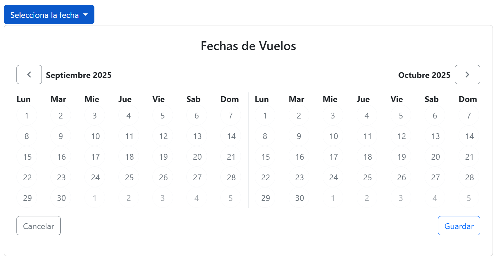
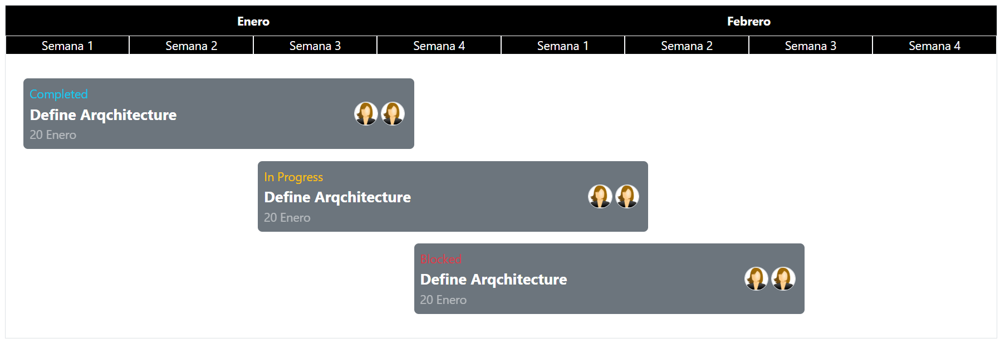
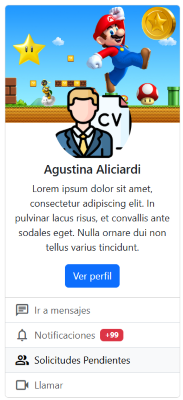
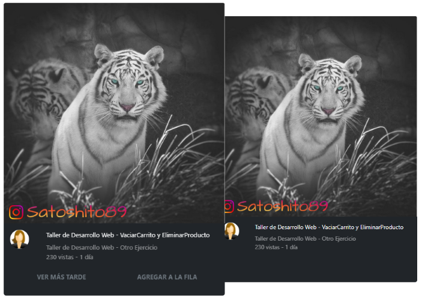

# Pre Procesadores CSS
Created by <i class="fab fa-telegram"></i>
[edme88]("https://t.me/edme88")

---
<!-- .slide: style="font-size: 0.60em" -->
<style>
.grid-container2 {
    display: grid;
    grid-template-columns: auto auto;
    font-size: 0.8em;
    text-align: left !important;
}

.grid-item {
    border: 3px solid rgba(121, 177, 217, 0.8);
    padding: 20px;
    text-align: left !important;
}
</style>
## Temario
<div class="grid-container2">
<div class="grid-item">

- Framework en CSS
- Ventajas y Desventajas
- Bootstrap
- Ejercicios Bootstrap
- TailwindCSS

</div>
<div class="grid-item">

- Preprocesadores CSS
- Ventajas y Desventajas
- Ejercicios SASS

</div>
</div>

---

### Frameworks CSS

Los frameworks CSS proporcionan un conjunto de estilos, componentes y utilidades predefinidas que permiten crear interfaces modernas de manera rápida y consistente. 

- Bootstrap
- TailwindCSS

Con ellos, los desarrolladores pueden enfocarse más en la funcionalidad y menos en la escritura repetitiva de estilos desde cero.

---

### Ventajas y desventajas de los frameworks CSS
<!-- .slide: style="font-size: 0.80em" -->
Ventajas:
- Aceleran el desarrollo inicial.
- Aseguran consistencia visual.
- Ofrecen componentes listos para usar.
- Amplia comunidad y documentación.

Desventajas:
- Código extra (estilos que no siempre se usan → CSS bloat).
- Sitios que lucen demasiado similares si no se personalizan.
- Curva de aprendizaje (en especial en Tailwind).

---

### [Bootstrap](https://getbootstrap.com/)
Es uno de los frameworks más utilizados, ofrece un sistema de rejilla (grid system), componentes listos para usar (botones, formularios, menús) y utilidades que facilitan el diseño responsivo.

---

### Ejercicio: Instagram
Empleando Ejercicios-CSS el template ej_instagram, el contenido debe visualizarse:
- Se deben mostrar 3 columnas las imagenes si la pantalla es mediana
- Se debe mostrar 1 columna si la pantalla es pequeña
- Las imagenes deben ocupar el 100% de su columna

---

### Ejercicio: Componente para selección de vuelos
<!--Ejercicio tomado de https://www.youtube.com/watch?v=7sDWDVODy8c-->
Elaborar el siguiente componente para la selección de vuelos empleando clases de bootstrap.



----

### Ejercicio: Componente para selección de vuelos
<iframe width="560" height="315" src="https://www.youtube.com/embed/YeWg5_vBBRE?si=jKvzmVu1LjmvMx-D" title="YouTube video player" frameborder="0" allow="accelerometer; autoplay; clipboard-write; encrypted-media; gyroscope; picture-in-picture; web-share" referrerpolicy="strict-origin-when-cross-origin" allowfullscreen></iframe>

----

### Ejercicio: Componente para selección de vuelos
<iframe width="560" height="315" src="https://www.youtube.com/embed/gLcHn837_S4?si=1RGjAdgEIk9-BreZ" title="YouTube video player" frameborder="0" allow="accelerometer; autoplay; clipboard-write; encrypted-media; gyroscope; picture-in-picture; web-share" referrerpolicy="strict-origin-when-cross-origin" allowfullscreen></iframe>

----

### Ejercicio: Componente para selección de vuelos
<!-- .slide: style="font-size: 0.70em" -->
#### Componentes (Dropdowns y Botones)
- **dropdown:** Contenedor que define un menú desplegable.
- **dropdown-toggle:** Estilo y comportamiento para el botón que abre/cierra el dropdown.
- **dropdown-menu:** Contenedor del menú que se despliega.
- **btn:** Clase base para botones.
- **btn-primary:** Variante de botón con color primario.
- **btn-outline-secondary:** Botón con borde y texto “secondary” (fondo transparente).
- **btn-outline-light:** Botón contorneado en tono “light”.
- **btn-outline-primary:** Botón contorneado en tono “primary”.

#### Atributos Bootstrap
- **data-bs-toggle="dropdown"** habilita el comportamiento del menú;
- **data-bs-auto-close="outside"** evita que se cierre al hacer clic dentro del menú.

----

### Ejercicio: Componente para selección de vuelos
<!-- .slide: style="font-size: 0.70em" -->
#### Grid / Layout
- **row:** Fila del sistema de grilla.
- **col:** Columna flexible (toma el ancho disponible equitativamente).
- **border-end:** Borde en el lado “end” (derecho en LTR) del elemento, útil para separar columnas.

#### Utilidades de espaciado y alineación
- **p-4:** Padding en todos los lados (4).
- **py-3:** Padding vertical (y) tamaño 3.
- **gap-2:** Espacio entre ítems en contenedores flex/grid (gap = 2).
- **d-flex:** Convierte el elemento en contenedor flex.
- **justify-content-end:** Alinea contenido al final del eje principal (derecha por defecto).
- **justify-content-between:** Distribuye los elementos con espacio entre ellos.
- **align-items-center:** Centra verticalmente (eje cruzado) los ítems en un contenedor flex.

----

### Ejercicio: Componente para selección de vuelos
<!-- .slide: style="font-size: 0.80em" -->
#### Tipografía / color / forma
- **fw-bold:** Texto en negrita.
- **text-center:** Texto centrado.
- **text-secondary:** Color de texto con el color “secondary” del tema.
- **rounded-circle:** Bordes completamente redondeados (círculo), típico para botones/avatares.

### Ejercicio: Clases propias
- **calendar-container:** Clase propia (la usás en tu CSS para ancho/alto de botones).
- **calendar-grid:** Clase propia.
- **material-symbols-outlined:** Propia de Google Fonts/Material Symbols.

---

### Ejercicio: Timeline
<!--Ejercicio tomado de https://www.youtube.com/watch?v=7sDWDVODy8c-->
Elaborar el siguiente timeline (similar a Jira) empleando clases de bootstrap.



----

### Ejercicio: Timeline

<iframe width="560" height="315" src="https://www.youtube.com/embed/7G3kyOIOxGg?si=2ulSrJemV5bRfluO" title="YouTube video player" frameborder="0" allow="accelerometer; autoplay; clipboard-write; encrypted-media; gyroscope; picture-in-picture; web-share" referrerpolicy="strict-origin-when-cross-origin" allowfullscreen></iframe>

----

### Ejercicio: Timeline
<!-- .slide: style="font-size: 0.80em" -->
#### Disposición (Grid / Layout)
- **container:** contenedor centrado con anchos máximos responsivos; crea el “lienzo” del timeline.
- **row:** fila del sistema de grilla. Agrupa columnas y gestiona gutters.
- **col / col-X (1-12):** columnas con fracciones fijas.

#### Espaciado y tamaño
- **mt-X:** margen superior grande al bloque principal.
- **p-X py-X:** padding general y vertical para airear los bloques.

#### Tipografía
- **fw-bold:** negrita.
- **fs-X:** tamaños de fuente semánticos.
- **text-center:** centra texto.
- **opacity-X:** baja opacidad del texto.

----

### Ejercicio: Timeline
<!-- .slide: style="font-size: 0.70em" -->
####  Colores / fondos / estados
- **bg-black + text-white:** cabecera con alto contraste.
- **bg-secondary + text-white:** “tarjetas” de ítems de timeline.
- **text-info, text-warning, text-danger:** estado visual para textos.

#### Bordes y formas
- **border:** borde por defecto).
- **border-light:** borde claro.
- **rounded-X:** radios suaves.
- **rounded-circle:** hace los avatares circulares.

#### Flexbox y alineación
- **d-flex:** activa flexbox.
- **align-items-center:** centra verticalmente elementos dentro del contenedor flex.
- **gap-X:** separación uniforme entre elementos.

---

### Ejercicio: Componente Perfil
<!--Ejercicio tomado de https://www.youtube.com/watch?v=7sDWDVODy8c-->
Elaborar el siguiente Perfil (tipo linkedin) empleando clases de bootstrap.



---

### Ejercicio: Youtube
<!--Ejercicio tomado de https://www.youtube.com/watch?v=7sDWDVODy8c-->
Elaborar la siguiente pantalla similar a youtube empleando clases de bootstrap.



---

### [TailwindCSS](https://tailwindcss.com/)
Está basado en clases utilitarias, permite aplicar estilos directamente en el HTML de forma modular y altamente personalizable, lo que fomenta un flujo de trabajo ágil y flexible.

---

## Preprocesadores CSS

El CSS juega un papel central para definir la presentación y la experiencia visual de una página.

A medida que los proyectos se vuelven más complejos, mantener y escalar el código CSS puede resultar difícil. 

Para afrontar este desafío surgieron herramientas que **optimizan** y **aceleran** el trabajo con estilos, entre ellas los frameworks CSS y los preprocesadores CSS.
---

### Ventajas y desventajas de los preprocesadores
<!-- .slide: style="font-size: 0.80em" -->
Ventajas:
- CSS más organizado y mantenible.
- Reutilización de estilos (mixins, funciones).
- Permite trabajar con variables antes de que fueran estándar en CSS.

Desventajas:
- Necesitan un paso de compilación (no se interpretan directo en el navegador).
- Agregan complejidad al flujo de trabajo.
- Algunas funciones ya fueron incorporadas en CSS moderno (ej. variables nativas --var).

---

### Preprocesadores CSS

<!-- .slide: style="font-size: 0.80em" -->
Los preprocesadores CSS como [SASS](https://sass-lang.com/) y [LESS](https://lesscss.org/) extienden las capacidades nativas de CSS, añadiendo características propias de lenguajes de programación, tales como:
- Variables para colores, fuentes o medidas.
- Anidamiento de reglas para mejorar la legibilidad.
- Mixins y funciones para reutilizar bloques de estilo.
- Herencia y modularización que permiten mantener el código más limpio y organizado.

Estos archivos se escriben en sintaxis SASS o LESS y luego se compilan a CSS estándar para ser interpretados por los navegadores.

---

## ¿Qué es Sass?

Sass (**Syntactically Awesome Stylesheets**) es un **preprocesador CSS** que extiende el lenguaje con:
- Variables
- Anidación
- Mixins y funciones
- Módulos reutilizables (`@use` / `@forward`)

Al final, **Sass se compila en CSS estándar** que entiende cualquier navegador.

---

### Variables

Permiten **almacenar valores** (colores, tamaños, tipografías) para reutilizarlos.

```scss
$color-principal: #3498db;
$padding-base: 16px;

body {
  background: $color-principal;
  padding: $padding-base;
}
```

---

### Mixins

Un mixin agrupa reglas CSS reutilizables.

Se pueden parametrizar para mayor flexibilidad.

```scss
@mixin boton($color, $radius: 4px) {
  background: $color;
  border-radius: $radius;
  padding: 8px 12px;
  color: white;
}
```

---

### Include

Para usar un mixin, se lo invoca con @include.
```scss
.btn-primario {
  @include boton(#3498db, 8px);
}

.btn-secundario {
  @include boton(#2ecc71);
}
```

Evita duplicar código y mejora la mantenibilidad.

---

### Módulos con @use

Sass recomienda organizar el código en módulos.

@use importa un archivo Sass y le asigna un namespace.

```scss
// _variables.scss
$color-fondo: #f4f4f4;

// estilos.scss
@use 'variables';

body {
  background: variables.$color-fondo;
}
```

@use reemplaza a @import (deprecado) y evita conflictos de nombres.

---

### Uso del símbolo &
El símbolo **&** se usa para hacer referencia al selector padre dentro de una regla anidada. Esto es útil cuando quieres aplicar estilos específicos a elementos que son descendientes directos del selector padre.

```scss
.button {
  background-color: blue;
  &:hover {
    background-color: red;
  }
}
```

---

### Listas en Sass
Las listas en Sass son una secuencia ordenada de valores, como números, colores o cadenas de texto. Los valores se pueden separar por comas o no. El uso de comillas para los valores es solo necesario cuando se usan caracteres especiales.

```scss
$colores: red, green, blue, yellow; // Valores separados con comas
$colores: red green blue yellow; // Valores separados sin comas
$colores: 'red' 'green' 'blue' 'yellow'; // Valores con comillas
```

Puedes acceder a los elementos individuales de una lista utilizando índices, comenzando desde 1.
```scss
$primer-color: nth($colores, 1); // red
$segundo-color: nth($colores, 2); // green
```

<!--https://www.eniun.com/tutorial-sass/-->

---

### Ejercicio
1. Instala [NodeJs](https://nodejs.org/en) o asegurate de tenerlo instalado `node --version` y `npm --version`
2. Instala sass `npm install -g sass` y verifica `sass --version`
3. Crea un archivo **styles.scss**
4. Ejecuta **sass --watch styles.scss styles.css** en la consola del proyecto

---
## ¿Dudas, Preguntas, Comentarios?

