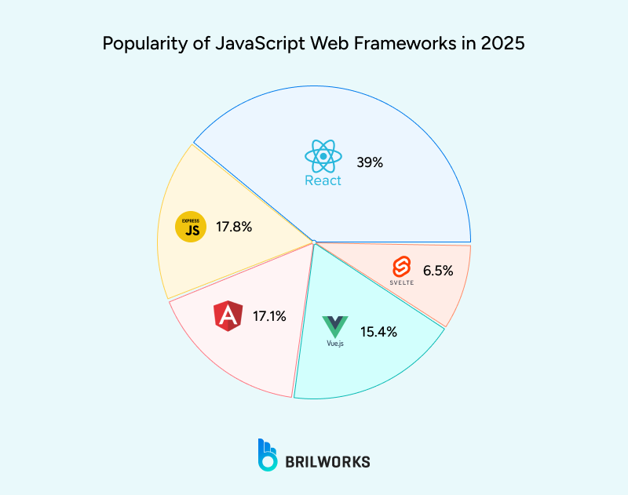
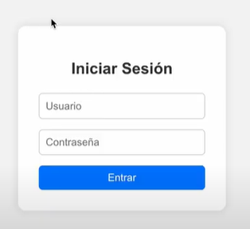
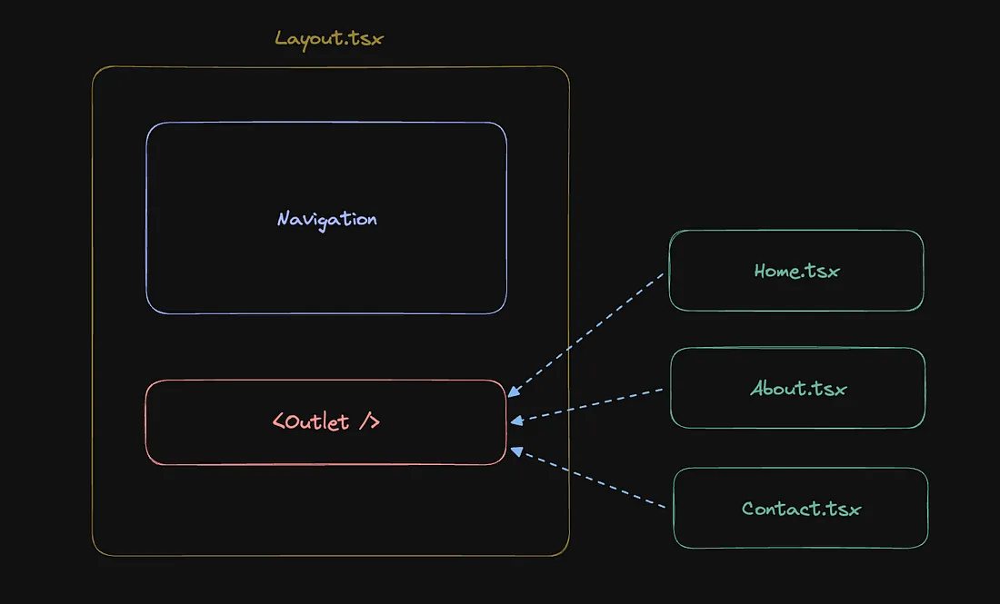

# Frameworks de JavaScript
Created by <i class="fab fa-telegram"></i> 
[edme88]("https://t.me/edme88")

---
<style>
.grid-container2 {
    display: grid;
    grid-template-columns: auto auto;
    font-size: 0.8em;
    text-align: left !important;
}

.grid-item {
    border: 3px solid rgba(121, 177, 217, 0.8);
    padding: 20px;
    text-align: left !important;
}
</style>
<!-- .slide: style="font-size: 0.80em" -->
## Temario
<div class="grid-container2">
<div class="grid-item">

### Frameworks
* Definición
* Funcionalidad
* Ejemplos de Frameworks

</div>
<div class="grid-item">

* Angular
  * Características
  * Ventajas
  * Desventajas
* React
  * Ventajas
  * Desventajas
* VueJs
  * Ventajas
  * Desventajas

</div>
</div>

---

<!--Agregar SPA-->
### Framework: Definición
Es un entorno de trabajo que posee ciertas herramientas y características útiles que agilizan el 
desarrollo de un proyecto de programación.

---
### Frameworks
Entre los frameworks más usados para desarrollo web encontramos:
* Angular
* VueJs
* React

<small><strong>React</strong> es una librería, pero suele considerarse un framework por su ecosistema y modo de uso.</small>

<small>Nota: Los frameworks establecen una estructura general del proyecto, mientras que las librerías se usan para resolver tareas específicas dentro de esa estructura.</small>

---



---
### [Angular](https://docs.angular.lat/)
Fue desarrollado por Google, y presentado en el 2010.
Angular se emplea para crear aplicaciones de una sola página y aplicaciones web progresivas, 
así como para el desarrollo multiplataforma. 

Su objetivo es simplificar tanto el desarrollo como la prueba de dichas aplicaciones al 
proporcionar un marco para las arquitecturas del lado del cliente, 
modelo-vista-controlador (MVC) y modelo-vista-modelo de vista (MVVM).

---
### Angular: Características
* Está respaldado y desarrollado por Google.
* Utiliza un DOM (Document Object Model) para representar el proyecto desde nodos.
* Es multi-plataforma para desarrollo de aplicaciones web, móviles o de escritorio.
* Tiene excelente experiencia de desarrollo gracias a TypeScript y a herramientas de detección de errores y autocompletado de código propias de Angular.
* Posee una gran comunidad

---
### Angular: Ventajas
* **Fácil de usar:** Es fácil de usar y comprender. Tiene una sintaxis simple y es fácil de aprender.
* **Modular:** Permite dividir en componentes más pequeños que se pueden reutilizar y combinar para crear aplicaciones más grandes.
* Cuenta con una estructura y control de los proyectos
* Posee una gran comunidad 
* Arquitectura MVC: que facilita el desarrollo y mantenimiento de aplicaciones grandes.

---
### Angular: Desventajas
* **Complejidad:** Puede ser difícil de aprender para los desarrolladores que son nuevos en los marcos de JavaScript.
* **Rendimiento:**  las aplicaciones pueden ser lentas en comparación con otros marcos como React o Vue.
* **Documentación deficiente**
* **Curva de aprendizaje pronunciada:** Requiere que los desarrolladores tengan una buena comprensión de TypeScript, HTML y CSS.

---
### [React](https://es.reactjs.org/)
Es una librería de Js desarrollada por **Facebook** en el 2013 para construir interfaces de usuario.

Su principal característica es el uso de un DOM virtual donde se realizan todos los cambios de la interfaz de usuario, 
que luego se aplican al verdadero DOM, acelerando la ejecución de aplicaciones.
Se puede utilizar tanto para crear sitios de web dinámicos de una sola página, 
como para paneles de control o grandes plataformas web.

---
### React: Ventajas
<!-- .slide: style="font-size: 0.90em" -->
* **DOM virtual:** Genera el DOM de forma dinámica, primero aplica los cambios en un DOM Virtual y luego al DOM real.
* **Isomorfismo:** El código se ejecuta en servidor y cliente, reduciendo así la carga de trabajo.
* **Componentes:** Permitirá ahorrar en tiempo de desarrollo, crear aplicaciones más escalables y fáciles de mantener.
* **Flujo de datos unidireccional:** La información se propaga desde los componentes superiores a los inferiores.
* **Amplia comunidad**
* **Multiplataforma:** Llevar la aplicación a **React Native** es sencillo.
* **Aprendizaje:** Curva de aprendizaje reducida.

---
### React: Desventajas
* **Documentación deficiente**
* No hay un patrón de desarrollo

---
### [VueJS](https://vuejs.org/)
Es es un framework Js para desarrollo frontend lanzado en 2014 por Evan You.

Su objetivo es facilitar la creación de interfaces de usuario interactivas y aplicaciones web de una sola página (SPA) de manera simple y flexible.

Vue combina ideas de React (componentes, virtual DOM) y Angular (enlace de datos bidireccional y directivas), ofreciendo un equilibrio entre potencia y facilidad de uso.

---
### Vue: Ventajas
* Fácil de aprender y utilizar.
* Liviano y flexible
* Sigue los estándares de HTML+CSS+Js
* Es un framework progresivo que permite migrar fácilmente proyectose existentes

---
### Vue: Desventajas
* Mucha documentación útil esta en chino (por ser ampliamente usado por Alibaba y Xiaomi).
* Complejidad de la reactividad
* Exceso de flexibilidad

---

### SPA

Son las siglas de **Single Page Application** o Aplicación de una sola página.

Es una aplicación web que carga una única página HTML y luego actualiza su contenido dinámicamente usando JavaScript (por ejemplo, con React, Vue o Angular).

----

### SPA: Características

- Carga una sola vez los archivos principales (HTML, JS, CSS).
- Actualiza el contenido sin recargar toda la página.
- Usa un enrutador del lado del cliente (react-router-dom).

----

### SPA: Ventajas y Desventajas

**Ventajas**
- Navegación rápida y fluida.
- Excelente experiencia de usuario.
- Reutilización de componentes.

**Desventajas**
- Peor SEO si no se usa prerendering o SSR (Server-Side Rendering).
- Mayor tiempo de carga inicial.

---

### PWA

Son las siglas de **Progressive Web App** o "Aplicación Web Progresiva".

Es una aplicación web que se comporta como una app móvil o de escritorio.
Puede instalarse, funcionar sin conexión (offline) y enviar notificaciones.

----

### PWA: Características

- Funciona offline mediante Service Workers.
- Incluye un archivo **manifest.json** con ícono y configuración de instalación.
- Debe servirse por HTTPS.

----

### PWA: Ventajas y Desventajas

**Ventajas**
- Funciona sin conexión (modo offline).
- Se puede instalar en el dispositivo.
- Rápida y optimizada para móviles.

**Desventajas**
- Configuración más compleja (service worker + manifest).
- Acceso limitado a algunas APIs del sistema.

---

# REACT

<section data-background-image="images/react/background.png">

---

### ¿Cómo crear una app de react?

Durante años se empleo: 
```bash
create-react-app
```

Fue la forma oficial y más fácil de crear proyectos React sin tener que configurar manualmente herramientas como **Webpack**, **Babel** o **ESLint**.

Genera toda la estructura básica (archivos, carpetas, configuraciones, scripts, etc.).

----

### ¿Por que ya no se usa CRA?
<!-- .slide: style="font-size: 0.70em" -->
<table>
  <thead>
    <tr>
      <th>Limitación de CRA</th>
      <th>Explicación</th>
    </tr>
  </thead>
  <tbody>
    <tr>
      <td>🚀 Lento en desarrollo</td>
      <td>Usa Webpack, que recompila todo el proyecto cada vez.</td>
    </tr>
    <tr>
      <td>⏱️ Arranque más lento</td>
      <td>Tarda varios segundos en iniciar el servidor.</td>
    </tr>
    <tr>
      <td>🔁 Recarga menos eficiente</td>
      <td>Hot reload más lento comparado con Vite.</td>
    </tr>
    <tr>
      <td>⚙️ Difícil de personalizar</td>
      <td>Para cambiar configuraciones de Webpack o Babel hay que "ejectar" (npm run eject) y ensucia el proyecto.</td>
    </tr>
    <tr>
      <td>📦 Ya no se mantiene activamente</td>
      <td>Meta (Facebook) dejó de actualizarlo con la misma frecuencia.</td>
    </tr>
    <tr>
      <td>🧱 No soporta las nuevas features de React tan rápido</td>
      <td>Vite y Next se adaptan más rápido a los nuevos features (como React 19).</td>
    </tr>
  </tbody>
</table>

---

### [Vite](https://es.vite.dev/guide/)

Es una herramienta de desarrollo de Frontend que busca proporcionar una experiencia de desarrollo más rápida y eficiente para proyectos web modernos. 

Su objetivo principal es acelerar el proceso de construcción y compilación de aplicaciones web, ofreciendo tiempos de arranque, compilación y recarga muy breves.

----

<!-- .slide: style="font-size: 0.90em" -->

<table>
  <thead>
    <tr>
      <th>Ventaja de Vite</th>
      <th>Descripción</th>
    </tr>
  </thead>
  <tbody>
    <tr>
      <td>⚡ Arranca en milisegundos</td>
      <td>No recompila todo, solo el módulo que cambió.</td>
    </tr>
    <tr>
      <td>🔥 Hot Module Replacement (HMR) instantáneo</td>
      <td>Cambios visibles casi al instante.</td>
    </tr>
    <tr>
      <td>🧩 Plantillas integradas</td>
      <td>Soporta React, Vue, Svelte, Vanilla, etc.</td>
    </tr>
    <tr>
      <td>📁 Configuración clara y mínima</td>
      <td>Todo en vite.config.js.</td>
    </tr>
    <tr>
      <td>🌍 Optimizado para ES Modules</td>
      <td>Más moderno y ligero.</td>
    </tr>
  </tbody>
</table>


---

### Vite

1. Ejecutar el siguiente comando para inicializar el proyecto:
```
npm create vite@latest
```
2. Colocar un nombre al proyecto
3. Seleccionar el framework: React
4. Seleccionar el lenguaje: JavaScript
5. Ingresar a la carpeta creada `cd nombre-proyecto`
6. Ejecutar `npm install`
7. Ejecutar `npm run dev`
8. Ingresar a localhost:5173

---

### Estructura de carpetas
<!-- .slide: style="font-size: 0.90em" -->
- **node_modules:** Contiene todas las dependencias que instala npm (React, Vite, ESLint, etc).
- **public:** Archivos estáticos que no pasan por el bundler de Vite. (imágenes globales, favicon, logo)
- **src:** Código fuente de React.
  - **assets:** Carpeta para imágenes, íconos o archivos CSS adicionales que sí pasan por el empaquetador.
  - **App.jsx:** Componente principal de React donde se agregan elementos y lógica.
  - **main.jsx:** Crea el root de React y monta App dentro del index.html.
- **.gitignore:** Indica qué carpetas o archivos no deben subirse al repositorio, como node_modules o .env

----

### Estructura de carpetas
<!-- .slide: style="font-size: 0.90em" -->
- **eslint.config.js:** Configuración de herramienta que analiza el código para detectar errores o malas prácticas.
- **index.html:** HTML base del proyecto. Se usa como plantilla para inyectar los bundles de JS y CSS.
- **package.json:** Archivo donde se define nombre del proyecto, dependencias y scripts que se pueden ejecutar.
- **package-lock.json:** Registra las versiones exactas de cada dependencia instalada.
- **README.md:** Archivo de documentación inicial.
- **vite.config.js:** Configuración del bundler Vite (alias, puertos, plugins).

---

### Instalación de React Usando Vite

<iframe width="560" height="315" src="https://www.youtube.com/embed/7SjTALRxnjA?si=LnK2mq4n9fEUPqFa" title="YouTube video player" frameborder="0" allow="accelerometer; autoplay; clipboard-write; encrypted-media; gyroscope; picture-in-picture; web-share" referrerpolicy="strict-origin-when-cross-origin" allowfullscreen></iframe>

---

### JSX

JSX es una sintaxis que permite escribir código similar a HTML dentro de JavaScript, usada en React para definir interfaces de usuario.

Durante la compilación, se transforma en código JavaScript que crea los elementos de la interfaz.

Sirve para:
- Describir la UI como función del estado.
- Crear componentes de forma legible y modular.
- Insertar expresiones de JavaScript dentro del marcado usando {}.

---

### Atributos que cambian de nombre

<table border="1" cellpadding="4" cellspacing="0">
  <thead>
    <tr>
      <th>En HTML</th>
      <th>En JSX</th>
      <th>Por qué</th>
    </tr>
  </thead>
  <tbody>
    <tr>
      <td>class</td>
      <td>className</td>
      <td><code>class</code> es una palabra reservada en JS (define clases).</td>
    </tr>
    <tr>
      <td>for</td>
      <td>htmlFor</td>
      <td><code>for</code> también es palabra reservada; React usa camelCase.</td>
    </tr>
    <tr>
      <td>tabindex</td>
      <td>tabIndex</td>
      <td>JSX usa camelCase para todos los atributos.</td>
    </tr>
    <tr>
      <td>onclick</td>
      <td>onClick</td>
      <td>Los eventos se escriben en camelCase y reciben funciones, no strings.</td>
    </tr>
    <tr>
      <td>onchange</td>
      <td>onChange</td>
      <td>Lo mismo, siempre en camelCase.</td>
    </tr>
    <tr>
      <td>maxlength</td>
      <td>maxLength</td>
      <td>JSX convierte todo a camelCase.</td>
    </tr>
    <tr>
      <td>readonly</td>
      <td>readOnly</td>
      <td>Igual que arriba.</td>
    </tr>
  </tbody>
</table>


---

### [Hooks](https://es.react.dev/reference/react/hooks)

Son funciones especiales que te permiten usar características de React (como estado, ciclo de vida, contexto, etc.) en componentes funcionales, sin necesidad de usar clases.

Los más comunes son:
* useState
* useEffect
* useContext
* useNavigate

---

### Hooks: useState
Permite guardar y actualizar estado local en un componente.

```react
import { useState } from 'react';

function Counter() {
  const [count, setCount] = useState(0); // estado inicial = 0

  return (
    <button onClick={() => setCount(count + 1)}>
      Clicks: {count}
    </button>
  );
}
```

---

### React 1: Crear un Login Básico

1. Crear un archivo **Login.jsx** similar al siguiente:



2. Al presionar **Ingresar**, si el usuario y password es 'admin', mostrar por consola "Login OK", sino "Login Incorrecto".

----

### React 1: Crear un Login Básico

3. Hacer una versión básica con **css** tradicional
4. A la altura del package ejecutar `npm install sass --save-dev`
5. Crear una carpeta de **styles** dentro de **src**
6. Adaptar el estilo al uso de **SASS**

----

### React 1: Crear un Login Básico

<iframe width="560" height="315" src="https://www.youtube.com/embed/CgZpHKvEaGg?si=0XKvTBIcz3UPBAxc" title="YouTube video player" frameborder="0" allow="accelerometer; autoplay; clipboard-write; encrypted-media; gyroscope; picture-in-picture; web-share" referrerpolicy="strict-origin-when-cross-origin" allowfullscreen></iframe>

---

### Enrutamiento o Routing

Es el proceso de definir cómo una aplicación web maneja diferentes URL o rutas que el usuario puede visitar

Cuando el usuario hace clic en un enlace o escribe directamente la URL en la barra de direcciones, React Router actualiza la interfaz sin recargar toda la página, esto se logra manipulando el historial del navegador y utilizando componentes de React para cambiar el contenido dinámicamente, todo del lado del cliente.

---

### Enrutamiento o Routing

Para poder utilizar el enrutamiento es necesario instalar la dependencia:

```
npm install react-router-dom
```

Te recomendamos leer la documentación [routing](https://reactrouter.com/start/declarative/routing)

---

### Ventajas de usar React Router

<!-- .slide: style="font-size: 0.70em" -->

- La navegación se vuelve fluida y sin interrupciones, y se maneja del lado del cliente.
- Permite navegar sin recargar toda la página, actualizando solo la parte necesaria del contenido, haciendo la navegación más rápida.
- Permite definir rutas específicas dentro de la aplicación como /home, /about , etc. También define rutas dinámicas que pueden contener parámetros variables como /products/:id donde el id es un identificador.
- Accede a los parámetros de ruta, lo cual es útil al momento de tener filtros, búsquedas o detalles de productos.
- Protege ciertas rutas con la finalidad de que solo los usuarios autenticados puedan acceder a ellas, permitiendo un mayor control sobre qué se muestra en cada ruta.
- Se puede crear rutas anidadas o subrutas, permitiendo una estructura más compleja y jerárquica.
- Soporta redirecciones automáticas y las rutas no encontradas (404).
- Es compatible con SEO (motores de búsqueda).

---

### React 2: Redirección de Rutas

1. Ejecutar `npm install react-router-dom`
2. Si el login es exitoso redireccionar a "/actividades"
3. Use la siguiente información para crear una pantalla donde se pueda mostrar adecuadamente

```javaScript
const activities = [
  {
    nombre: "taekwondo",
    descripcion: "Arte marcial coreana",
    horarios: [
      { dia: 2, "hora-inicio": "18:30", "hora-fin": "20:00" },
      { dia: 4, "hora-inicio": "18:30", "hora-fin": "20:00" }
    ]
  },
  {
    nombre: "zumba",
    descripcion: "ritmos latinos",
    horarios: [
      { dia: 1, "hora-inicio": "19:30", "hora-fin": "20:30" },
      { dia: 3, "hora-inicio": "19:30", "hora-fin": "20:30" }
    ]
  }
];

const diasSemana = ["Domingo", "Lunes", "Martes", "Miércoles", "Jueves", "Viernes", "Sábado"];


```

----

### React 2: Redirección de Rutas (parte 1)

<iframe width="560" height="315" src="https://www.youtube.com/embed/j46p0NoWjZY?si=jpK0yCt8NHRbmC0o" title="YouTube video player" frameborder="0" allow="accelerometer; autoplay; clipboard-write; encrypted-media; gyroscope; picture-in-picture; web-share" referrerpolicy="strict-origin-when-cross-origin" allowfullscreen></iframe>

----

### React 2: Redirección de Rutas (parte 2)

<iframe width="560" height="315" src="https://www.youtube.com/embed/TE-QTgIujU4?si=-uZlDTV6VjjIuU2Y" title="YouTube video player" frameborder="0" allow="accelerometer; autoplay; clipboard-write; encrypted-media; gyroscope; picture-in-picture; web-share" referrerpolicy="strict-origin-when-cross-origin" allowfullscreen></iframe>

---

### Outlet

Permite que los componentes de una ruta principal rendericen los componentes de sus rutas hijas. 
Esto facilita la creación de estructuras de navegación complejas en aplicaciones React, donde una ruta principal puede compartir un diseño común y luego renderizar contenido diferente según la ruta secundaria activa. 

---

### Outlet




---

### Outlet: Ejemplo

Este componente es una plantilla común para varias páginas. Contiene partes que son compartidas, como el header, el nav y el footer.

```jsx
// Layout.js
import { Outlet } from 'react-router-dom';

const Layout = () => {
  return (
    <div>
      <header>My App Header</header>
      <nav>Navigation Bar</nav>
      <main>
        <Outlet /> {/* Content specific to the route will be rendered here */}
      </main>
      <footer>My App Footer</footer>
    </div>
  );
};

export default Layout;

```

---

### Outlet: Enrutamiento Ejemplo

- path='/' → usa el componente Layout como base.
- `<Outlet />` en Layout decidirá qué mostrar según la ruta hija.
- index → muestra Home en la raíz (/).
- path='about' → muestra About en /about.
- path='contact' → muestra Contact en /contact.

```jsx
// App.js
<Routes>
  <Route path="/" element={<Layout />}>
    <Route index element={<Home />} />
    <Route path="about" element={<About />} />
    <Route path="contact" element={<Contact />} />
  </Route>
</Routes>
```

---

### React 3: Outlet

1. Crear un componente de **Header**, donde haya un menú de navegación con: Home, Login, Actividades
2. Crear un componente de **Footer**
3. Crear un **layout** que renderice Header, Main, Footer. El contenido de main puede variar acorde se selecicone /login o /actividades o /Home.
4. En la página de actividades, mostrar el botón de inscripción solo si el usuario está logueado.
5. Si el usuario está logueado, mostrar en **Header** el botón de **Logout**.

---

### React 3: Outlet

<iframe width="560" height="315" src="https://www.youtube.com/embed/YvN3uB1zR7g?si=IUkh6BYRZx-ulCML" title="YouTube video player" frameborder="0" allow="accelerometer; autoplay; clipboard-write; encrypted-media; gyroscope; picture-in-picture; web-share" referrerpolicy="strict-origin-when-cross-origin" allowfullscreen></iframe>

---

### Estructura del Proyecto

En los proyectos de react se recomienda emplear la siguiente estructura:
- **components:** Componentes reutilizables, como el Header, Footer o el Layout.
- **pages:** Vistas o páginas principales.
- **styles:** Archivos css.

---

### Ejercicio Estructura del Proyecto

1. Dentro de la carpeta **src** cree 3 subcarpetas:
  - components
  - pages
  - styles
2. Re-organice los archivos en las carpetas correspondientes
3. Modifique los imports y verifique que la página funciona correctamente.
4. Modifique **vite.config.js** para mejorar los imports usando **alias**

----

### Ejercicio Estructura del Proyecto

<iframe width="560" height="315" src="https://www.youtube.com/embed/IzvzIbWZNhI?si=HJAcJ-ZelaypBEe5" title="YouTube video player" frameborder="0" allow="accelerometer; autoplay; clipboard-write; encrypted-media; gyroscope; picture-in-picture; web-share" referrerpolicy="strict-origin-when-cross-origin" allowfullscreen></iframe>

---

### React: Imágenes

<!-- .slide: style="font-size: 0.70em" -->
Las imágenes pueden colocarse en:
- **src/assets**
- **public**

<table border="1" cellpadding="8" cellspacing="0">
  <thead>
    <tr>
      <th>Opción</th>
      <th>Ventajas</th>
      <th>Desventajas</th>
    </tr>
  </thead>
  <tbody>
    <tr>
      <td><strong>src/assets (importando)</strong></td>
      <td>
        <ul>
          <li>Se procesan y optimizan en el build (mejor performance).</li>
          <li>Evita errores de rutas relativas.</li>
          <li>Permite lazy loading y dinámicas.</li>
          <li>Más modular: cada componente gestiona sus imágenes.</li>
        </ul>
      </td>
      <td>
        <ul>
          <li>Debes importar cada imagen manualmente.</li>
          <li>No se pueden acceder directamente por URL en HTML o redes sociales.</li>
        </ul>
      </td>
    </tr>
    <tr>
      <td><strong>public/ (ruta directa)</strong></td>
      <td>
        <ul>
          <li>Permite usar rutas absolutas (ej: <code>/images/foto.jpg</code>).</li>
          <li>Útil para HTML directo, metadatos (og:image), favicon, etc.</li>
          <li>No requiere importación en JSX.</li>
        </ul>
      </td>
      <td>
        <ul>
          <li>No se optimizan en el build.</li>
          <li>Puede causar errores de ruta si se renombra/mueve algo.</li>
          <li>No hay verificación estática en tiempo de compilación.</li>
        </ul>
      </td>
    </tr>
  </tbody>
</table>

---

### React: Imágenes

1. Dentro de **public** crea una carpeta de home y guarda 2 imágenes
2. Dentro de **assets** crea una carpeta de home y guarda 2 imágenes
3. En la **Home** reemplaza el texto por una estructura de 4 cards, cada una con una imágen y el título de la actividad.

----


----

### React: Imágenes

<iframe width="560" height="315" src="https://www.youtube.com/embed/_FJLuPxzPCA?si=swYehpLSH1LI6lla" title="YouTube video player" frameborder="0" allow="accelerometer; autoplay; clipboard-write; encrypted-media; gyroscope; picture-in-picture; web-share" referrerpolicy="strict-origin-when-cross-origin" allowfullscreen></iframe>

---

### Ejercicio: Children
1. Cree un componente **Card** que permita mostrar las actividades del gym El mismo debe recibir: título, subtítulo e información en un **children**.
2. Separe la "data" en un archivo separado para mantener el orden de los componentes.

---
## ¿Dudas, Preguntas, Comentarios?

