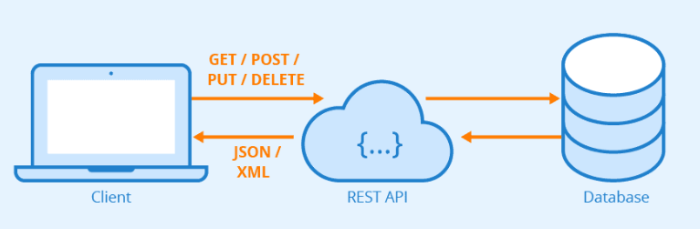
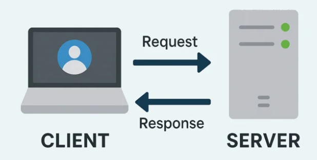
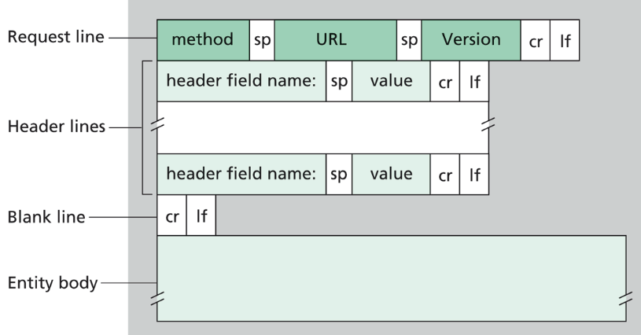
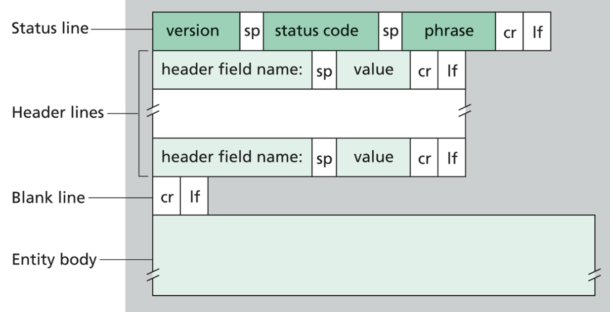
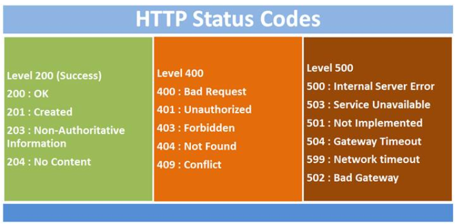
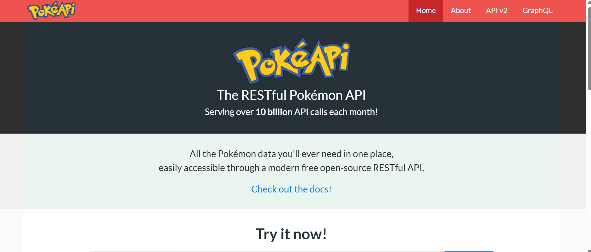

# Backend & APIs
Created by <i class="fab fa-telegram"></i>
[edme88]("https://t.me/edme88")

---
<!-- .slide: style="font-size: 0.60em" -->
<style>
.grid-container2 {
    display: grid;
    grid-template-columns: auto auto;
    font-size: 0.8em;
    text-align: left !important;
}

.grid-item {
    border: 3px solid rgba(121, 177, 217, 0.8);
    padding: 20px;
    text-align: left !important;
}
</style>
## Temario
<div class="grid-container2">
<div class="grid-item">

- API
- API REST
- HTTP
  - Solicitud o Request
  - Response
  - Métodos
  - Status Code
</div>
<div class="grid-item">

- fetch
- hooks: useEffect
- mock backend
- Ejercicio: Mock del Backend
- OpenApi (Swagger)
- PokeAPI
- Postman
</div>
</div>

---

### ¿Qué es una API?

<!--https://www.youtube.com/watch?v=IwnIxk8DdHs-->
- Son las siglas de **Application Programming Interface**.
- Es un conjunto de funciones y procedimientos (métodos) que se usan para diseñar e integrar el software de diferentes aplicaciones.
- Permite que varias aplicacines se puedan comunicar entre sí, por más que estén desarrolladas en lenguajes de programación completamente distintos.

---

### API REST
- La forma más común de implementación de una API es mediante **REST** (Representational State Transfer)
- **REST** es un tipo de servicio que se caracteriza por no tener estado alguno y por lograr interconexiones mediante el protocolo HTTP con mensajes de tipo *XML o JSON*.



---

### ¿Qué es el protocolo HTTP?

<!--https://www.youtube.com/watch?v=l2MihYAj0Iw-->

Un protocolo es un conjunto de reglas que se deben seguir para poder obtener o lograr un determinado resultado o acceder a un determinado recurso o servicio.

**HTTP** significa "Hypertext Transfer Protocol", es decir, protocolo de transferencia de hipertexto.

----

### ¿Qué es el protocolo HTTP?
HTTP permite que las solicitudes (Requests) y respuestas (Responses) entre clientes y servidores tengan un deterinado formato a seguir y respetar para que puedan comunicarse sin inconvenientes.



---

### Solicitud o Request
<!-- .slide: style="font-size: 0.90em" -->
Una solicitud o request que se realiza en una comunicación que utiliza el **protocolo HTTP** tiene una serie de partes, donde cada una de ellas cumple con una funcionadad distitna respecto a la transmisión del mensaje que se desea dar a conocer desde el cliente hacia el servidor.

- **Método:** Establece un verbo o modo de comunicación en HTTP
- **URL:** Dirección con la que queremos comunicarnos
- **Header o cabecera:** Van especificaciones, mensajes que se quieren enviar: ej. nombre en formato json
- **Body o cuerpo:** Campo opcional, para solicitar más datos.

----

### Solicitud o Request

Formato del paquete de solicitud:



---

### Response

Las responses tienen un formato particular que les permiten transportar la información necesaria para atender a las solicitudes recibidas.

- **Status Code:** Códigos que permiten al cliente entender la respuesta obtenida.
- **Header o Cabecera:** Datos o Información que se van a devolver.
- **Body o Cuerpo:** Campo opcional, con información extra de ser necesario.

----

### Response

Formato del paquete de respuesta:




---
### Métodos HTTP (Verbos)

- **GET:** Permite obtener o recuperar datos. (read)
- **POST:** Permite enviar un recurso específico, causando un cambio en el estado. (create)
- **PUT:** Para reemplazar/modificar el recurso actual. (update)
- **DELETE:** Borra un resurso específico.
- **PATCH:** Permite aplicar modificaciones parciales a un recurso.

---
### [HTTP: Status Code](https://cheatography.com/kstep/cheat-sheets/http-status-codes/)
- **2xx** = Operaciones exitosas
- **4xx** = Errores del cliente
- **5xx** = Errores del servidor



---

### Fetch

fetch() es una función nativa de JavaScript que se usa para hacer peticiones HTTP (como GET, POST, etc.) a servidores o APIs. Es muy común usarlo para obtener datos desde un backend o un servicio web.

Por ejemplo:

```js
fetch('http://example.com/movies.json')
  .then(response => response.json())
  .then(data => console.log(data));
```

----

### Fetch
En caso de tener que enviar **headers** o información en un **body**:

```js
fetch('https://ejemplo.com/api/ruta', {
  method: 'POST', // Tipo de solicitud
  headers: {
    'Content-Type': 'application/json', // Tipo de contenido enviado
    'Authorization': 'Bearer TU_TOKEN_AQUI' // Si necesitas autenticación
  },
  body: JSON.stringify({
    clave1: 'valor1',
    clave2: 'valor2'
  }) // Convertimos el objeto JS a JSON
})
.then(response => {
  if (!response.ok) {
    throw new Error('Error en la solicitud');
  }
  return response.json(); // Parseamos la respuesta a JSON
})
.then(data => {
  console.log('Respuesta del servidor:', data);
})
.catch(error => {
  console.error('Error:', error);
});
```


---

### Hooks: useEffect
Se ejecuta una vez cuando la página se carga. Se emplea habitualmente con el **fetch** para obtener datos.

```react
import React, { useEffect, useState } from 'react';

const PostList = () => {
  const [posts, setPosts] = useState([]);

  useEffect(() => {
    fetch('https://jsonplaceholder.typicode.com/posts')
      .then(response => {
        if (!response.ok) throw new Error("Error al obtener los datos");
        return response.json();
      })
      .then(data => {
        setPosts(data);
      })
      .catch(error => {
        console.error("Hubo un error:", error);
      });
  }, []); // Los corchetes indican que solo se ejecuta al montar el componente

  return (
    <div>
      <h2>Lista de Posts</h2>
      <ul>
        {posts.slice(0, 10).map(post => (
          <li key={post.id}>
            <strong>{post.title}</strong>
            <p>{post.body}</p>
          </li>
        ))}
      </ul>
    </div>
  );
};

export default PostList;
```

---

### [Async y Await](https://lenguajejs.com/asincronia/async-await/que-es/)
<!-- .slide: style="font-size: 0.90em" -->
Cuando una tarea tarda un tiempo, JavaScript no se queda esperando.
Sigue ejecutando el resto del código y, cuando la tarea termina, notifica el resultado.

**async/await** permiten trabajar con código asíncrono de forma más legible.

- **async:** Se usa para declarar una función como asíncrona, la cual automáticamente devuelve una promesa. 
- **await:** pausa la ejecución de la función async hasta que la promesa se resuelve

Es una alternativa del uso de **.then()**.

---

### Mock Backend
"Mockear" el backend es una técnica de prueba que consiste en simular las respuestas del servidor (backend) para poder desarrollar y probar otras partes de la aplicación (como el frontend) de forma aislada y sin depender del servidor real. 

Esto se logra creando un objeto o servicio simulado que imita el comportamiento de los componentes reales, como APIs o bases de datos, proporcionando respuestas predefinidas y predecibles para las pruebas. 


----

### Mock Backend: Ventajas
<!-- .slide: style="font-size: 0.90em" -->
- **Aislamiento:** Permite probar un componente sin que dependa de otros sistemas externos, lo que facilita la depuración. 
- **Desarrollo paralelo:** Los equipos de frontend pueden trabajar independientemente del backend, incluso si este no está terminado, agilizando el proceso de desarrollo. 
- **Ahorro de tiempo:** Evita la espera de que el backend esté listo o de que los datos de prueba estén disponibles. 
- **Control de casos de prueba:** Permite simular fácilmente escenarios específicos o casos de error que son difíciles de replicar en un entorno real. 

---

### Ejercicio: Mock del Backend
1. En la carpeta donde se encuentre el **package.json** ejecutar:
```bash
npm i -D json-server
```
2. Crear el archivo **src/data/activities.json** con la información necesaria para mockear el servicio.
3. Emplear una terminal para levantar el servidor:
```bash
npx json-server --watch src/data/activities.json --port 4000
```
4. Modificar el código para que en lugar de leer los datos del **js** se realice un **fetch**

---

### ¿Qué es [OpenAPI](https://www.openapis.org/) ([Swagger](https://swagger.io/))? 

- Es un formato estándar para documentar APIs REST.
- Permite describir endpoints, parámetros, respuestas, y generar documentación automática.
- Ejemplo: https://petstore.swagger.io
- [Swagger UI](https://editor.swagger.io/) / Editor te permite probar endpoints igual que Postman.

---

### PokeApi

Para los siguientes ejercicios vamos a usar la [pokeApi](https://pokeapi.co/)



Puedes ver APIS gratuitas en: https://publicapis.dev/

---

### [Postman](https://www.postman.com/downloads/)

Es una herramienta que permite:

- Probar APIS
- Documentarlas
- Testear APIs
- Monitorear servicios, etc

---

### Ejercicio
1. Ingresar a https://pokeapi.co/api/v2/pokemon/1
2. Analizar brevemente la información obtenida
3. Empleando POSTMAN realizar un GET a la misma URL
4. Analizar los datos obtenidos

---

### Ejercicio: APIs en React

1. Crear un archivo **Poke** en *src/page*
2. Crear un archivo **PokeCard** en *src/components* 
3. En **Poke** emplear el *fetch* para obtener los datos de bulbasaur. Usar el *useEffect* para poder visualizar esos datos.

---

### Ejercicio: APIs en React

1. Modificar **Poke** para llamar a la API de 1 a 20

---

### ¿Cómo re-armarías el carrito de compras usando Vite-React?

----

### Carrito

1. Si aún no tenemos instalado **json-server** en el **package.json** ejecutar:
```bash
npm i -D json-server
```
2. Crear **product.json** con los datos en **src/data** para separar datos de lógica, y mockear
el servicio **get**.
3. Crear un **Store.jsx** en */pages* que contenga .map para iterar y generar las cards
4. Emplear una terminal para levantar el servidor:
```bash
npx json-server --watch src/data/productos.json --port 4000
```
Y otra terminal para levantar el proyecto:
```bash
npm run dev
```

----


4. Agregar un componente para la ventana con detalle del producto.
5. Crear función **formatPrice** en **src/utils**
6. Modificar la tienda para que el boton de agregar al carrito solo esté disponible cuando el usuario inicio sesión.


4. Modificar el código para que en lugar de leer los datos del **js** se realice un **fetch**

---
## ¿Dudas, Preguntas, Comentarios?

