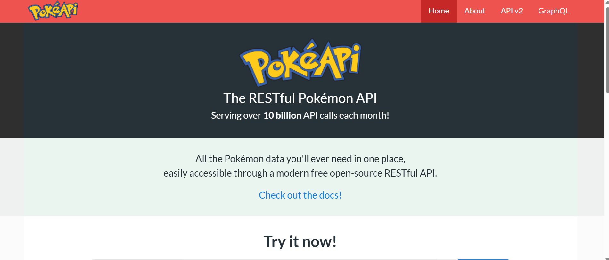

# Mock APIs
Created by <i class="fab fa-telegram"></i>
edme88

---
<!-- .slide: style="font-size: 0.60em" -->
<style>
.grid-container2 {
    display: grid;
    grid-template-columns: auto auto;
    font-size: 0.8em;
    text-align: left !important;
}

.grid-item {
    border: 3px solid rgba(121, 177, 217, 0.8);
    padding: 20px;
    text-align: left !important;
}
</style>
## Temario
<div class="grid-container2">
<div class="grid-item">

- mock backend

</div>
<div class="grid-item">

- OpenApi (Swagger)
- PokeAPI
- Postman

</div>
</div>

---

### Ejercicio: Mock del Backend
1. En la carpeta donde se encuentre el **package.json** ejecutar:
```bash
npm i -D json-server
```
2. Crear el archivo **src/data/activities.json** con la información necesaria para mockear el servicio.
3. Emplear una terminal para levantar el servidor:
```bash
npx json-server --watch src/data/activities.json --port 4000
```
4. Modificar el código para que en lugar de leer los datos del **js** se realice un **fetch**

---

### ¿Qué es [OpenAPI](https://www.openapis.org/) ([Swagger](https://swagger.io/))? 

- Es un formato estándar para documentar APIs REST.
- Permite describir endpoints, parámetros, respuestas, y generar documentación automática.
- Ejemplo: https://petstore.swagger.io
- [Swagger UI](https://editor.swagger.io/) / Editor te permite probar endpoints igual que Postman.

---

### PokeApi

Para los siguientes ejercicios vamos a usar la [pokeApi](https://pokeapi.co/)



Puedes ver APIS gratuitas en: https://publicapis.dev/

---

### [Postman](https://www.postman.com/downloads/)

Es una herramienta que permite:

- Probar APIS
- Documentarlas
- Testear APIs
- Monitorear servicios, etc

---

### Ejercicio
1. Ingresar a https://pokeapi.co/api/v2/pokemon/1
2. Analizar brevemente la información obtenida
3. Empleando POSTMAN realizar un GET a la misma URL
4. Analizar los datos obtenidos

---

### Ejercicio: APIs en React

1. Crear un archivo **Poke** en *src/page*
2. Crear un archivo **PokeCard** en *src/components* 
3. En **Poke** emplear el *fetch* para obtener los datos de bulbasaur. Usar el *useEffect* para poder visualizar esos datos.

---

### Ejercicio: APIs en React

1. Modificar **Poke** para llamar a la API de 1 a 20

---

### ¿Cómo re-armarías el carrito de compras usando Vite-React?

----

### Carrito

1. Si aún no tenemos instalado **json-server** en el **package.json** ejecutar:
```bash
npm i -D json-server
```
2. Crear **product.json** con los datos en **src/data** para separar datos de lógica, y mockear
el servicio **get**.
3. Crear un **Store.jsx** en */pages* que contenga .map para iterar y generar las cards
4. Emplear una terminal para levantar el servidor:
```bash
npx json-server --watch src/data/productos.json --port 4000
```
Y otra terminal para levantar el proyecto:
```bash
npm run dev
```

----


4. Agregar un componente para la ventana con detalle del producto.
5. Crear función **formatPrice** en **src/utils**
6. Modificar la tienda para que el boton de agregar al carrito solo esté disponible cuando el usuario inicio sesión.


4. Modificar el código para que en lugar de leer los datos del **js** se realice un **fetch**

---
## ¿Dudas, Preguntas, Comentarios?

